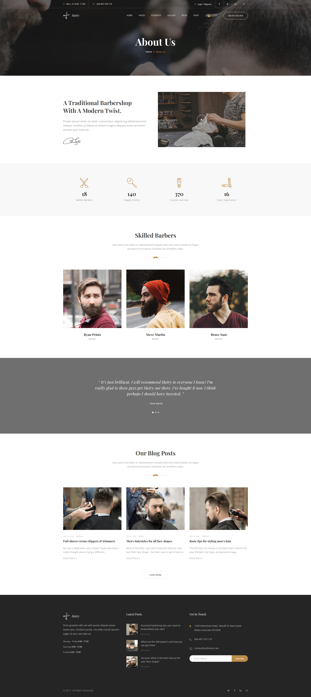
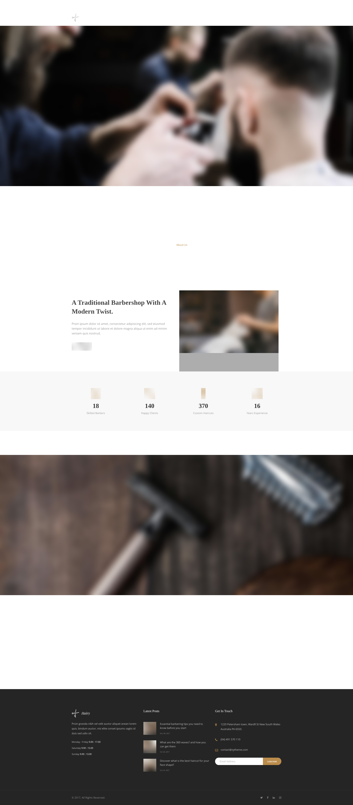
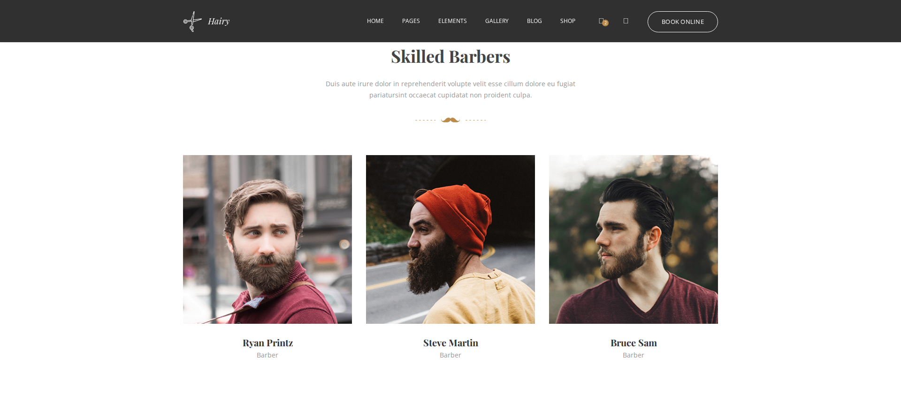
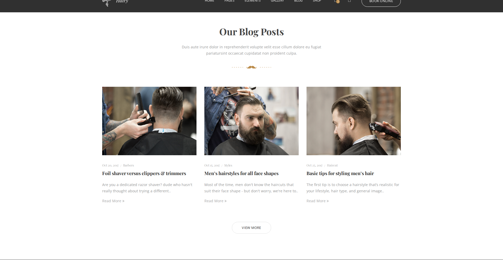
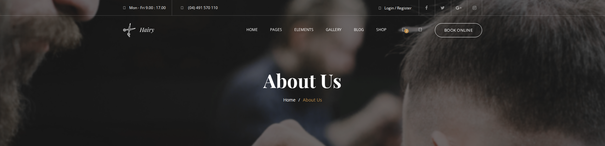
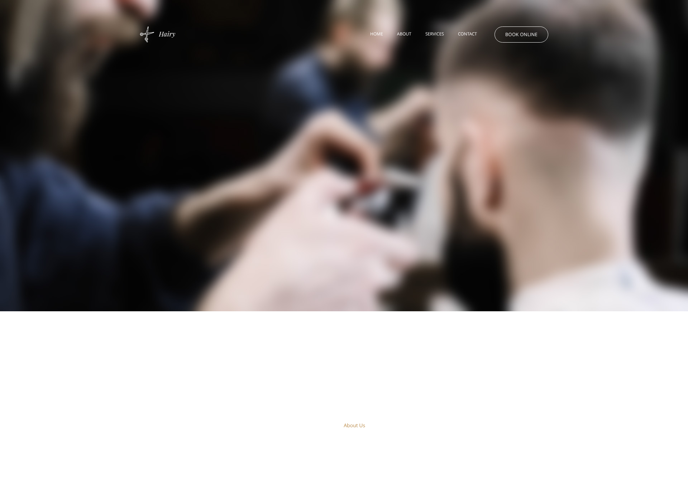
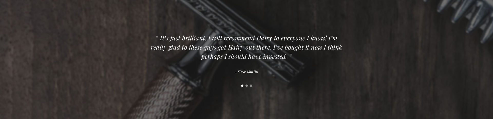
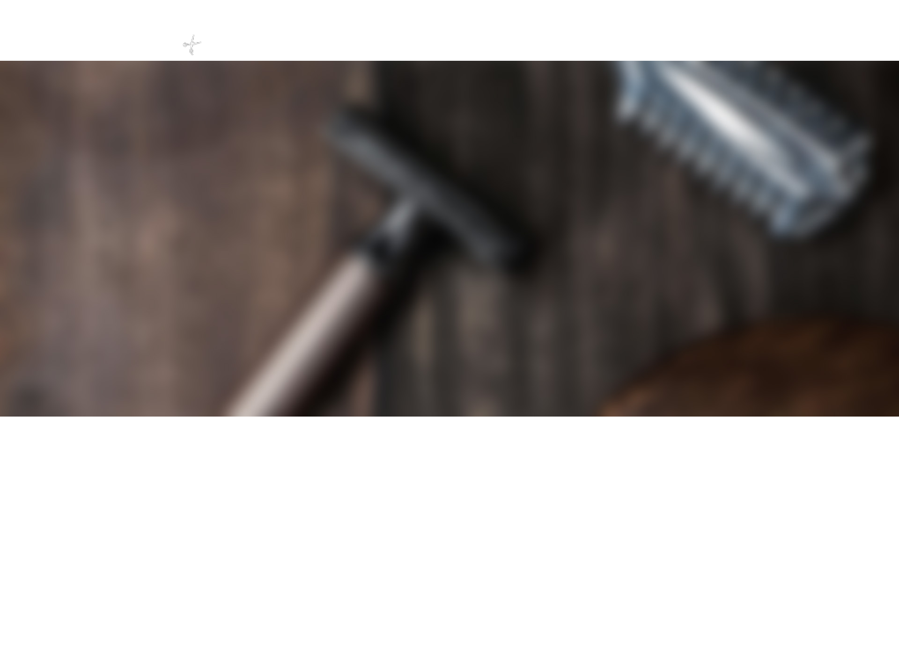

# AboutUsPage Visual Comparison Audit Report

## Executive Summary

**Verdict: SIGNIFICANT ISSUES FOUND** ❌

The React port of the AboutUsPage is **incomplete and has major visual regressions**. This audit, conducted like a thorough food safety inspection, reveals:

- **4 CRITICAL** missing sections (entire content blocks not ported)
- **2 MAJOR** layout/dimension issues
- **Multiple** navigation simplifications
- **~2,800px** of missing vertical content

---

## Audit Methodology

| Aspect | Details |
|--------|---------|
| **Date** | 2026-01-18 |
| **Tools Used** | Playwright 1.57.0, TypeScript, Chromium 143.0 |
| **Viewport** | 1920×1080 |
| **Original Source** | `assets/Hairy/page-about-us.html` served on `localhost:8080` |
| **React Version** | Storybook iframe `pages-aboutuspage--full-page` on `localhost:6006` |
| **Sections Compared** | 18 |
| **Issues Found** | 10 across 6 sections |

---

## Visual Comparison Evidence

### Full Page Comparison

| Original HTML Template | React Storybook Port |
|------------------------|----------------------|
|  |  |

**Observation**: The React version is visibly shorter and missing entire content sections. The page goes directly from Testimonials to Footer, skipping Team and Blog sections.

---

## CRITICAL FINDINGS 🚨

### 1. MISSING: Team Section (`#team1` / Skilled Barbers)

**Severity**: CRITICAL ❌

| Aspect | Original | React |
|--------|----------|-------|
| Exists | ✓ | ✗ **MISSING** |
| Height | 875px | N/A |
| Content | 3 barber cards with photos, names, social links | Not implemented |

**Evidence**:


**Original HTML** (lines 446-544):
```html
<section id="team1" class="team team-1">
  <div class="heading heading-2 mb-70">
    <h2 class="heading--title">Skilled Barbers</h2>
  </div>
  <!-- 3 team member cards with images, overlay, social links -->
</section>
```

**React Implementation**: Component does not exist. No `TeamSection` component in `ui/src/components/sections/`.

**Impact**: Users cannot see the barbershop staff - a key trust-building element.

---

### 2. MISSING: Blog Section (`#blog` / Our Blog Posts)

**Severity**: CRITICAL ❌

| Aspect | Original | React |
|--------|----------|-------|
| Exists | ✓ | ✗ **MISSING** |
| Height | 993.73px | N/A |
| Content | 3 blog post cards with images, dates, excerpts | Not implemented |

**Evidence**:


**Original HTML** (lines 603-723):
```html
<section id="blog" class="blog blog-grid pb-100">
  <div class="heading text--center mb-70">
    <h2 class="heading--title">Our Blog Posts</h2>
  </div>
  <!-- 3 blog entry cards with images, meta, excerpts -->
</section>
```

**React Implementation**: Component does not exist. No `BlogGridSection` component.

**Impact**: Content marketing and SEO value lost.

---

### 3. MAJOR: Page Title Hero Height Wrong

**Severity**: HIGH ⚠️

| Aspect | Original | React | Difference |
|--------|----------|-------|------------|
| Height | 466px | 1336px | **+870px** |
| Padding | `120px 0 80px` | Computed same | N/A |
| Position | relative | static | Different |
| Margin | `-140px 0 0` | `0` | Missing overlap |

**Evidence**:

| Original | React |
|----------|-------|
|  |  |

**Root Cause Analysis**:

1. **Missing Negative Margin**: Original uses `margin-top: -140px` to overlap with the fixed header. React version has `margin: 0`.

2. **Background Image Sizing**: The background image container is not properly constrained.

3. **Position Property**: Original is `position: relative`, React is `position: static`.

**Original CSS** (from style.css):
```css
.page-title {
  margin-top: -140px;
  position: relative;
}
.page-title .bg-section img {
  width: 100%;
  height: 100%;
  object-fit: cover;
}
```

---

### 4. MAJOR: Testimonials Carousel Not Working

**Severity**: HIGH ⚠️

| Aspect | Original | React | Difference |
|--------|----------|-------|------------|
| Height | 465.5px | 1401px | **+935.5px** |
| Behavior | Carousel (1 at a time) | All visible | Broken |
| Dots/Navigation | Present | Missing | Not implemented |

**Evidence**:

| Original | React |
|----------|-------|
|  |  |

**Root Cause**: 

Original uses **Owl Carousel** with configuration:
```html
<div id="testimonial-carousel" class="carousel carousel-dots"
     data-slide="1" data-slide-rs="1" data-autoplay="false"
     data-nav="false" data-dots="true" data-loop="true">
```

React just renders all testimonials in a list without any carousel library:
```tsx
{items.map((item, index) => (
  <div key={...} className="testimonial-panel">
    // All items visible at once
  </div>
))}
```

**Solution Required**: Integrate a React carousel library (react-slick, swiper, or embla-carousel).

---

## MODERATE FINDINGS ⚠️

### 5. Header Navigation Simplified

| Aspect | Original | React |
|--------|----------|-------|
| Top Bar | Hours, phone, login, social | Missing entirely |
| Menu Items | 6 dropdown menus | 4 simple links |
| Cart Module | Present with items | Missing |
| Search Module | Present | Missing |

**Original Navigation** (lines 46-318):
- Top bar: Hours (Mon-Fri 9:00-17:00), Phone, Login/Register, Social icons
- Main nav: HOME (dropdown), PAGES (dropdown), ELEMENTS (dropdown), GALLERY (dropdown), BLOG (dropdown), SHOP (dropdown)
- Modules: Cart with preview, Search overlay, Book Online button

**React Navigation**:
- No top bar
- Simple links: home, about, services, contact
- Book Online button only

**Impact**: Reduced functionality and navigation options.

---

### 6. Video Section Position Difference

| Aspect | Original | React |
|--------|----------|-------|
| video--content position | relative | static |

Minor but could affect overlay positioning for play button.

---

## SECTIONS PASSING ✅

The following sections matched within acceptable tolerance:

| Section | Width | Height | Styles |
|---------|-------|--------|--------|
| page-title-heading | 1140px ✓ | 72px ✓ | Match |
| breadcrumb | 1140px ✓ | 14px ✓ | Match |
| video-section | 1920px ✓ | 540px ✓ | Match |
| video-heading | 555px ✓ | 96px ✓ | Match |
| video-player-area | 540px ✓ | 340px ✓ | Match |
| counter-section | 1920px ✓ | 323px ✓ | Match |
| count-box-first | 262.5px ✓ | 143px ✓ | Match |
| testimonial-card | 750px ✓ | 130px ✓ | Match |
| footer | 1920px ✓ | 629px ✓ | Match |
| footer-widgets | 1920px ✓ | 548px ✓ | Match |
| header | 1920px ✓ | 140px ✓ | Match |
| navbar | 1920px ✓ | 90px ✓ | Match |

---

## Required Remediation Actions

### Priority 1: Create Missing Components

```bash
# Components to create:
ui/src/components/sections/TeamSection.tsx
ui/src/components/sections/TeamSection.stories.tsx
ui/src/components/sections/BlogGridSection.tsx
ui/src/components/sections/BlogGridSection.stories.tsx
```

### Priority 2: Fix Layout Issues

1. **Page Title Section** - Add proper margin and position:
```css
.page-title {
  margin-top: -140px;
  position: relative;
}
```

2. **Testimonials** - Integrate carousel:
```tsx
// Install: npm install swiper
import { Swiper, SwiperSlide } from 'swiper/react';
import { Pagination } from 'swiper/modules';
```

### Priority 3: Restore Header Functionality

- Add TopBar component with hours, phone, social links
- Implement dropdown menus
- Add cart and search modules

---

## Checklist for Port Completion

- [ ] Create TeamSection component
- [ ] Create BlogGridSection component  
- [ ] Fix page-title margin-top: -140px
- [ ] Fix page-title position: relative
- [ ] Implement testimonials carousel with swiper/embla
- [ ] Add carousel dots/pagination
- [ ] Add TopBar to Header component
- [ ] Implement navigation dropdowns
- [ ] Add CartModule component
- [ ] Add SearchModule component
- [ ] Verify all background images load correctly
- [ ] Test at multiple viewport sizes

---

## Raw Data

Full JSON comparison results: `sources/comparison-results.json`

Screenshots available in `sources/`:
- `full-page-original.png` / `full-page-react.png`
- `original-{section}.png` / `react-{section}.png` for each section

---

*Report generated by automated Playwright comparison on 2026-01-18*
