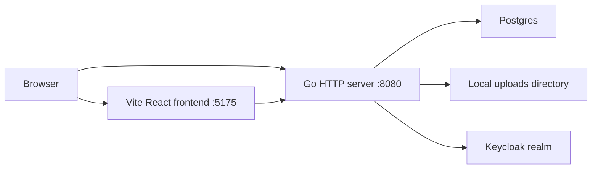
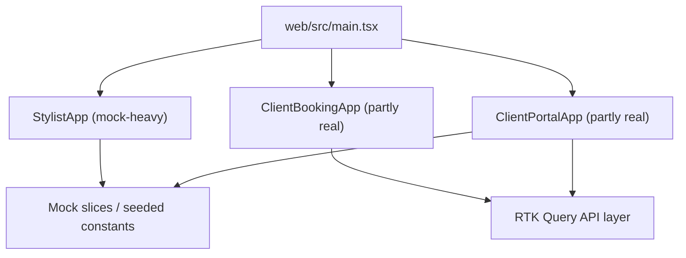
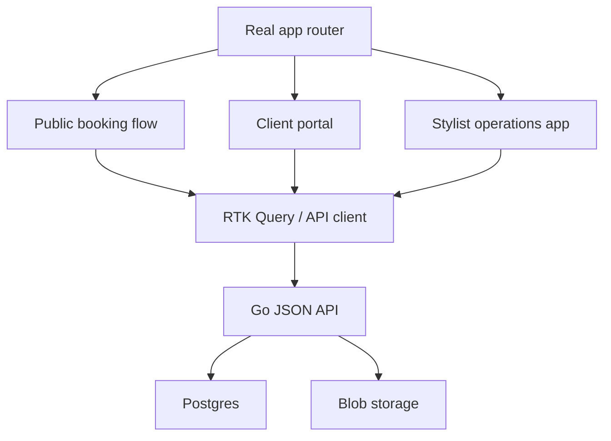

# Hair Booking MVP Readiness Review

## Executive Summary

The current codebase is not one app. It is three overlapping application modes sharing one frontend package and one Redux store:

- a client booking funnel that is partly real and now talks to the Go backend
- a client portal that has real auth and some real reads and writes, but still carries mock rewards and photo timeline data
- a stylist-side app that still behaves like an imported Storybook demo with seeded clients, seeded appointments, and seeded loyalty flows

The backend is materially stronger than the frontend right now. The Go/Postgres side already supports the core public booking flow and authenticated client portal basics:

- services catalog
- intake submission
- intake photo upload
- availability calculation
- appointment creation
- client bootstrap from Keycloak
- portal profile updates
- portal notification preference updates
- portal appointment listing/detail/reschedule/cancel
- maintenance plan reads

That means the shortest path to a real MVP is not to keep broadening the client portal. The shortest path is to narrow scope and finish the operational loop around the stylist.

Recommended MVP scope:

- keep:
  - Keycloak login
  - public intake
  - intake photo upload
  - service listing
  - availability
  - appointment booking
  - client portal for profile and appointment management
  - stylist review of incoming intakes, appointments, photos, notes, and basic client history
- cut or hide for MVP:
  - rewards
  - referrals
  - payment and deposit UI
  - reminder automation
  - marketing preferences
  - unused bootstrap page on backend root
- add:
  - stylist-side authenticated workflow
  - stylist-side intake queue and appointment review screens
  - a cleaner app-shell strategy so there is one obvious frontend entry point

The main product risk is not database design anymore. The main risk is application identity confusion:

- visiting the frontend root loads the stylist demo app by default
- logging in through Keycloak redirects to the backend bootstrap page
- some screens are real, some are mock, and the user cannot tell which is which

That confusion must be removed before calling the product shippable.

## What Exists Today

### Runtime Topology

The current runtime boundary looks like this:



The browser can talk to two different web origins during local development:

- Vite at `http://127.0.0.1:5175`
- Go server at `http://127.0.0.1:8080`

The React frontend calls the Go API with `credentials: "include"` in `web/src/stylist/store/api/base.ts:15-22`.

### Frontend App Modes

The frontend entrypoint selects the app by query parameter in `web/src/main.tsx:11-24`:

- no query parameter: `StylistApp`
- `?app=booking`: `ClientBookingApp`
- `?app=portal`: `ClientPortalApp`

That means the default root is not the client booking flow and not the portal. It is the stylist/admin-facing imported widget app. This is one of the main sources of product confusion.

### Backend API Surface

The Go server registers these JSON routes in `pkg/server/http.go:189-202`:

- `GET /api/info`
- `GET /api/me`
- `PATCH /api/me`
- `PATCH /api/me/notification-prefs`
- `GET /api/me/appointments`
- `GET /api/me/appointments/{id}`
- `PATCH /api/me/appointments/{id}`
- `POST /api/me/appointments/{id}/cancel`
- `GET /api/me/maintenance-plan`
- `GET /api/services`
- `POST /api/intake`
- `POST /api/intake/{id}/photos`
- `GET /api/availability`
- `POST /api/appointments`

There are no stylist/admin APIs yet.

### Current Database Shape

The schema in `pkg/db/migrations/0001_init.sql:1-129` already covers:

- clients
- services
- intake submissions
- intake photos
- appointments
- appointment photos
- maintenance plans and items
- notification preferences
- weekly schedule blocks
- date-specific schedule overrides

The schema does not yet cover stylist-side workflow state such as:

- stylist users or staff roles
- intake triage status
- appointment review queue
- client flags
- quote approval state
- “needs follow-up” markers

## Real Versus Mock Matrix

This is the most important section for an intern. The product cannot be reasoned about correctly unless the person knows which screens are backed by the server and which ones are still demo scaffolding.

| Area | Status | Evidence | Notes |
| --- | --- | --- | --- |
| Public services list | Real | `pkg/server/handlers_public.go:66-79`, `web/src/stylist/store/api/servicesApi.ts` | Server-backed |
| Public intake form | Real | `pkg/server/handlers_public.go:81-121`, `web/src/stylist/store/api/bookingApi.ts:24-30` | Server-backed |
| Intake photo upload | Real | `pkg/server/handlers_public.go:123-158`, `web/src/stylist/store/api/bookingApi.ts:31-42` | Local blob storage only |
| Availability | Real | `pkg/appointments/service.go:150-186`, `web/src/stylist/store/api/bookingApi.ts:43-53` | Single-resource schedule model |
| Appointment creation | Real | `pkg/server/handlers_public.go:192-244`, `web/src/stylist/store/api/bookingApi.ts:54-65` | Creates pending appointments |
| Portal login | Real | `pkg/auth/oidc.go:136-221`, `web/src/stylist/store/api/authApi.ts:50-70` | Keycloak-backed |
| Portal profile edit | Real | `pkg/server/handlers_me.go`, `web/src/stylist/pages/PortalProfilePage.tsx` | Works through `/api/me` |
| Portal appointment list/detail/reschedule/cancel | Real | `pkg/server/handlers_portal.go:56-221`, RTK Query `portalApi.ts` | Mostly live |
| Portal maintenance | Real | `pkg/server/handlers_portal.go:223-248` | Read-only |
| Portal rewards | Mock | `web/src/stylist/pages/PortalRewardsPage.tsx:8-43`, `web/src/stylist/store/portalSlice.ts:27-63` | Out of scope for MVP |
| Portal photo timeline | Mock | `web/src/stylist/pages/PortalPhotosPage.tsx:5-20`, `web/src/stylist/store/portalSlice.ts:27-35` | UI only |
| Deposit/payment flow | Fake | `web/src/stylist/ClientBookingApp.tsx:88-111`, `web/src/stylist/components/DepositPaymentSheet.tsx:108-110` | Simulated timeout, no payments backend |
| Stylist home/schedule/clients | Mock | `web/src/stylist/StylistApp.tsx:22-85`, `web/src/stylist/pages/HomePage.tsx:10-99`, `web/src/stylist/store/appointmentsSlice.ts:1-28`, `web/src/stylist/store/clientsSlice.ts:1-69` | Demo-only |
| Backend root page | Legacy bootstrap | `pkg/web/public/index.html:20-24` | Not the actual React app |

## Code Review Findings

### High Severity Findings

#### 1. The product has no real stylist-side operating surface

The current backend only exposes public routes and authenticated client routes. There are no stylist-facing routes, no staff authorization model, and no queue/review workflow. See `pkg/server/http.go:189-202`.

Why this matters:

- booking is only half the business workflow
- the stylist must be able to review intake answers, intake photos, booked appointments, and notes
- without that side, the app cannot replace even a lightweight manual booking workflow

Impact:

- not shippable as a studio operations MVP
- current “StylistApp” is misleading because it looks operational but is not connected to reality

Recommendation:

- add a stylist-side MVP surface before any more rewards/payment/reminder work
- implement stylist authz and stylist APIs before polishing the mock admin UI

#### 2. The default frontend route opens a demo app, not the real customer workflow

`web/src/main.tsx:11-24` defaults to `StylistApp`.

Why this matters:

- a developer or stakeholder landing on the frontend root sees a fake admin-style interface
- it hides the fact that the real integrated flows are under `?app=booking` and `?app=portal`
- it makes smoke testing and demos error-prone

Recommendation:

- replace query-param app selection with explicit routes or separate app entrypoints
- default root should be the client booking landing page or a real home shell
- hide or remove the stylist demo app until it is real

#### 3. The Keycloak login redirect lands on the wrong surface

`pkg/auth/oidc.go:132` sets `postLoginPath: "/"`, and `HandleCallback` redirects there in `pkg/auth/oidc.go:221`.

In local development, that sends the user to the Go server root, which still serves the bootstrap page in `pkg/web/public/index.html:20-24`.

Why this matters:

- login succeeds, but the user lands on an old bootstrap page instead of the actual portal app
- it makes the product look broken even when auth works

Recommendation:

- make post-login redirect configurable
- in local dev, redirect to the intended Vite route or a shared app route
- once the React app is embedded or proxied, point `/` at the actual app shell

#### 4. The stylist/admin UI is still driven by hard-coded sample data and out-of-scope loyalty logic

Examples:

- `web/src/stylist/pages/HomePage.tsx:10-23` hard-codes the date and greeting
- `web/src/stylist/data/constants.ts:34-112` hard-codes clients, appointments, loyalty tiers, and rewards
- `web/src/stylist/StylistApp.tsx:44-52` records referral points in local Redux only

Why this matters:

- the UI appears more complete than the backend actually is
- stakeholders may assume stylist operations already exist
- the codebase pays a maintenance cost for reward/referral concepts that the desired MVP explicitly does not need

Recommendation:

- remove rewards/referrals from MVP scope
- turn the stylist-side app into a real intake and appointment operations tool

### Medium Severity Findings

#### 5. The Redux store mixes server-backed state and demo-only state in one global runtime

`web/src/stylist/store/index.ts:12-21` combines:

- mock/demo slices such as `clients`, `appointments`, `portal`
- real RTK Query API cache under `stylistApi`

Why this matters:

- it is hard to reason about what data is canonical
- UI components can accidentally keep reading mock state even after a real API exists
- debugging becomes “which slice am I looking at?” instead of “what is the source of truth?”

Recommendation:

- split demo-only state from production state
- preferably replace query-param app switching with route-based features using RTK Query as the data source
- restrict local Redux to UI state, transient form state, and view-level toggles

#### 6. The portal still leaks non-MVP reward and photo assumptions into real screens

Examples:

- `web/src/stylist/pages/PortalHomePage.tsx:10-45` blends real profile data with `rewardsUser` from `state.portal.user`
- `web/src/stylist/pages/PortalRewardsPage.tsx:8-43` is fully mock-backed
- `web/src/stylist/pages/PortalPhotosPage.tsx:5-20` is fully mock-backed

Why this matters:

- the app visually suggests features the backend does not support
- mixed real/mock data models create subtle bugs and misleading screenshots

Recommendation:

- remove the rewards tab from MVP
- either implement real appointment photo timeline APIs or hide the photos tab until they exist
- stop merging real profile data with mock reward-tier view models

#### 7. Payment UI is present but not real

`web/src/stylist/ClientBookingApp.tsx:99-106` simulates payment success with `setTimeout`, while `DepositPaymentSheet.tsx:108-110` says “Secured by Stripe”.

Why this matters:

- this is product-risky, not just technically unfinished
- fake payment UI can be mistaken for real billing behavior

Recommendation:

- remove the payment and deposit surface entirely from the MVP branch
- if deposits return later, reintroduce them behind real backend capabilities

#### 8. Storage is local-only even though the config suggests S3 is available

`cmd/hair-booking/cmds/serve.go:131-137` rejects `StorageModeS3` with “s3 storage mode is not implemented yet”.

Why this matters:

- photo uploads work for local development only
- a shippable deployment needs a durable file strategy

Recommendation:

- either implement S3-compatible blob storage before launch
- or explicitly document “single-node local filesystem deployment only” for a private pilot

### Low Severity Findings

#### 9. The backend root still serves an obsolete bootstrap page

`pkg/web/public/index.html:21` literally says the login is ready for a “later React frontend.”

This is technically harmless, but it makes the app feel unfinished and increases onboarding confusion.

#### 10. Frontend automated test coverage is effectively absent

There are no `*.test.*` or `*.spec.*` files under `web/src`.

The backend test posture is much better:

- `go test ./...` passes
- service and repository tests exist across `pkg/appointments`, `pkg/auth`, `pkg/clients`, `pkg/config`, `pkg/db`, `pkg/intake`, `pkg/server`, `pkg/services`, `pkg/storage`

Why this matters:

- frontend regressions are currently caught by manual testing and Storybook only
- the codebase needs at least a small set of smoke-level component or route tests for core flows

## Architecture Review

### Backend Architecture

The backend structure is sound for an MVP foundation:

```text
cmd/hair-booking/cmds/serve.go
  -> pkg/server
      -> pkg/auth
      -> pkg/clients
      -> pkg/services
      -> pkg/intake
      -> pkg/appointments
      -> pkg/storage
      -> pkg/db
```

Good qualities:

- domain packages are separated cleanly
- handlers remain thin and delegate to service packages
- Postgres persistence sits behind repository interfaces
- the API envelope strategy is consistent
- OIDC session auth is isolated under `pkg/auth`

Weak points:

- no stylist domain package yet
- no clear admin authorization boundary
- no background job or notification architecture, which is acceptable if reminders are out of scope
- no explicit deployment-ready blob storage strategy

### Frontend Architecture

The frontend structure is in transition.

Good qualities:

- RTK Query base layer is a good direction
- DTOs and mapping helpers are centralized under `web/src/stylist/store/api`
- the booking flow is now server-backed in the key path
- the portal auth bootstrap is rational

Weak points:

- one frontend package still serves three product modes with one store
- imported Storybook/demo assumptions remain mixed into production paths
- view models for rewards/tiers/perks are mixed with real profile data
- the app shell is query-param based rather than route-based
- there are no frontend tests

Current frontend shape:



Target MVP shape:



## Product Review: What A Shippable MVP Actually Needs

The requested business focus is:

- booking
- making it easy for the stylist to review information
- allowing the stylist to work on her side of things

That means the MVP must solve two loops:

1. client submits information and books time
2. stylist reviews information and decides what to do next

The codebase already solves most of loop 1. It does not yet solve loop 2.

### Keep For MVP

- Keycloak login and browser session management
- client record creation from authenticated subject
- service catalog
- intake submission
- intake photo upload
- availability lookup
- booking
- portal profile editing
- portal appointment reschedule/cancel
- maintenance timeline if it is cheap to keep

### Cut For MVP

- rewards
- referrals
- loyalty tiers
- deposit and payment UI
- marketing preference toggle
- reminder automation
- fake admin metrics

### Add For MVP

- stylist/staff login authorization
- stylist dashboard or queue
- stylist intake detail review
- stylist appointment review and notes
- stylist client detail page
- appointment confirmation workflow

## Recommended MVP Data Model Additions

The current schema is usable, but the stylist workflow needs a thin layer of operational state.

### Suggested New Tables

#### `staff_users`

Purpose:

- map authenticated Keycloak users to stylist/staff roles

Suggested fields:

```yaml
staff_users:
  id: uuid PK
  auth_subject: text UNIQUE NOT NULL
  auth_issuer: text NOT NULL
  name: text NOT NULL
  email: text
  role: text NOT NULL       # owner | stylist | assistant
  is_active: bool default true
  created_at: timestamptz
  updated_at: timestamptz
```

#### `intake_reviews`

Purpose:

- record stylist-side review state for a submitted intake

Suggested fields:

```yaml
intake_reviews:
  id: uuid PK
  intake_id: uuid FK -> intake_submissions UNIQUE NOT NULL
  reviewer_id: uuid FK -> staff_users
  status: text NOT NULL     # new | in_review | needs_client_reply | approved_to_book | archived
  priority: text NOT NULL   # normal | urgent
  summary: text
  internal_notes: text
  quoted_service_id: uuid FK -> services
  quoted_price_low: int
  quoted_price_high: int
  reviewed_at: timestamptz
  created_at: timestamptz
  updated_at: timestamptz
```

#### `appointment_assignments` or a stylist column on appointments

Purpose:

- assign appointments to the stylist

For a single-stylist MVP, the simplest option is to skip this and assume one stylist. If multi-stylist is even remotely expected, add:

```yaml
appointments:
  stylist_id: uuid FK -> staff_users
```

### Why These Additions Matter

The existing schema stores the raw facts:

- who the client is
- what they asked for
- what photos they uploaded
- when an appointment exists

But it does not store the stylist’s operational judgment:

- has anyone reviewed this intake
- does it need follow-up
- what quote range did the stylist settle on
- who owns the appointment

Without that layer, the stylist app cannot become a real work surface.

## Recommended MVP API Additions

### Stylist Auth Guard

All stylist routes should require:

- authenticated browser session
- mapped `staff_users` record
- active role

### Proposed Stylist Routes

```yaml
GET    /api/stylist/me
  returns: { staff_user }

GET    /api/stylist/dashboard
  returns:
    {
      new_intakes,
      pending_appointments,
      todays_appointments,
      upcoming_appointments
    }

GET    /api/stylist/intakes
  query: { status?, limit?, offset? }
  returns: { intakes[], total }

GET    /api/stylist/intakes/:id
  returns:
    {
      intake,
      photos[],
      client,
      review
    }

PATCH  /api/stylist/intakes/:id/review
  body:
    {
      status?,
      priority?,
      summary?,
      internal_notes?,
      quoted_service_id?,
      quoted_price_low?,
      quoted_price_high?
    }
  returns: { review }

GET    /api/stylist/appointments
  query: { date?, status?, client_id? }
  returns: { appointments[], total }

GET    /api/stylist/appointments/:id
  returns:
    {
      appointment,
      client,
      service,
      intake,
      intake_photos[],
      appointment_photos[]
    }

PATCH  /api/stylist/appointments/:id
  body:
    {
      status?,
      stylist_notes?,
      prep_notes?,
      date?,
      start_time?
    }
  returns: { appointment }

GET    /api/stylist/clients
  query: { search?, limit?, offset? }
  returns: { clients[], total }

GET    /api/stylist/clients/:id
  returns:
    {
      client,
      appointments[],
      maintenance_plan,
      maintenance_items[],
      recent_intakes[]
    }
```

## Recommended Frontend Reorganization

### Current Problem

The current frontend organization is inheritance from the imported widget/storybook app. That was useful for fast UI assembly, but it is no longer a good production architecture.

Problems:

- `StylistApp` is still demo-first
- client and stylist experiences are co-located without clear routing
- mock state and real server state share the same store
- business scope and demo scope are blended

### Recommended Target

Move toward three route groups inside one routed app:

```text
/
  public booking landing
/booking/*
  intake + estimate + calendar + confirmation
/portal/*
  authenticated client portal
/stylist/*
  authenticated stylist operations
```

Recommended state boundaries:

- RTK Query for all server-backed entities
- local slice state only for:
  - current intake wizard draft
  - modal visibility
  - tab/view UI state
  - local unsaved form state
- remove seeded domain data slices from production runtime

### Suggested Frontend Delivery Order

1. Remove rewards, referrals, and payment UI from active runtime.
2. Replace query-param app mode with real routing.
3. Keep booking and portal routes alive with existing RTK Query integrations.
4. Build stylist queue and detail pages against new stylist APIs.
5. Add minimal frontend tests for:
   - booking happy path shell
   - portal auth gating
   - stylist intake queue render
   - stylist appointment detail render

## Pseudocode For The Missing Stylist Workflow

```text
on new intake submission:
  persist intake
  persist uploaded photos
  create intake_review(status = "new")

stylist dashboard load:
  fetch counts for:
    new intakes
    in-review intakes
    pending appointments
    today's appointments

stylist opens intake detail:
  load intake
  load intake photos
  load linked client if present
  load current review record

stylist updates review:
  save summary
  save internal notes
  save quoted range
  set status

if intake is ready to book and no appointment exists:
  optionally generate suggested booking action

if appointment exists:
  stylist can confirm
  add prep notes
  add stylist notes
```

## Concrete MVP Phases

### Phase 0: Scope Cleanup

- remove or hide rewards/referrals UI
- remove or hide deposit/payment UI
- remove marketing preference toggle
- choose one real default app shell
- fix Keycloak post-login redirect target

### Phase 1: Frontend Shell Consolidation

- replace query-param app switching with route-based app entry
- make `/` a real landing page or booking start page
- ensure portal and stylist surfaces are navigable and bookmarkable
- retire the legacy bootstrap page on backend root

### Phase 2: Stylist Backend

- add `staff_users`
- add stylist authz middleware
- add stylist queue and detail endpoints
- add intake review persistence
- add appointment management endpoints for stylist-side notes and confirmation

### Phase 3: Stylist Frontend

- replace the current mock `StylistApp` home/schedule/clients surfaces
- create:
  - stylist dashboard
  - intake queue
  - intake detail
  - appointment list
  - appointment detail
  - client detail

### Phase 4: Production Hardening

- implement durable blob storage
- add frontend test coverage for core flows
- add more explicit error states and retry flows
- verify auth/session behavior with embedded or proxied frontend hosting

## Intern Guidance: How To Read This Codebase

If you are new to this project, read in this order:

1. `pkg/server/http.go`
   Understand the actual server surface and which routes exist.
2. `pkg/db/migrations/0001_init.sql`
   Understand the actual data model.
3. `pkg/appointments/service.go`, `pkg/intake/service.go`, `pkg/clients/service.go`
   Understand the business logic boundaries.
4. `web/src/main.tsx`
   Understand the current app split.
5. `web/src/stylist/store/api/*`
   Understand the new RTK Query server integration layer.
6. `web/src/stylist/ClientBookingApp.tsx` and `web/src/stylist/ClientPortalApp.tsx`
   Understand the client flows.
7. `web/src/stylist/StylistApp.tsx`
   Understand what is still demo-only and should not be assumed production-ready.

## Final Recommendation

This codebase is close to a credible booking prototype, but it is not yet a coherent product.

The right move is not to keep polishing every visible screen. The right move is to do the following:

1. cut the visible non-MVP features
2. fix the app-shell and auth redirect confusion
3. build the stylist-side operational workflow on top of the existing backend foundation

If those three things are done well, the project becomes a real MVP. If they are not, the app will keep feeling like a mixture of imported widgets and backend experiments rather than a focused studio tool.
