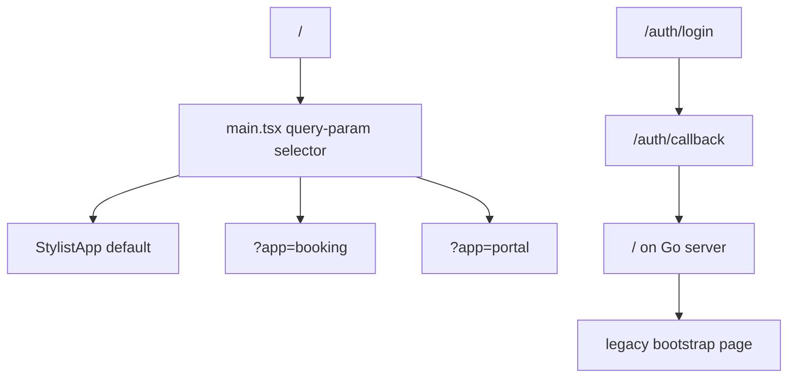
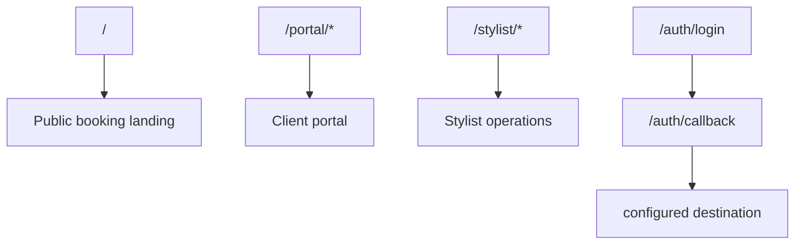

# App Shell And Non-MVP Cleanup Guide

## Executive Summary

This ticket exists because the current app still behaves like a prototype bundle rather than a single product.

The three main problems are:

- the browser root opens the wrong app surface
- successful login lands on the wrong post-auth destination
- the runtime still exposes rewards, referrals, loyalty, and fake payment behaviors that are not part of the intended MVP

The point of HAIR-005 is to make the product understandable.

## Problem Statement

The codebase currently has three overlapping frontend modes:

- booking
- portal
- stylist

But they are not organized like three real product areas. They are organized like three demo entrypoints.

Current runtime behavior:



This is confusing for:

- users
- developers
- testers
- stakeholders

## Desired End State



## Scope

### In Scope

- route strategy
- app shell organization
- auth redirect targeting
- removal or hiding of visible non-MVP surfaces
- cleanup of runtime state boundaries

### Out Of Scope

- new backend stylist APIs
- payments implementation
- rewards implementation
- new database work

## Recommended Implementation Approach

### 1. Introduce Real Routing

The query-param selector in `web/src/main.tsx` is a dead end for a real product.

Replace it with explicit route groups:

```text
/
  public landing or booking start
/booking/*
  client consultation and booking flow
/portal/*
  authenticated client portal
/stylist/*
  authenticated stylist area
```

Practical advice:

- do not rewrite every screen first
- first wrap the existing booking and portal apps behind routes
- then phase out the mock stylist shell

### 2. Fix Auth Redirects

The OIDC callback should not blindly land on `/`.

At minimum:

- make post-login target configurable
- set a sane default route for each audience

If the login entry is portal-specific, land on `/portal`.

If the login entry is stylist-specific, land on `/stylist`.

### 3. Remove Visible Non-MVP Features

The user has already said:

- no reminders
- no payment
- no rewards

That means runtime UI should not show:

- rewards tab
- referral flows
- loyalty metrics
- deposit/payment sheet
- fake Stripe security wording
- marketing preferences row

Keep stories if useful for design history, but do not keep them in the production runtime.

That is the intended rule for this ticket:

- preserve non-MVP screens and components in Storybook if they still provide design value
- remove their runtime navigation, route entrypoints, and product copy from the actual app

### 4. Clarify Runtime State Ownership

Current rule of thumb:

- RTK Query owns real backend data
- local state owns in-progress UI state
- demo fixtures should not own runtime business state

Practical cleanup targets:

- shrink `portalSlice`
- retire runtime dependence on `data/constants.ts`
- keep only local booking draft state where it is still useful

### 5. Treat Storybook As An Archive, Not As Runtime

The imported widget library is still useful for:

- design reference
- visual regression via stories
- preserving UI experiments that may return later

It should not define what the runtime app offers today.

Working rule:

```text
if a screen is out of MVP scope:
  keep it in Storybook if useful
  remove it from runtime navigation and shell
```

## Suggested Task Order

### Phase 1

- decide route map
- decide public root behavior
- decide login return behavior

### Phase 2

- introduce routed shell
- preserve current screen behavior temporarily

### Phase 3

- fix OIDC callback target
- verify login/logout flow end-to-end

### Phase 4

- remove visible rewards/payment/referral surfaces
- clean up dead navigation entrypoints

### Phase 5

- replace backend bootstrap page
- run route and auth smoke testing

## Pseudocode

```text
resolvePostLoginPath(context):
  if context == "portal":
    return "/portal"
  if context == "stylist":
    return "/stylist"
  return "/"
```

```text
runtimeStateRule(data):
  if data comes from backend:
    use RTK Query
  else if data is temporary UI state:
    keep local
  else if data only exists for stories/demo:
    keep out of runtime
```

## Acceptance Criteria

- app root no longer opens the mock stylist runtime by default
- login redirects land on the intended frontend route
- logout returns the browser to the intended public route
- rewards/referrals/payment are no longer visible in the MVP runtime
- backend root no longer looks like an obsolete integration stub

## Intern Notes

- do not over-engineer the routing layer
- get to a coherent shell first
- treat visible scope cleanup as product correctness, not cosmetic cleanup
