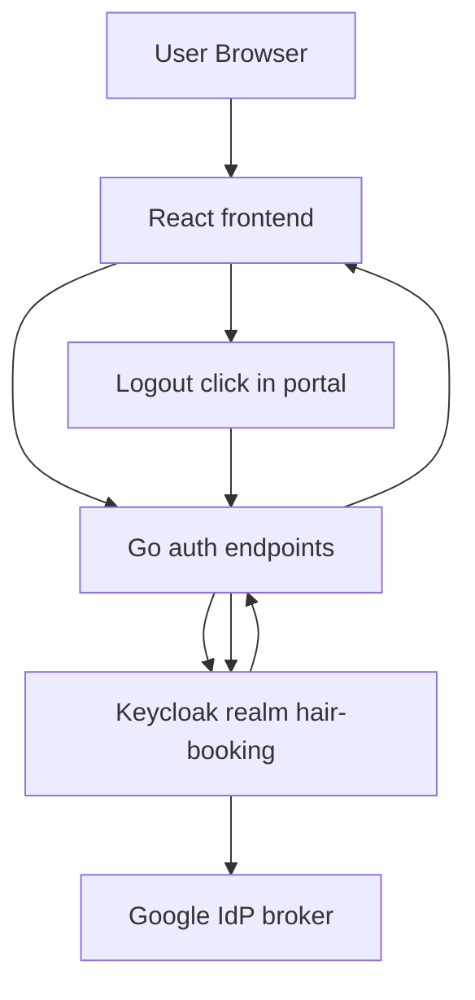

# Hosted logout redirect validation and brokered login re-entry fix guide

## Purpose

This guide explains two auth defects currently visible on the hosted `hair-booking` app:

1. logout from the portal currently lands on a Keycloak error page: `Invalid redirect uri`
2. after a brokered Google login, an explicit sign-out does not reliably reset the next login experience to the full Keycloak chooser screen

These are related because they both live at the boundary between:

- frontend runtime navigation
- Go-side OIDC helper code
- hosted Keycloak browser-client configuration
- Keycloak brokered identity behavior

They are not the same bug, and they should not be “fixed” by treating them as the same bug.

## Product expectation

The desired behavior is:

1. user clicks `Logout`
2. app session is cleared
3. Keycloak session is terminated successfully
4. browser returns to the app, typically `/`
5. next time the user clicks login, they see the Keycloak login screen and its identity choices instead of being silently pushed back through Google

In short:

```text
explicit sign-out
  -> leave app in signed-out state
  -> leave Keycloak in signed-out state
  -> next login should feel neutral, not sticky to the last social provider
```

## System overview

The current hosted auth architecture is:



Important components:

- frontend creates `/auth/login` and `/auth/logout` entry URLs with `return_to`
- Go auth helper turns those into OIDC authorization and logout URLs
- hosted Keycloak client enforces its allowlists for:
  - redirect URIs
  - post-logout redirect URIs
- Google is an upstream brokered identity provider, not the primary app auth system

## Current code path for issue 1: invalid redirect URI on logout

### Frontend step

The portal logout button currently uses:

- [PortalProfilePage.tsx](/home/manuel/workspaces/2026-03-19/hair-signup/hair-booking/web/src/stylist/pages/PortalProfilePage.tsx)
- [authNavigation.ts](/home/manuel/workspaces/2026-03-19/hair-signup/hair-booking/web/src/stylist/utils/authNavigation.ts)

The relevant behavior is:

```text
buildRuntimeURL("/")
  -> https://hair-booking.app.scapegoat.dev/

buildAuthPath("/auth/logout", "https://hair-booking.app.scapegoat.dev/")
  -> /auth/logout?return_to=https://hair-booking.app.scapegoat.dev/
```

### Backend step

The Go OIDC helper then receives:

```text
GET /auth/logout?return_to=https://hair-booking.app.scapegoat.dev/
```

and in [oidc.go](/home/manuel/workspaces/2026-03-19/hair-signup/hair-booking/pkg/auth/oidc.go) does this:

1. clears the app session
2. validates `return_to`
3. builds a Keycloak logout URL using the discovery `end_session_endpoint`
4. sets:
   - `post_logout_redirect_uri=https://hair-booking.app.scapegoat.dev/auth/logout/callback?return_to=https%3A%2F%2Fhair-booking.app.scapegoat.dev%2F`
   - `client_id=hair-booking-web`

Pseudo-flow:

```text
returnTo = resolveRequestedRedirect("/" absolute URL)
postLogoutURL = buildLogoutCallbackURL(redirectURL, returnTo)
redirect -> Keycloak end_session_endpoint?post_logout_redirect_uri=<postLogoutURL>
```

### Keycloak step

Hosted Terraform currently configures the browser client in:

- [main.tf](/home/manuel/code/wesen/terraform/keycloak/apps/hair-booking/envs/hosted/main.tf)

The relevant allowlist is:

```text
valid_post_logout_redirect_uris = [
  "https://hair-booking.app.scapegoat.dev/auth/logout/callback"
]
```

That means Keycloak is likely comparing:

- configured: `https://hair-booking.app.scapegoat.dev/auth/logout/callback`
- actual request: `https://hair-booking.app.scapegoat.dev/auth/logout/callback?return_to=...`

and rejecting the latter as not allowlisted.

### Current diagnosis

This is best understood as:

- not a frontend bug
- not a generic Keycloak outage
- not a portal-only bug

It is a protocol/config mismatch between:

- app-generated `post_logout_redirect_uri`
- hosted Keycloak client allowlist

## Current code path for issue 2: “logout should clear who I am”

The reported behavior is:

- user signs in with Google through Keycloak brokering
- user explicitly signs out
- on next signup/login attempt, the flow can re-enter Google too aggressively instead of presenting the full Keycloak chooser screen again

This can happen for several different reasons:

### Cause class A: Keycloak logout never completed

If issue 1 is still happening, Keycloak may never have completed the RP-initiated logout flow. In that case:

- app session may be cleared
- but Keycloak SSO session may still exist

Then next login can feel “sticky” because the realm session was not actually terminated.

### Cause class B: default identity provider redirector

Keycloak browser flows can include an `Identity Provider Redirector` execution with a configured default provider. If `google` is configured there, Keycloak can skip the chooser screen and immediately redirect users into Google.

That would produce exactly the product complaint:

```text
I logged out
I clicked login again
I did not get the full Keycloak screen
I got pushed into Google again
```

### Cause class C: upstream Google session still exists

Even if Keycloak logout succeeds, the Google session itself may still exist in the browser. If Keycloak immediately brokers back to Google, Google may silently authenticate the user or show only a very minimal account-chooser experience.

This is normal broker behavior and should not be the primary control point for the app UX.

### Current diagnosis

The correct product solution is not “force Google to forget the user.” The correct product solution is:

- make app and Keycloak logout deterministic
- ensure the next login entrypoint is neutral and chooser-based
- do not rely on upstream Google logout semantics to produce a good app UX

## Recommended design

### Fix 1: stop embedding return_to inside post_logout_redirect_uri

This is the safest and cleanest fix for the redirect-validation bug.

Instead of:

```text
post_logout_redirect_uri = /auth/logout/callback?return_to=<final-url>
```

use:

```text
post_logout_redirect_uri = /auth/logout/callback
```

and carry the final app redirect target through a separate server-controlled mechanism.

Recommended options:

1. a short-lived signed logout-state cookie
2. a short-lived signed JWT/state token stored in a cookie
3. a short-lived server session entry if the existing session layer already supports it cleanly

The simplest in this codebase is probably:

- a short-lived `hair_booking_logout_return_to` cookie

Logout flow becomes:

```text
/auth/logout?return_to=/desired-final-url
  -> validate return_to
  -> clear app session
  -> set short-lived logout-return cookie
  -> redirect to Keycloak with post_logout_redirect_uri=/auth/logout/callback

/auth/logout/callback
  -> read logout-return cookie
  -> validate it
  -> clear logout-return cookie
  -> redirect user to final app route
```

Pseudo-code:

```text
HandleLogout:
  returnTo = resolveRequestedRedirect(...)
  clearSession()
  setShortLivedCookie("logout_return_to", returnTo)
  redirect(Keycloak end_session_endpoint with plain callback URI)

HandleLogoutCallback:
  returnTo = readCookie("logout_return_to")
  clearCookie("logout_return_to")
  redirect(returnTo or default "/")
```

This keeps the Keycloak allowlist simple and deterministic.

### Fix 2: explicitly ensure the next login path is chooser-first

After logout is fixed, inspect the hosted Keycloak browser flow.

What to check:

1. Is an `Identity Provider Redirector` present?
2. If yes, does it have `Default Identity Provider = google`?
3. Is the login page configured to skip the chooser under some client-specific condition?

Recommended product behavior:

- default login route should land on the Keycloak chooser/login page
- users can choose Google there
- explicit sign-out should not silently hardwire the next login to Google

That means:

- if a default IdP redirector is configured, remove or neutralize it for the normal browser login path
- if the app later wants “Sign in with Google” as an explicit shortcut, that can be a separate button using `kc_idp_hint=google`
- the generic `Continue to Sign In` path should remain neutral

### Optional fallback: explicit neutral login hint

If the realm must keep a default IdP redirector for other reasons, a fallback strategy is:

- generic login button uses a Keycloak login URL that suppresses default broker redirection

That needs to be validated against the exact Keycloak version/config, but the first step should still be browser-flow inspection, not speculative frontend changes.

## Implementation plan

### Phase 1: confirm hosted realm behavior

Do these first:

1. inspect hosted client `hair-booking-web`
   - confirm current valid post-logout redirect URIs
2. inspect hosted browser flow
   - confirm whether Identity Provider Redirector is configured
   - confirm whether `google` is the default provider
3. replay logout with the current app URL and capture the exact Keycloak rejection

### Phase 2: implement logout callback simplification

In app code:

- update [oidc.go](/home/manuel/workspaces/2026-03-19/hair-signup/hair-booking/pkg/auth/oidc.go)
  - build `post_logout_redirect_uri` without query parameters
  - add short-lived logout-return storage
- add/update tests in:
  - [oidc_test.go](/home/manuel/workspaces/2026-03-19/hair-signup/hair-booking/pkg/auth/oidc_test.go)

Expected test coverage:

- logout redirect URL contains plain callback URI only
- logout callback returns user to requested final route
- invalid or missing logout-return state falls back safely

### Phase 3: align hosted Keycloak and Terraform

In infra:

- keep or re-apply hosted allowlist:
  - `https://hair-booking.app.scapegoat.dev/auth/logout/callback`
- confirm no query-string dependence remains
- if browser flow has default Google redirector, remove or reconfigure it

### Phase 4: verify user experience

Manual validation:

1. log in with Google
2. click logout
3. verify no Keycloak redirect error appears
4. verify browser lands back in the app signed out
5. click login again
6. verify the Keycloak chooser/login screen appears
7. only after choosing Google should brokering proceed

## Risks

### Risk 1: fixing logout redirect but not the chooser UX

Possible outcome:

- logout succeeds
- next login still jumps into Google

This means issue 1 was fixed, but issue 2 still requires browser-flow or login-entry adjustments.

### Risk 2: making the login flow too Google-specific

If the app starts hardcoding Google-specific login behavior in the generic login path, it will become harder to support:

- email/password
- Facebook
- future providers

The neutral login path must remain provider-agnostic.

### Risk 3: using a query-string allowlist workaround

It would be tempting to just add the query-string form to Keycloak allowlists. That is fragile because:

- return targets can vary
- it pushes dynamic behavior into a static allowlist mechanism
- it keeps the confusing coupling between Keycloak logout validation and app final-return routing

The plain callback URI design is cleaner.

## Recommendation

Implement the fix in this order:

1. simplify the logout callback URI to the plain allowlisted path
2. store final return target outside `post_logout_redirect_uri`
3. inspect and neutralize any hosted default IdP redirector behavior for the generic login path
4. then test Google-brokered login/logout again

That sequence cleanly separates protocol correctness from login UX policy.
