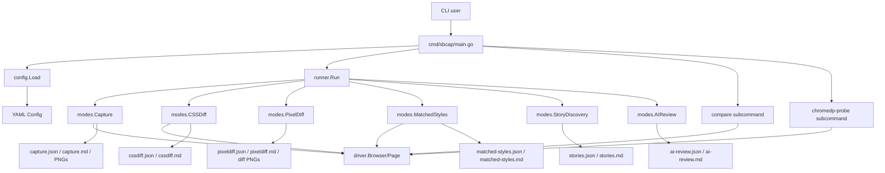

# Executive Summary

`sbcap` is already very close to the kind of standalone screen-diff utility we need. It is a small Go application with a clear separation between configuration loading, browser driving, orchestration, and comparison modes. The core loop is: load a YAML plan, open two browser targets, capture screenshots for named sections, compare computed CSS, optionally inspect matched cascade winners, optionally compute image diffs, and emit JSON/Markdown artifacts. The application is not yet a polished standalone product, but it already contains the essential technical spine for one.

The strongest part of the current system is that its data model is explicit and file-backed. It does not hide intent inside code. A capture plan defines metadata, original/react targets, section selectors, style selectors, output switches, and requested modes in one place (`/home/manuel/workspaces/2026-01-18/hair-booking-start/hair-booking/internal/sbcap/config/config.go:14-172`). The strongest engineering decision is that the browser driver is deliberately thin and the analysis logic lives in mode packages rather than in the CLI entrypoint (`/home/manuel/workspaces/2026-01-18/hair-booking-start/hair-booking/internal/sbcap/driver/chrome.go:13-115`, `/home/manuel/workspaces/2026-01-18/hair-booking-start/hair-booking/internal/sbcap/runner/runner.go:12-100`). That makes extraction realistic.

The biggest limitation is product shape. Today `sbcap` behaves like an internal operator tool, not a self-explanatory standalone diff application for designers and frontend engineers. It has three separate command surfaces (`run`, `compare`, `chromedp-probe`), a YAML-first workflow, a Glazed-based tabular output path, and several partially overlapping concepts (`capture`, `cssdiff`, `matched-styles`, `pixeldiff`, `compare`). Those are useful for internals, but they need consolidation into a simpler user-facing architecture if we want a standalone tool for direct screen comparison work.

This guide explains the current system in detail, identifies what should be kept vs simplified, and proposes an extraction design for a standalone screen diff application built from `sbcap`'s existing internals.

---

# 1. Problem Statement

We need to understand whether the `cmd/sbcap` application can be turned into a standalone screen diff tool suitable for workflows like “compare an original HTML reference screen against a current implementation and produce screenshots, CSS deltas, and richer diagnostics.” The target audience includes new interns, so the analysis needs to explain not only what the code does, but why the system is structured this way and where the extraction seams are.

Concretely, this investigation answers five questions:

1. What does `sbcap` do today, and through which packages?
2. Which subsystems are already reusable for a standalone app?
3. Which parts are specific to the current Glazed/CLI-driven internal workflow?
4. What evidence do we have that the tool actually runs?
5. What extraction design would give a new engineer a clear path from current code to a standalone screen diff product?

---

# 2. Repository Surface and Evidence Map

## 2.1 Observed package structure

The main executable surface is a single Go entrypoint:

- `/home/manuel/workspaces/2026-01-18/hair-booking-start/hair-booking/cmd/sbcap/main.go`

The implementation lives under:

- `/home/manuel/workspaces/2026-01-18/hair-booking-start/hair-booking/internal/sbcap/config`
- `/home/manuel/workspaces/2026-01-18/hair-booking-start/hair-booking/internal/sbcap/driver`
- `/home/manuel/workspaces/2026-01-18/hair-booking-start/hair-booking/internal/sbcap/runner`
- `/home/manuel/workspaces/2026-01-18/hair-booking-start/hair-booking/internal/sbcap/modes`
- `/home/manuel/workspaces/2026-01-18/hair-booking-start/hair-booking/internal/sbcap/ai`

Line counts from this investigation:

- `cmd/sbcap/main.go` — 446 lines
- `internal/sbcap/matched_styles.go` — 722 lines
- `internal/sbcap/compare.go` — 365 lines
- `internal/sbcap/cssdiff.go` — 230 lines
- `internal/sbcap/capture.go` — 225 lines
- `internal/sbcap/pixeldiff.go` — 171 lines
- `internal/sbcap/config/config.go` — 172 lines
- `internal/sbcap/driver/chrome.go` — 115 lines
- `internal/sbcap/runner/runner.go` — 100 lines

That size distribution tells us where the conceptual weight lives:

- `matched_styles` is the deepest mode and likely the most domain-specific browser/CSS logic.
- `compare`, `cssdiff`, and `capture` are the core user-facing diff capabilities.
- `driver`, `config`, and `runner` are orchestration infrastructure.

## 2.2 External dependencies

From `go.mod`, the tool depends on:

- `chromedp` and `cdproto` for browser automation and DevTools Protocol access
- `cobra` for traditional CLI commands
- `glazed` for parameter schema and tabular output
- `zerolog` for structured logging

This matters because extraction does **not** require inventing a new browser stack. The current browser automation is already CDP-based through chromedp.

---

# 3. Current System Architecture

## 3.1 High-level architecture

At a high level, `sbcap` looks like this:



The key observation is that the mode layer is already the functional core. `main.go` mostly parses options and dispatches. This is exactly what we want for extraction: a product can change its CLI or UI while preserving mode implementations.

## 3.2 Layered responsibilities

### Layer 1 — CLI and command wiring

`cmd/sbcap/main.go` does three jobs:

1. define the Glazed-powered `run` command (`main.go:39-143`),
2. define the standalone `compare` convenience command (`main.go:258-347`),
3. define the `chromedp-probe` diagnostic command (`main.go:380-446`).

This file is **not** the browser engine. It is the command adapter layer.

### Layer 2 — Config schema and validation

`internal/sbcap/config/config.go` defines the declarative plan:

- metadata
- original target
- react target
- sections
- styles
- output settings
- default modes

The most important design choice here is support for either a shared selector or per-target selectors (`config.go:46-63`, `config.go:116-145`). That is essential in real migrations, because the old DOM and the new DOM rarely line up 1:1.

### Layer 3 — Browser driver

`internal/sbcap/driver/chrome.go` wraps chromedp into two coarse types:

- `Browser`
- `Page`

This layer is intentionally tiny. It exposes only:

- new browser context
- new page
- set viewport
- navigate
- wait
- full screenshot
- selector screenshot
- arbitrary JS evaluation

That narrow surface is a strength. It keeps CDP details from leaking everywhere.

### Layer 4 — Runner/orchestrator

`internal/sbcap/runner/runner.go` turns mode names into actions. It normalizes mode lists, expands `full`, and executes each mode in sequence (`runner.go:26-100`).

This layer is the batch-pipeline orchestrator. It is not responsible for the details of screenshot capture or style analysis.

### Layer 5 — Mode implementations

The mode layer is the real product logic.

- `capture.go` — availability/visibility/screenshots per named section
- `cssdiff.go` — computed style snapshots and property-by-property diffs
- `matched_styles.go` — cascade-rule inspection and winning declaration analysis
- `pixeldiff.go` — image-level diff overlay generation
- `stories.go` — Storybook `index.json` discovery for story inventory
- `ai_review.go` — placeholder AI review pass backed by a noop AI client
- `compare.go` — a direct ad hoc comparison pipeline without YAML planning

---

# 4. Entrypoints and User-Facing Workflows

## 4.1 `sbcap run`

The `run` command is the batch-plan entrypoint. It expects a YAML config and a mode list (`main.go:49-78`, `main.go:84-143`).

Conceptually:

```text
load YAML config
resolve requested modes
run modes sequentially
emit Glazed rows for mode status
optionally emit coverage/story rows from generated artifacts
```

This is well suited to repeatable CI or scripted migration audits.

## 4.2 `sbcap compare`

The `compare` command is the closest existing shape to a standalone screen diff app (`main.go:258-347`). It does not require a YAML plan. Instead, it accepts:

- URL 1 + selector 1
- URL 2 + selector 2
- viewport
- CSS properties to compare
- attributes to capture
- output directory
- pixel threshold

This command is already a compact product surface. In many ways, the extraction plan should be “promote `compare` to the center of the product, and make `run` an advanced batch mode.”

## 4.3 `sbcap chromedp-probe`

The probe command is a diagnostic tool (`main.go:380-446`). It validates that:

- chromedp launches,
- navigation works,
- viewport override works,
- title evaluation works,
- selector lookup works.

This command is extremely useful operationally, because browser automation failures often come from environment problems rather than application logic. A standalone app should keep some form of this preflight.

---

# 5. Config Model and Why It Matters

The config model lives in `internal/sbcap/config/config.go:14-172`.

## 5.1 Core data structures

### `Target`

A target is one browser-rendered side of the diff:

- `name`
- `url`
- `wait_ms`
- `viewport`

This is the minimal information needed to open a browser page and capture something reproducibly.

### `SectionSpec`

A section is a named screenshot target:

- `name`
- shared selector or per-target selectors
- optional `ocr_question`

This is the right granularity for screen migration work: named regions rather than full-page-only comparison.

### `StyleSpec`

A style spec defines a named CSS comparison scope:

- shared selector or per-target selectors
- properties to compare
- whether to include bounds
- which element attributes to capture
- reporting hints such as `box_model`

This structure is richer than many visual diff tools, because it preserves semantic context instead of only pixels.

## 5.2 Validation behavior

Validation enforces:

- non-empty metadata slug
- valid URLs on both targets
- required output directory
- valid selector contract for each section/style entry

The subtle but important validation rule is:

- if `selector` is omitted, then both `selector_original` and `selector_react` are required

This prevents silent half-configured diffs.

## 5.3 What a new intern should understand

The YAML config is not just a convenience file. It is the **comparison contract**. It encodes:

- which pages are canonical,
- which DOM anchors matter,
- which CSS properties matter,
- which outputs are worth keeping.

For extraction, this should remain central even if we later add a friendlier UI editor on top.

---

# 6. Browser Driver Design

`internal/sbcap/driver/chrome.go:13-115` wraps chromedp with a deliberately small API.

## 6.1 Why this layer exists

Without a driver wrapper, every mode would repeat:

- browser allocation setup,
- page context setup,
- device metrics override,
- navigation,
- screenshot boilerplate,
- `chromedp.Evaluate` calls.

The current wrapper keeps those operations consistent.

## 6.2 What the wrapper does well

- centralizes browser lifecycle,
- exposes page-scoped operations,
- adds consistent structured logging,
- keeps mode packages focused on diff logic.

## 6.3 What it does **not** yet do

It does not abstract:

- network interception,
- console log capture,
- asset stabilization hooks,
- screenshot clipping beyond selector/full page,
- DOM snapshot helpers,
- automatic “wait until stable” semantics.

That means extraction into a richer standalone product should probably extend this layer rather than bypass it.

---

# 7. Mode-by-Mode Analysis

## 7.1 Capture mode

File: `/home/manuel/workspaces/2026-01-18/hair-booking-start/hair-booking/internal/sbcap/modes/capture.go:15-225`

### What it does

Capture mode:

1. opens original and react pages,
2. takes a full screenshot of each page,
3. loops through named `sections`,
4. checks whether each selector exists and is visible,
5. takes selector screenshots when present,
6. computes a coverage summary,
7. writes `capture.json` and `capture.md`.

### Why it matters

This is the migration coverage pass. It answers:

- did we render the expected regions on both sides?
- which regions are missing?
- which regions exist but are hidden?

### Hidden design strength

`evaluateDOMCheck` uses browser-side DOM + computed style + bounding box checks (`capture.go:215-224`). That is more useful than a plain `querySelector != null` check because it distinguishes missing from invisible.

### Limitation

Coverage is index-aligned. It compares `original.Sections[i]` to `react.Sections[i]` (`capture.go:194-212`) rather than using a stable key lookup map. That is fine for a well-formed config but brittle if section lists ever diverge after generation.

## 7.2 CSS diff mode

File: `/home/manuel/workspaces/2026-01-18/hair-booking-start/hair-booking/internal/sbcap/modes/cssdiff.go:16-230`

### What it does

CSS diff mode takes computed style snapshots for named selectors and selected properties, then writes diffs.

The browser-side script created in `evaluateStyle` (`cssdiff.go:149-185`) returns:

- whether the element exists,
- a map of requested computed properties,
- optional bounds,
- requested element attributes.

### Why it matters

This is the mode that turns “the design feels off” into specific property-level evidence:

- background-color changed,
- border-radius drifted,
- font-family diverged,
- bounds shifted.

### Strength

This mode is selector-semantic and property-focused. It gives more actionable output than a pure screenshot diff.

### Limitation

It only sees final computed values, not why they won in the cascade. That is why `matched_styles` exists.

## 7.3 Matched styles mode

File: `/home/manuel/workspaces/2026-01-18/hair-booking-start/hair-booking/internal/sbcap/modes/matched_styles.go:21-722`

### What it does

This mode drops deeper into the CSS domain by querying:

- matched CSS rules,
- computed style for the node,
- optional box model,
- inline styles,
- selector specificity,
- winning declarations per property.

The most important logic is:

1. collect all candidate declarations by property,
2. compare by `!important`,
3. compare by cascade origin,
4. compare by specificity,
5. compare by source order,
6. report the winning declaration on both sides.

### Why it matters

This is the most powerful diagnostic layer in the system. It answers not only “what changed?” but “which selector won, and why?”

That is exactly the kind of output a frontend engineer needs during restyling work.

### Strength

It turns CSS from a black box into an explainable decision tree.

### Limitation

The implementation is large and intricate. It is likely the first subsystem that would need dedicated extraction hardening, tests, and documentation if this becomes a product.

## 7.4 Pixel diff mode

File: `/home/manuel/workspaces/2026-01-18/hair-booking-start/hair-booking/internal/sbcap/modes/pixeldiff.go:12-171`

### What it does

Pixel diff mode reads screenshots from `capture.json`, pads the two images to the same size, computes a per-pixel color-distance threshold, paints changed pixels red, and writes:

- a diff-only PNG,
- a side-by-side comparison PNG,
- `pixeldiff.json`,
- `pixeldiff.md`.

### Strength

This mode is intentionally simple and deterministic. The util code in `pixeldiff_util.go` is short and readable.

### Limitation

It only works after capture mode. It is therefore a downstream artifact mode, not a first-class ad hoc comparison surface. For a standalone app, that dependency is acceptable in batch mode but awkward in interactive compare mode.

## 7.5 Story discovery mode

File: `/home/manuel/workspaces/2026-01-18/hair-booking-start/hair-booking/internal/sbcap/modes/stories.go:15-107`

### What it does

This mode fetches Storybook `index.json` from the react target and extracts story IDs/titles/names.

### Why it exists

This is effectively a discovery helper for “what can we compare?” It is not itself a diff mode.

### Extraction implication

This should likely become an optional discovery plugin or helper command in a standalone product, not part of the core compare path.

## 7.6 AI review mode

Files:

- `/home/manuel/workspaces/2026-01-18/hair-booking-start/hair-booking/internal/sbcap/modes/ai_review.go:14-112`
- `/home/manuel/workspaces/2026-01-18/hair-booking-start/hair-booking/internal/sbcap/ai/client.go:8-23`

### What it does today

It reads `capture.json`, finds any sections with `ocr_question`, and asks the configured AI client about the corresponding screenshots.

### What it actually means today

The AI client is a noop that always returns `ai client not configured`. So architecturally the seam exists, but the feature is not operational.

### Extraction implication

Treat AI review as an extension point, not a shipping core feature.

---

# 8. What We Learned from Running It

## 8.1 Verified commands

I ran and recorded the following:

- `go test ./cmd/sbcap ./internal/sbcap/...`
- `go build ./cmd/sbcap`
- `go run ./cmd/sbcap --help`
- `go run ./cmd/sbcap compare --help`
- `go run ./cmd/sbcap chromedp-probe --url https://example.com --selector h1 --wait-ms 500 --timeout-ms 15000`

All of those succeeded.

## 8.2 Verified browser automation works

The `chromedp-probe` command successfully:

- launched headless Chrome,
- navigated to `https://example.com`,
- waited,
- extracted title,
- verified one `h1` match.

That is important evidence that the app is not merely compiling; the browser pipeline is functional on this machine.

## 8.3 Verified direct compare mode works end to end

I created two simple local fixture pages and ran `sbcap compare` against `#hero-card` at `390x844`. The run produced:

- full-page screenshots,
- element screenshots,
- `compare.json`,
- `compare.json`,
- `diff_comparison.png`,
- `diff_only.png`.

The resulting report showed meaningful deltas:

- height changed,
- font-family changed,
- text color changed,
- background color changed,
- border-radius changed,
- box-shadow changed,
- pixel diff reported `18.6952%` changed pixels at threshold `30`.

That experiment is strong evidence that `compare` is already a viable seed for a standalone screen-diff workflow.

---

# 9. Why `sbcap` Already Points Toward a Standalone Screen Diff App

It already has almost every primitive such an app needs.

## 9.1 Needed primitives and current ownership

| Needed capability | Already present? | Current file(s) |
| --- | --- | --- |
| Launch headless browser | Yes | `driver/chrome.go` |
| Set mobile/desktop viewport | Yes | `driver/chrome.go` |
| Navigate and wait | Yes | `driver/chrome.go` |
| Full screenshots | Yes | `driver/chrome.go`, `capture.go`, `compare.go` |
| Element screenshots | Yes | `driver/chrome.go`, `capture.go`, `compare.go` |
| Computed CSS extraction | Yes | `cssdiff.go` |
| Cascade winner introspection | Yes | `matched_styles.go` |
| Pixel diff overlays | Yes | `pixeldiff.go`, `pixeldiff_util.go` |
| Markdown/JSON report output | Yes | several modes |
| Ad hoc compare command | Yes | `main.go`, `compare.go` |
| Story discovery | Yes | `stories.go` |
| AI seam | Partially | `ai_review.go`, `ai/client.go` |

## 9.2 Why this is enough

A standalone app does **not** need to start from zero. It needs to do three things:

1. simplify the product surface,
2. stabilize the core comparison APIs,
3. improve packaging and ergonomics.

The analysis above shows the underlying mechanics are already there.

---

# 10. Gaps Between Current `sbcap` and a Standalone Product

## 10.1 Product surface is split across overlapping workflows

Today there are at least two comparison paths:

- config-driven `run`
- direct `compare`

These overlap conceptually. A standalone product should clarify:

- is the primary unit of work an ad hoc compare session?
- or a reusable capture plan?

My recommendation: make **ad hoc compare** the primary interface and treat batch plans as a reusable “project file” feature.

## 10.2 Artifact model is file-centric but not domain-centric

Outputs are currently named by mode:

- `capture.json`
- `cssdiff.json`
- `matched-styles.json`
- `pixeldiff.json`
- etc.

That is fine internally, but a standalone app may want a single richer session artifact such as:

- `session.json`
- `summary.md`
- `artifacts/screenshots/*`
- `artifacts/diffs/*`

with sub-sections for all analysis layers.

## 10.3 Browser stabilization is too primitive for UI-heavy apps

Waiting is currently based on fixed `wait_ms` values. That works, but it is fragile.

A more product-ready tool should support richer waits:

- selector present,
- fonts ready,
- network idle,
- custom JS predicate,
- animation disabling.

## 10.4 AI mode is a seam, not a feature

The AI review path exists architecturally but is not configured. That is fine, but it should be framed honestly in the standalone extraction plan.

## 10.5 Glazed dependency is helpful but not essential for productization

Glazed is useful for internal CLI ergonomics, especially tabular output, but it is not fundamental to the diff engine. A standalone app could keep it, reduce it, or replace it with plain Cobra depending on target audience.

---

# 11. Proposed Extraction Architecture

## 11.1 Design goal

Extract `sbcap` into a standalone screen diff application that supports two first-class workflows:

1. **single compare session** — “compare this original screen against this current screen now”
2. **saved project plan** — “run the same comparisons again later or in CI”

## 11.2 Proposed package structure

```text
cmd/screendiff/
  main.go

internal/screendiff/
  app/              # top-level commands / orchestration
  config/           # project/session config schema
  browser/          # browser driver abstraction (from sbcap/driver)
  session/          # common session artifact model
  compare/          # direct compare workflow (from modes/compare)
  capture/          # region capture workflow (from modes/capture)
  style/            # computed style diff logic (from modes/cssdiff)
  cascade/          # matched/winner logic (from modes/matched_styles)
  pixels/           # pixel diff logic (from modes/pixeldiff + util)
  discovery/        # optional story discovery
  ai/               # optional AI hooks
  report/           # markdown/json/html report generation
```

## 11.3 Extraction principles

### Keep

- browser driver wrapper
- config schema idea
- compare mode concept
- capture mode concept
- CSS diff and matched-style logic
- pixel diff math and image generation

### Change

- unify outputs around a single session model
- simplify CLI surface
- move “report writing” out of individual modes into a report layer
- separate reusable libraries from command adapters
- add better waiting/stabilization options

### Defer

- AI review as a hard requirement
- Storybook discovery as a core product feature

---

# 12. Proposed Runtime Model for the Standalone App

## 12.1 Core session object

Instead of each mode writing its own standalone top-level JSON, define one session object.

### Pseudocode

```go
type Session struct {
    Meta SessionMeta
    Inputs SessionInputs
    Screenshots ScreenshotArtifacts
    Regions []RegionComparison
    Summary SummaryMetrics
}

type RegionComparison struct {
    Name string
    SelectorA string
    SelectorB string

    Existence ExistenceComparison
    Computed  ComputedStyleComparison
    Cascade   CascadeComparison
    Pixels    PixelComparison
}
```

This preserves all current data while making the output easier to consume by:

- humans,
- CI,
- a future UI,
- downstream scripts.

## 12.2 Command surface

### Recommended commands

```text
screendiff compare      # direct URL/selector compare
screendiff run          # run a saved plan/project
screendiff doctor       # browser/env/config diagnostics
screendiff discover     # optional Storybook/project discovery
```

### Why this is cleaner

- `compare` is the main user path
- `run` is the automation path
- `doctor` replaces the ad hoc probe concept with a more product-like diagnostic verb

---

# 13. API Sketches for an Intern

## 13.1 Browser API

```go
type Browser interface {
    NewPage() (Page, error)
    Close()
}

type Page interface {
    SetViewport(width, height int) error
    Goto(url string) error
    Wait(ms int) error
    WaitForSelector(selector string) error
    ScreenshotSelector(selector string, path string) error
    ScreenshotFull(path string) error
    Evaluate(script string, out any) error
    Close()
}
```

The current `driver.Page` is already close to this.

## 13.2 Comparison API

```go
type CompareRequest struct {
    URLA string
    URLB string
    SelectorA string
    SelectorB string
    Viewport Viewport
    Props []string
    Attrs []string
    Threshold int
}

func Compare(ctx context.Context, req CompareRequest) (*Session, error)
```

This is the natural evolution of `modes.CompareSettings`.

## 13.3 Report API

```go
type Writer interface {
    WriteJSON(path string, session *Session) error
    WriteMarkdown(path string, session *Session) error
    WriteHTML(path string, session *Session) error
}
```

Right now report writing is scattered. Extraction should centralize it.

---

# 14. Comparison of Extraction Options

## Option A — keep sbcap mostly as-is and add a wrapper

### Pros

- fastest path
- minimal refactor
- preserves working commands

### Cons

- keeps conceptual duplication (`run` vs `compare`)
- keeps outputs fragmented by mode
- keeps intern onboarding harder than necessary

## Option B — extract reusable libraries and build a new standalone CLI on top

### Pros

- cleanest long-term architecture
- simpler product surface
- easier for new engineers to reason about
- keeps sbcap internals reusable

### Cons

- more up-front refactoring
- needs careful artifact-model design

## Option C — rewrite from scratch inspired by sbcap

### Pros

- maximal freedom

### Cons

- highest risk
- throws away proven logic
- duplicates already-working chromedp and diff behavior

## Recommendation

Choose **Option B**.

This is the right balance:

- reuse proven logic,
- remove product confusion,
- keep intern onboarding manageable.

---

# 15. Implementation Plan

## Phase 1 — freeze and document current behavior

Goal: preserve confidence before refactoring.

Steps:

1. keep current `sbcap` behavior green with tests,
2. create fixture-based compare tests for ad hoc compare behavior,
3. capture sample artifacts from real runs,
4. document expected outputs.

## Phase 2 — extract reusable core packages

Goal: separate domain logic from command adapters.

Steps:

1. move driver into extraction-friendly browser package,
2. move compare/capture/style/cascade/pixels into clearer packages,
3. define a shared session/result model,
4. update existing commands to consume the new core.

## Phase 3 — build the standalone CLI

Goal: expose the cleaner surface.

Steps:

1. add `compare`, `run`, `doctor`, `discover` commands,
2. keep direct flag usage simple,
3. add explicit stabilization flags,
4. emit one cohesive session bundle.

## Phase 4 — improve reporting

Goal: make outputs easier to consume.

Steps:

1. produce a single summary markdown report,
2. produce machine-readable JSON session data,
3. optionally add HTML report output with embedded thumbnails and links.

## Phase 5 — optional product features

Goal: reduce operator friction.

Candidates:

- config generator from compare sessions,
- selector picker,
- CSS-property presets,
- AI review plugin,
- Storybook discovery as a discovery helper.

---

# 16. Intern Onboarding Notes

A new intern should understand these mental models before changing code:

## 16.1 There are three kinds of comparison in this system

1. **existence/coverage** — is the thing there?
2. **semantic/CSS** — what computed styles differ?
3. **visual/pixel** — what changed visually?

All three matter. None is sufficient alone.

## 16.2 The browser is not the product boundary

Chromedp is just the automation substrate. The real product is the comparison and reporting model.

## 16.3 Config is a contract, not just input

If selectors are ambiguous or unstable, the diff quality collapses. Good config design is part of the product.

## 16.4 `matched_styles` is the advanced debugger

If `cssdiff` says “property changed,” `matched_styles` should answer “which rule won and why?”

---

# 17. Risks and Sharp Edges

## 17.1 Fixed waits cause flaky captures

Current use of `wait_ms` is pragmatic but brittle. Dynamic apps can render incomplete states or transient animations.

## 17.2 Selector brittleness

The system assumes the operator knows the right selectors. This is reasonable for engineers but harder for designers.

## 17.3 Output fragmentation

Separate mode files are easy to generate but harder to consume as one comparison story.

## 17.4 Matched-style complexity

This mode is powerful but harder to maintain. Any extraction should protect it with tests and careful API boundaries.

## 17.5 AI review is currently aspirational

Do not design the standalone product around AI being ready today.

---

# 18. Concrete Recommendation

If the goal is a standalone screen diff application for visual migration work, `sbcap` should be treated as the seed implementation, not merely as inspiration.

### Keep immediately

- chromedp driver wrapper
- direct compare workflow
- computed style diff logic
- matched style winner logic
- pixel diff math

### Refactor next

- unify results into a single session model
- simplify command surface
- move report writing out of individual mode packages
- add better wait/stability strategies

### Defer until later

- AI review
- Story discovery as a core path
- richer UX layers like selector picker or HTML dashboards

---

# 19. References

## Primary files

- `/home/manuel/workspaces/2026-01-18/hair-booking-start/hair-booking/cmd/sbcap/main.go`
- `/home/manuel/workspaces/2026-01-18/hair-booking-start/hair-booking/internal/sbcap/config/config.go`
- `/home/manuel/workspaces/2026-01-18/hair-booking-start/hair-booking/internal/sbcap/driver/chrome.go`
- `/home/manuel/workspaces/2026-01-18/hair-booking-start/hair-booking/internal/sbcap/runner/runner.go`
- `/home/manuel/workspaces/2026-01-18/hair-booking-start/hair-booking/internal/sbcap/modes/capture.go`
- `/home/manuel/workspaces/2026-01-18/hair-booking-start/hair-booking/internal/sbcap/modes/cssdiff.go`
- `/home/manuel/workspaces/2026-01-18/hair-booking-start/hair-booking/internal/sbcap/modes/compare.go`
- `/home/manuel/workspaces/2026-01-18/hair-booking-start/hair-booking/internal/sbcap/modes/matched_styles.go`
- `/home/manuel/workspaces/2026-01-18/hair-booking-start/hair-booking/internal/sbcap/modes/pixeldiff.go`
- `/home/manuel/workspaces/2026-01-18/hair-booking-start/hair-booking/internal/sbcap/modes/stories.go`
- `/home/manuel/workspaces/2026-01-18/hair-booking-start/hair-booking/internal/sbcap/modes/ai_review.go`
- `/home/manuel/workspaces/2026-01-18/hair-booking-start/hair-booking/internal/sbcap/ai/client.go`

## Experiment scripts created for this ticket

- `/home/manuel/workspaces/2026-04-21/hair-v2/hair-booking/ttmp/2026/04/21/HAIR-017--analyze-sbcap-and-extract-a-standalone-screen-diff-application/scripts/01_build_test_and_probe.sh`
- `/home/manuel/workspaces/2026-04-21/hair-v2/hair-booking/ttmp/2026/04/21/HAIR-017--analyze-sbcap-and-extract-a-standalone-screen-diff-application/scripts/02_compare_fixture.sh`

## Experiment artifacts

- `/home/manuel/workspaces/2026-04-21/hair-v2/hair-booking/ttmp/2026/04/21/HAIR-017--analyze-sbcap-and-extract-a-standalone-screen-diff-application/various/01-build-test-probe/output.log`
- `/home/manuel/workspaces/2026-04-21/hair-v2/hair-booking/ttmp/2026/04/21/HAIR-017--analyze-sbcap-and-extract-a-standalone-screen-diff-application/various/02-compare-fixture/output/compare.json`
