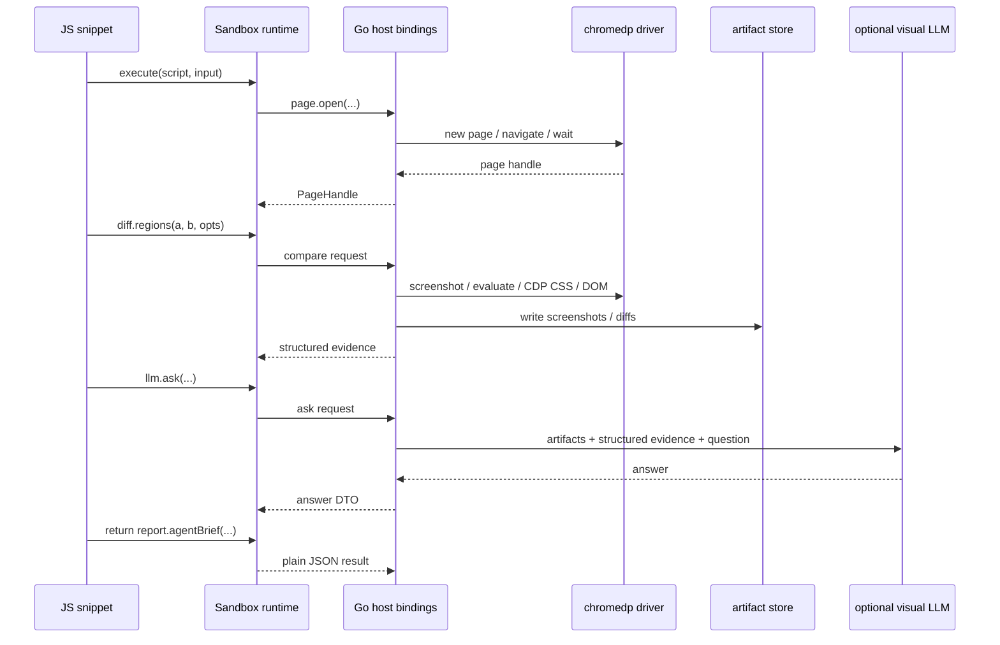

# Executive Summary

`css-visual-diff` already contains most of the hard browser-analysis primitives we need for a programmable evidence-gathering tool. Today those primitives are hidden behind a small set of fixed entrypoints: a YAML-driven `run` command, an ad hoc `compare` command, and a `chromedp-probe` diagnostic command (`/home/manuel/workspaces/2026-04-21/hair-v2/css-visual-diff/cmd/css-visual-diff/main.go:39-446`). The browser layer is intentionally thin (`/home/manuel/workspaces/2026-04-21/hair-v2/css-visual-diff/internal/cssvisualdiff/driver/chrome.go:13-115`), and the core logic is already decomposed into distinct evidence modes such as computed-style capture, matched-style cascade inspection, and pixel diffing (`/home/manuel/workspaces/2026-04-21/hair-v2/css-visual-diff/internal/cssvisualdiff/modes/*.go`).

That architecture is a good foundation for a sandboxed JavaScript DSL. Instead of forcing users to choose among a few fixed workflows, the tool can expose Go-backed primitives to short JS snippets that describe the exact evidence needed for a task. A snippet should be able to say: “open these pages, select these regions, gather these properties, compute this diff, ask this precise question, and return a concise JSON brief for the coding agent.” The DSL should not expose raw browser internals directly. It should expose a small, carefully designed query surface that is task-oriented, serializable, safe to run in a sandbox, and easy to optimize inside Go.

This document explains the current architecture, shows why it is a strong fit for a JS-based orchestration layer, and proposes a concrete design for that DSL. It includes a recommended object model, example scripts, host/runtime boundaries, return schemas, phased implementation steps, testing strategy, and the file-by-file guidance a new intern would need to begin implementing the feature.

---

# 1. Problem Statement

The current `css-visual-diff` executable is good at performing a few pre-defined comparison workflows, but it is not yet good at letting a coding agent ask a very specific browser evidence question. The gap is not that the tool lacks browser access. The gap is that the orchestration layer is too fixed.

Right now, a user can:

- run a YAML plan over multiple modes,
- compare one selector across two targets,
- or run a diagnostic probe.

What the user cannot do elegantly is express narrowly tailored investigative programs such as:

- “compare only the padding, line-height, and background color of these two widgets, then return the top five actionable deltas,”
- “capture box model and winning declarations for this selector and summarize only spacing-related evidence,”
- “collect screenshots plus structured CSS evidence and send only that evidence to a visual LLM,”
- “walk four regions on a page, rank them by visual drift, and return only the worst two.”

The desired outcome is therefore a **programmable, sandboxed JS query layer** that:

1. reuses the existing Go/browser primitives,
2. is more flexible than the current CLI surface,
3. can return concise, token-efficient structured evidence,
4. can optionally hand gathered artifacts to a third-party visual LLM,
5. remains safe and bounded.

---

# 2. Current-State Architecture of css-visual-diff

## 2.1 Current entrypoints

The main executable surface is in:

- `/home/manuel/workspaces/2026-04-21/hair-v2/css-visual-diff/cmd/css-visual-diff/main.go`

It exposes three user-facing paths:

1. `run` — a YAML-driven batch pipeline backed by Glazed (`main.go:39-143`),
2. `compare` — a direct two-URL, two-selector comparison path (`main.go:234-347`),
3. `chromedp-probe` — a minimal browser sanity-check command (`main.go:371-446`).

This is already a useful split for CLI work, but it also reveals the main limitation: orchestration logic is still command-specific rather than scriptable.

## 2.2 Config model

The declarative batch model lives in:

- `/home/manuel/workspaces/2026-04-21/hair-v2/css-visual-diff/internal/cssvisualdiff/config/config.go`

Key structures:

- `Target` — URL, wait time, viewport (`config.go:34-44`)
- `SectionSpec` — region-level screenshot selectors (`config.go:46-52`)
- `StyleSpec` — CSS-oriented comparison selectors and property lists (`config.go:54-63`)
- `OutputSpec` — artifact switches (`config.go:65-70`)
- `Config` — top-level plan (`config.go:72-80`)

Important design detail:

- selectors can be shared or per-target (`selector` vs `selector_original` / `selector_react`, `config.go:121-145`)

That is a key clue for the future DSL: a useful programmable API must support region identity independent of DOM identity.

## 2.3 Browser layer

The browser driver is deliberately thin:

- `/home/manuel/workspaces/2026-04-21/hair-v2/css-visual-diff/internal/cssvisualdiff/driver/chrome.go`

Current primitives include:

- create browser (`NewBrowser`, `chrome.go:25-36`)
- create page (`NewPage`, `chrome.go:48-52`)
- set viewport (`SetViewport`, `chrome.go:65-72`)
- navigate (`Goto`, `chrome.go:74-81`)
- wait (`Wait`, `chrome.go:83-86`)
- full screenshot (`FullScreenshot`, `chrome.go:88-96`)
- selector screenshot (`Screenshot`, `chrome.go:98-106`)
- evaluate arbitrary JS (`Evaluate`, `chrome.go:108-115`)

This is one of the strongest signs that a DSL is the right next step. The browser driver is already generic enough that a higher-level programmable query language can sit on top of it.

## 2.4 Mode layer

The functional core is in:

- `/home/manuel/workspaces/2026-04-21/hair-v2/css-visual-diff/internal/cssvisualdiff/modes/`

The most relevant modes are:

- `compare.go` — direct two-region comparison with screenshots, computed diffs, matched-style winners, and pixel diff (`compare.go:16-365`)
- `cssdiff.go` — computed style extraction with optional bounds and attributes (`cssdiff.go:16-230`)
- `matched_styles.go` — matched CSS rule and cascade winner analysis using CDP CSS/DOM APIs (`matched_styles.go:21-722`)
- `pixeldiff.go` / `pixeldiff_util.go` — image-level diff generation
- `ai_review.go` — placeholder AI review path currently backed by a noop client (`ai_review.go:31-90`)

The runner simply sequences these modes:

- `/home/manuel/workspaces/2026-04-21/hair-v2/css-visual-diff/internal/cssvisualdiff/runner/runner.go:61-100`

---

# 3. Why the Current Architecture Is a Good Fit for a JS DSL

The current system already has the right layers for a host-backed scripting model.

## 3.1 What is already present

### Browser primitives exist

The browser layer already knows how to:

- open targets,
- set viewports,
- navigate,
- wait,
- capture screenshots,
- run evaluation scripts.

### Evidence primitives exist

The mode layer already knows how to gather:

- computed style values (`cssdiff.go:149-185`),
- element attributes and bounds (`cssdiff.go:149-185`),
- matched rules and winners (`matched_styles.go:219-370`),
- pixel-diff artifacts (`compare.go:171-184`, `compare.go:340-365`).

### Structured output already exists

The compare path already returns a strongly shaped result with:

- inputs,
- side artifacts,
- computed diffs,
- winner diffs,
- pixel diff stats (`compare.go:40-88`, `compare.go:186-205`).

That means the missing piece is mostly a better orchestration interface.

## 3.2 What is still missing

The current tool does **not** yet provide:

- a programmable host runtime,
- a safe sandbox for user-defined logic,
- a compact evidence-query vocabulary,
- a mechanism for task-specific result shaping,
- a clean abstraction for “gather evidence, then ask a visual LLM.”

The current `Evaluate(script string, out any)` method (`chrome.go:108-115`) is too low-level to be the public scripting interface. It is a host primitive, not the DSL itself.

---

# 4. High-Level Design Goal

The goal is to let users write tiny task-specific JavaScript “query plans” that run in a sandbox and call a set of Go-backed host primitives.

The key principle is:

> **JavaScript should describe what evidence to gather, not reimplement how browser inspection works.**

That means the JS layer should be declarative and task-oriented, while Go remains responsible for:

- browser lifetime,
- CDP access,
- screenshot generation,
- CSS parsing / rule resolution,
- diff computation,
- artifact storage,
- resource limits,
- optional external LLM invocation.

---

# 5. Proposed Object Model for the DSL

## 5.1 Core namespaces

I recommend exposing exactly five top-level namespaces into the sandbox:

1. `page`
2. `diff`
3. `llm`
4. `report`
5. `host`

### Why these five

- `page` covers navigation and region selection.
- `diff` covers evidence comparisons.
- `llm` covers optional model handoff.
- `report` covers token-efficient output shaping.
- `host` provides a place for specialized high-level helpers later without polluting the more stable primitives.

## 5.2 Core object graph

```mermaid
flowchart TD
    A[JS snippet] --> B[page.open]
    B --> C[PageHandle]
    C --> D[region(selector)]
    D --> E[RegionHandle]
    E --> F[snapshot]
    E --> G[screenshot]
    E --> H[computed]
    E --> I[matchedStyles]

    A --> J[diff.regions]
    F --> J
    H --> J
    I --> J

    J --> K[Structured evidence]
    K --> L[report.agentBrief]
    K --> M[llm.ask]
```

---

# 6. Proposed JavaScript API

## 6.1 `page.open`

```js
const p = await page.open({
  url: "http://localhost:5173",
  viewport: { width: 390, height: 844 },
  waitFor: { ms: 300 }
});
```

### Return type

`PageHandle`

### Responsibilities

- create a browser page from the Go driver,
- set viewport,
- navigate,
- apply host-controlled waiting logic.

### Why not expose raw browser APIs

A coding-agent-oriented DSL should not need raw `chromedp` or raw DOM APIs. Those are too broad, harder to sandbox, and likely to encourage token-expensive scripts.

## 6.2 `PageHandle.region`

```js
const hero = p.region("#hero");
const card = p.region({ selector: ".pricing-card" });
const crop = p.region({ x: 20, y: 120, width: 320, height: 180 });
```

### Return type

`RegionHandle`

### Why this matters

The DSL needs a common abstraction for page subsets. The existing tool already works on selectors and sections, so `RegionHandle` is the natural bridge between the current mode layer and the future scripting layer.

## 6.3 `RegionHandle.snapshot`

```js
const snap = await hero.snapshot({
  text: true,
  html: "outer",
  box: true,
  attrs: ["id", "class", "data-testid"],
  computed: ["font-size", "color", "padding"],
  matchedStyles: {
    properties: ["color", "padding"],
    limit: 10
  },
  screenshot: true
});
```

### Recommended return shape

```json
{
  "exists": true,
  "visible": true,
  "text": "Book now",
  "html": "<button class=...>",
  "box": { "x": 20, "y": 40, "width": 120, "height": 44 },
  "attrs": { "class": "btn-primary" },
  "computed": { "padding": "12px 20px", "color": "rgb(...)" },
  "matchedStyles": {
    "winners": [...],
    "rules": [...]
  },
  "artifacts": {
    "screenshot": "artifacts/hero.png"
  }
}
```

### Implementation note

This should not be one monolithic reimplementation. Internally it should delegate to:

- style evaluation logic from `cssdiff.go:149-185`,
- matched-style evaluation logic from `matched_styles.go:219-305`,
- screenshot logic from `chrome.go:88-106`.

## 6.4 `diff.regions`

```js
const result = await diff.regions(left.region("#hero"), right.region(".hero"), {
  computed: ["font-size", "line-height", "padding", "color"],
  box: true,
  pixels: { threshold: 20 },
  matchedStyles: { properties: ["padding", "color"] },
  screenshot: true
});
```

### Recommended return shape

- both side snapshots,
- computed property diffs,
- winner diffs,
- pixel diff stats,
- optional artifact paths.

This should be implemented largely as a refactoring of the current `modes.Compare` logic (`compare.go:90-219`) into a reusable service object.

## 6.5 `llm.ask`

```js
const answer = await llm.ask({
  question: "Why does the right version feel more cramped?",
  inputs: [
    result.artifacts.left,
    result.artifacts.right,
    result.artifacts.diff,
    result.computedDiffs,
    result.winnerDiffs
  ],
  style: "precise"
});
```

### Important note

The current AI path is not production-ready. `ai_review.go` currently instantiates `ai.NoopClient{}` (`ai_review.go:43`), so any future `llm` namespace should be treated as a new subsystem, not a minor extension of the current AI mode.

## 6.6 `report.agentBrief`

```js
return report.agentBrief({
  question: "What exact CSS changes should I make?",
  evidence: result,
  maxBullets: 8
});
```

### Why this matters

This is one of the main product features. The DSL should make it easy to emit concise, token-efficient JSON tailored for a coding agent instead of dumping every raw artifact.

## 6.7 `host` for specialized helpers

```js
const summary = await host.compareForAgent({
  left: { url: input.leftUrl, selector: input.leftSelector },
  right: { url: input.rightUrl, selector: input.rightSelector },
  focus: ["spacing", "radius", "color"],
  maxChanges: 6
});
```

This namespace is intentionally optional and future-facing. It is the right place for compound helpers once the lower-level API stabilizes.

---

# 7. Example Scripts

## 7.1 Exact button diff for a coding agent

```js
const left = await page.open({
  url: "http://localhost:3000/reference",
  viewport: { width: 1280, height: 900 }
});

const right = await page.open({
  url: "http://localhost:5173",
  viewport: { width: 1280, height: 900 }
});

const result = await diff.regions(
  left.region(".btn-primary"),
  right.region(".button-primary"),
  {
    computed: [
      "font-family",
      "font-size",
      "font-weight",
      "padding-top",
      "padding-right",
      "padding-bottom",
      "padding-left",
      "border-radius",
      "color",
      "background-color",
      "box-shadow"
    ],
    matchedStyles: { properties: ["padding-top", "border-radius", "background-color"] },
    pixels: { threshold: 20 },
    screenshot: true
  }
);

return report.agentBrief({
  question: "What exact CSS changes should be made to match the reference button?",
  evidence: result,
  maxBullets: 6
});
```

## 7.2 Deep inspection of one widget

```js
const p = await page.open({
  url: "http://localhost:5173",
  viewport: { width: 390, height: 844 },
  waitFor: { selector: ".pricing-card" }
});

const card = p.region(".pricing-card");

const snap = await card.snapshot({
  text: true,
  html: "outer",
  box: true,
  attrs: ["class", "data-state"],
  computed: [
    "display",
    "width",
    "height",
    "padding",
    "gap",
    "background-color",
    "border-radius",
    "box-shadow",
    "font-family",
    "font-size"
  ],
  matchedStyles: {
    properties: ["padding", "gap", "background-color", "border-radius"],
    limit: 8
  },
  screenshot: true
});

return {
  widget: "pricing-card",
  text: snap.text,
  box: snap.box,
  keyStyles: snap.computed,
  winningRules: snap.matchedStyles.winners,
  screenshot: snap.artifacts.screenshot
};
```

## 7.3 Structured handoff to a visual LLM

```js
const comparison = await diff.regions(
  left.region("#hero"),
  right.region("#hero"),
  {
    computed: ["font-size", "line-height", "padding", "color", "background-color"],
    box: true,
    pixels: { threshold: 20 },
    screenshot: true
  }
);

const answer = await llm.ask({
  question: "Describe the top 5 visually meaningful differences. Use the CSS evidence when possible.",
  inputs: [
    comparison.artifacts.left,
    comparison.artifacts.right,
    comparison.artifacts.diff,
    comparison.computedDiffs,
    comparison.winnerDiffs
  ],
  style: "precise"
});

return {
  evidence: report.compact(comparison, {
    include: ["computedDiffs", "winnerDiffs", "pixelDiff"]
  }),
  llm: answer
};
```

---

# 8. Sandbox Model

The sandbox must be strict. The goal is to let users script evidence queries, not run arbitrary programs.

## 8.1 Allowed

- `async` / `await`
- arrays, objects, strings, numbers, booleans
- loops and small helper functions
- host-provided globals only:
  - `page`
  - `diff`
  - `llm`
  - `report`
  - `host`

## 8.2 Disallowed

- arbitrary `fetch`
- filesystem access
- subprocesses
- unrestricted timers
- dynamic imports / package loading
- access to Go runtime internals

## 8.3 Resource limits

The host should enforce:

- max runtime duration,
- max open pages,
- max screenshot count,
- max artifact size,
- max return JSON size,
- max LLM calls.

## 8.4 Why not expose raw DOM APIs directly

The current driver already supports raw evaluation (`chrome.go:108-115`), but that should remain an implementation detail. If the DSL exposes raw DOM and arbitrary evaluation broadly, then:

- scripts become brittle,
- host optimization becomes harder,
- token usage becomes less predictable,
- sandboxing becomes more dangerous.

The DSL should feel like a query language, not like unrestricted browser scripting.

---

# 9. Proposed Host Architecture in Go

## 9.1 New package layout

I recommend the following new packages inside `css-visual-diff`:

```text
cmd/css-visual-diff/
  main.go

internal/cssvisualdiff/
  browser/        # optional rename of driver later
  evidence/       # reusable evidence gatherers extracted from modes
  session/        # artifact/session bookkeeping
  dsl/
    runtime.go    # JS VM lifecycle + resource limits
    api_page.go   # page / region host bindings
    api_diff.go   # diff host bindings
    api_llm.go    # optional future visual-LLM bindings
    api_report.go # concise output shaping helpers
    types.go      # host-facing DTOs
  services/
    compare.go    # extracted compare orchestration
    snapshot.go   # region snapshot orchestration
```

## 9.2 Why extract services before binding JS

The current mode layer is still command/report oriented. For example:

- `modes.Compare` both gathers evidence and writes files (`compare.go:90-219`),
- `CSSDiff` both drives the browser and writes mode reports (`cssdiff.go:57-146`).

A DSL runtime should bind to **services**, not to CLI/report functions. So the first implementation step should be extracting reusable service-layer methods like:

- `CaptureRegionSnapshot(...)`
- `CompareRegions(...)`
- `ComputePixelDiff(...)`
- `GatherMatchedStyles(...)`

Then the CLI and JS runtime can both call those services.

## 9.3 Recommended runtime interface

### Pseudocode

```go
type Runtime struct {
    browserPool BrowserPool
    artifactStore ArtifactStore
    llmClient LLMClient
    limits Limits
}

func (r *Runtime) ExecuteScript(ctx context.Context, script string, input map[string]any) (any, error)
```

### Host bindings

```go
type PageAPI interface {
    Open(ctx context.Context, opts OpenPageOptions) (*PageHandle, error)
}

type DiffAPI interface {
    CompareRegions(ctx context.Context, left *RegionHandle, right *RegionHandle, opts CompareOptions) (*CompareResult, error)
}
```

The actual JS engine can be implemented with a sandbox-friendly Go JS runtime such as `goja`, but the architecture should not couple business logic too tightly to a specific VM package.

---

# 10. Execution Flow



---

# 11. Return Shapes and Token Efficiency

This DSL only becomes valuable for coding agents if it makes concise output easy.

## 11.1 Default return rule

Every host object returned to JS should ultimately collapse into plain JSON.

## 11.2 Recommended output helpers

### `report.compact`

For schema slicing:

```js
report.compact(result, {
  include: ["computedDiffs", "pixelDiff.changedPercent"]
})
```

### `report.agentBrief`

For coding-agent summaries:

```js
report.agentBrief({
  question: "What should change?",
  evidence: result,
  maxBullets: 8,
  focus: ["spacing", "typography", "shape"]
})
```

### Why this is important

The current mode outputs are rich but verbose. They are excellent artifacts, but not always ideal prompt payloads. The DSL should treat concise reshaping as a first-class feature.

---

# 12. Implementation Plan

## Phase 1 — Extract reusable evidence services

Goal: separate browser evidence collection from CLI/report writing.

### Work items

1. Create an `evidence` or `services` package.
2. Move reusable logic out of `modes.Compare`, `CSSDiff`, and `MatchedStyles` into functions that return plain structs.
3. Keep current CLI behavior unchanged by making mode functions call the new services.

### File guidance

Start from:

- `/home/manuel/workspaces/2026-04-21/hair-v2/css-visual-diff/internal/cssvisualdiff/modes/compare.go`
- `/home/manuel/workspaces/2026-04-21/hair-v2/css-visual-diff/internal/cssvisualdiff/modes/cssdiff.go`
- `/home/manuel/workspaces/2026-04-21/hair-v2/css-visual-diff/internal/cssvisualdiff/modes/matched_styles.go`

## Phase 2 — Add a script runtime package

Goal: execute sandboxed JS snippets with host bindings.

### Work items

1. Add `internal/cssvisualdiff/dsl/runtime.go`.
2. Define page/region/diff host interfaces.
3. Expose stable DTOs for script I/O.
4. Add runtime limits.

## Phase 3 — Implement the minimal JS API

Goal: support the smallest useful scripting surface.

### Minimum version

- `page.open`
- `PageHandle.region`
- `RegionHandle.snapshot`
- `diff.regions`
- `report.agentBrief`

Defer `llm.ask` until the host-side LLM integration is real.

## Phase 4 — Add a CLI entrypoint for scripts

Goal: make the feature usable from the command line.

### Example shape

```bash
css-visual-diff script --file examples/button_diff.js --input input.json
```

### Output

- stdout JSON by default,
- optional artifact directory on disk,
- optional markdown/html report helpers later.

## Phase 5 — Add optional LLM integration

Goal: support precise model-assisted answering only after evidence gathering is stable.

This should be built as a separate host client, not as a continuation of the current noop AI review path.

---

# 13. Testing Strategy

## 13.1 Unit tests

Add tests for:

- option validation,
- result DTO shaping,
- candidate winner ordering,
- output compaction,
- runtime limit enforcement.

Reuse and extend existing mode tests where possible:

- `/home/manuel/workspaces/2026-04-21/hair-v2/css-visual-diff/internal/cssvisualdiff/config/config_test.go`
- `/home/manuel/workspaces/2026-04-21/hair-v2/css-visual-diff/internal/cssvisualdiff/modes/compare_test.go`
- `/home/manuel/workspaces/2026-04-21/hair-v2/css-visual-diff/internal/cssvisualdiff/modes/matched_styles_test.go`
- `/home/manuel/workspaces/2026-04-21/hair-v2/css-visual-diff/internal/cssvisualdiff/modes/pixeldiff_test.go`

## 13.2 Integration tests

Create small fixture pages and script fixtures such as:

- `testdata/fixtures/page_a.html`
- `testdata/fixtures/page_b.html`
- `testdata/scripts/button_diff.js`

Then run:

```bash
css-visual-diff script --file testdata/scripts/button_diff.js --input testdata/input/button.json
```

Validate:

- JSON schema,
- expected changed properties,
- artifact file creation.

## 13.3 Sandbox tests

Add tests for rejected behavior:

- filesystem access attempts,
- oversized return payloads,
- too many pages/screenshots,
- infinite loop / timeout handling.

---

# 14. Alternatives Considered

## Alternative A — Keep adding more CLI flags

Rejected because it scales poorly. Every new evidence question would require another fixed command or more optional flags.

## Alternative B — Expose raw DOM scripting directly

Rejected because it makes the public interface too low-level and too hard to sandbox well.

## Alternative C — Send everything to an external visual LLM

Rejected because it is expensive, less deterministic, and usually too verbose for coding-agent workflows. The tool should gather precise structured evidence first, then call an LLM only when it adds value.

## Alternative D — Use YAML only

Rejected because YAML is good for static plans but poor for branching, ranking, reshaping, and token-conscious result construction.

---

# 15. Risks and Open Questions

## Risks

- mixing service extraction and DSL binding in one step could create avoidable churn,
- exposing too much raw power would weaken sandbox guarantees,
- artifact/result schemas could drift if the DSL and CLI paths diverge,
- LLM integration could bloat the first implementation if introduced too early.

## Open questions

- Should the first script engine support only selectors, or also rectangle-based regions?
- Should artifact writing be opt-in or default?
- Should the `run` YAML model later compile into script calls, or remain a separate workflow?
- Should the internal package path remain `internal/cssvisualdiff`, or be split further once the DSL lands?

---

# 16. Recommendation

The right next move is **not** to replace the current CLI. The right next move is to extract the evidence-gathering core into reusable services and add a new sandboxed JS entrypoint on top of it.

Recommended order:

1. extract compare/style/matched-style logic into service functions,
2. implement a minimal script runtime with `page`, `diff`, and `report`,
3. ship `script --file ...` as an additional command,
4. only then consider higher-level helpers and LLM integration.

That path preserves the working parts of `css-visual-diff`, gives coding agents a much more expressive tool, and keeps the implementation comprehensible for a new engineer.

---

# 17. References

## Current repository files

- `/home/manuel/workspaces/2026-04-21/hair-v2/css-visual-diff/cmd/css-visual-diff/main.go`
- `/home/manuel/workspaces/2026-04-21/hair-v2/css-visual-diff/internal/cssvisualdiff/config/config.go`
- `/home/manuel/workspaces/2026-04-21/hair-v2/css-visual-diff/internal/cssvisualdiff/driver/chrome.go`
- `/home/manuel/workspaces/2026-04-21/hair-v2/css-visual-diff/internal/cssvisualdiff/runner/runner.go`
- `/home/manuel/workspaces/2026-04-21/hair-v2/css-visual-diff/internal/cssvisualdiff/modes/compare.go`
- `/home/manuel/workspaces/2026-04-21/hair-v2/css-visual-diff/internal/cssvisualdiff/modes/cssdiff.go`
- `/home/manuel/workspaces/2026-04-21/hair-v2/css-visual-diff/internal/cssvisualdiff/modes/matched_styles.go`
- `/home/manuel/workspaces/2026-04-21/hair-v2/css-visual-diff/internal/cssvisualdiff/modes/ai_review.go`

## Related ticket docs

- `/home/manuel/workspaces/2026-04-21/hair-v2/hair-booking/ttmp/2026/04/21/HAIR-017--analyze-sbcap-and-extract-a-standalone-screen-diff-application/design-doc/01-sbcap-analysis-architecture-and-standalone-screen-diff-extraction-guide.md`
- `/home/manuel/workspaces/2026-04-21/hair-v2/hair-booking/ttmp/2026/04/21/HAIR-018--rebuild-css-visual-diff-from-sbcap-and-retire-python-prototype/design-doc/01-short-implementation-plan.md`
