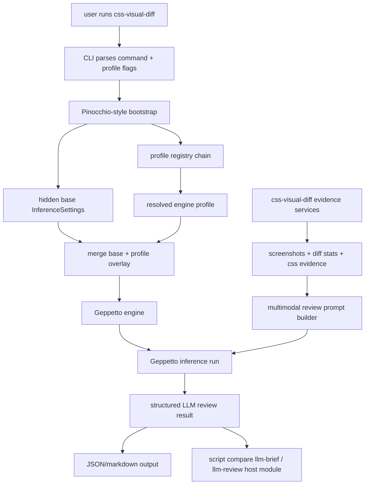

# Geppetto + Pinocchio profile-backed LLM review integration guide for css-visual-diff

## Executive summary

`css-visual-diff` currently has two opposite ends of the LLM story:

- the old Python prototype had a direct provider call path using OpenAI Vision
- the current Go rewrite has an `ai-review` mode and an `ai.Client` interface, but the live implementation is still a `NoopClient`

At the same time, the repo has already moved toward a Go-native runtime architecture based on:

- reusable Go comparison services
- embedded JavaScript verbs via `go-go-goja`
- CLI/runtime composition through Glazed/Cobra

The correct next step is **not** to add another ad hoc direct provider client. The correct next step is to make LLM review a **Geppetto-backed inference service** and to resolve model/inference settings through the **Pinocchio/Geppetto profile-registry path** so `css-visual-diff` can use the same model-selection workflows as the rest of Manuel's toolchain.

That means the first real LLM slice should:

1. keep evidence gathering in `css-visual-diff`
2. build a multimodal prompt from screenshots + diff summary + CSS evidence
3. resolve final inference settings through Pinocchio/Geppetto profile loading
4. run the model through Geppetto
5. return structured LLM review output that can be reused by both classic commands and script-backed verbs

## The situation today

### What exists in css-visual-diff right now

There are three relevant code paths in the repo today:

1. **legacy Python prototype**
   - `legacy/python-prototype/src/llm_analysis.py`
   - does a direct OpenAI chat completion call with three images and text context
2. **stubbed Go AI client**
   - `internal/cssvisualdiff/ai/client.go`
   - defines an interface but only ships `NoopClient`
3. **batch AI review mode**
   - `internal/cssvisualdiff/modes/ai_review.go`
   - reads `capture.json`, iterates configured sections, and asks the AI client questions per screenshot

That means the product already has an intended place for AI review, but the live Go rewrite never completed the provider-backed implementation.

### What changed since the original prototype

The context is now different from the Python version:

- `css-visual-diff` is no longer a one-off prototype; it is a proper Go CLI
- the repo already has a new JS runtime layer in `internal/cssvisualdiff/dsl/`
- the user explicitly wants Geppetto-based LLM functionality, not another direct SDK integration
- the user explicitly clarified that **profile repository loading matters**, because the selected model and inference defaults must come from the Pinocchio/Geppetto profile system

That last point changes the architecture materially. A plain `gp.engines.fromConfig(...)` integration is not enough by itself if we want operator-friendly model selection and the right resolved inference settings.

## User requirement clarification

The important clarification from the user is:

> to support LLMs we need to support the profile repository loading of pinocchio/geppetto, because we also need to get the proper inference settings

The practical reading of that requirement is:

- `css-visual-diff` should not hardcode model names in its own flags only
- `css-visual-diff` should understand `--profile` and `--profile-registries`
- the selected profile should influence the resolved model/inference behavior
- the app must still preserve an app-owned baseline for credentials and transport/operator defaults
- the final engine should be built from the resolved/merged inference settings, not from an unrelated local config object

## The key architectural decision

## Recommendation

Use **Geppetto for inference execution** and **Pinocchio-compatible profile bootstrap for profile/config resolution**.

In practice, that means:

- `css-visual-diff` owns the evidence-gathering domain
- Geppetto owns engine construction and inference execution
- Pinocchio-style bootstrap owns config/env/profile-registry loading and final inference-settings resolution

This is the recommended first cut because it matches the user's requirement most directly and avoids re-implementing a subtle configuration lifecycle by hand.

## Why not use direct provider SDKs anymore?

Direct provider SDK calls are the wrong boundary now because they would reintroduce all of the complexity Geppetto already solves elsewhere:

- provider-specific request wiring
- model selection rules
- future provider switching
- shared operator credential handling
- unified tool/runtime evolution later

Direct SDK calls would also drift away from the user's existing Pinocchio/Geppetto profile workflow.

## Why raw Geppetto alone is not quite enough

Raw Geppetto can absolutely build engines and resolve engine profiles. But the user's clarification points toward **Pinocchio-style profile repository loading**, not just a naked `fromConfig(...)` or even a minimal `ResolveEngineProfile(...)` call.

The subtle but important lifecycle is:

```text
hidden base inference settings
  + resolved engine-profile overlay
  = final inference settings
  -> engine
```

That lifecycle is already implemented and documented in Pinocchio bootstrap code. Reusing it avoids guessing how defaults/config/env/profile selection should be combined.

## Target architecture



## What should be implemented

### 1. A reusable Geppetto-backed LLM client in css-visual-diff

Add a real implementation behind the existing AI abstraction.

Suggested package layout:

- `internal/cssvisualdiff/llm/geppetto_client.go`
- `internal/cssvisualdiff/llm/bootstrap.go`
- `internal/cssvisualdiff/llm/prompt.go`
- `internal/cssvisualdiff/llm/types.go`

The existing `internal/cssvisualdiff/ai/client.go` can either:

- remain as the stable interface boundary, with a Geppetto-backed implementation added behind it, or
- be renamed/reorganized into the newer `llm/` package while keeping a small compatibility shim

Recommended first cut: keep the existing `ai.Client` interface alive and add a Geppetto-backed implementation so the old `ai-review` mode can be revived without rewriting everything at once.

### 2. Pinocchio-compatible profile bootstrap on the CLI

`css-visual-diff` needs public profile-selection flags and an internal bootstrap path.

At minimum, expose:

- `--profile`
- `--profile-registries`

Recommended if operator parity matters:

- `--config-file`

The most direct bootstrap path is to reuse Pinocchio helpers such as:

- `pinocchio/pkg/cmds/profilebootstrap.NewProfileSettingsSection()`
- `pinocchio/pkg/cmds/profilebootstrap.ResolveCLIEngineSettings(...)`
- `pinocchio/pkg/cmds/profilebootstrap.ResolveUnifiedConfig(...)`
- `pinocchio/pkg/cmds/profilebootstrap.ResolveUnifiedProfileRegistryChain(...)`

That gives `css-visual-diff`:

- hidden base inference settings from env/default/config
- selected profile resolution from registry sources
- merged final inference settings
- a consistent close/cleanup lifecycle for registry resources

### 3. Multimodal prompt construction from css-visual-diff evidence

The LLM path should not rediscover evidence itself. `css-visual-diff` already knows how to gather:

- left element screenshot
- right element screenshot
- diff comparison screenshot
- computed property diffs
- winner-rule/cascade diffs
- pixel-diff percentage and artifacts

So the prompt builder should consume the existing compare result and convert it into a multimodal Geppetto turn.

The right first prompt shape is:

- one system prompt owned by `css-visual-diff`
- one user block containing:
  - the user's question
  - a compact summary of key structured evidence
  - three images: left, right, diff

Geppetto's canonical multimodal turn shape already exists through:

- `turns.NewUserMultimodalBlock(...)`

### 4. A reusable review service above raw inference

Add a domain service that takes a compare result and a question and returns a typed review object.

Suggested API:

```go
type ReviewOptions struct {
    Question      string
    Evidence      modes.CompareResult
    MaxProperties int
}

type ReviewResult struct {
    Question            string            `json:"question"`
    Model               string            `json:"model,omitempty"`
    Profile             string            `json:"profile,omitempty"`
    Registry            string            `json:"registry,omitempty"`
    Answer              string            `json:"answer"`
    Artifacts           map[string]string `json:"artifacts,omitempty"`
    PromptSummary       string            `json:"promptSummary,omitempty"`
    InferenceMetadata   map[string]any    `json:"inferenceMetadata,omitempty"`
}
```

That service should be reusable from both:

- classic command/mode paths
- JS runtime host modules

### 5. First script-backed LLM verb

Once the service exists, add a script-backed verb such as:

- `script compare llm-brief`

That verb can follow the existing shape in `internal/cssvisualdiff/dsl/scripts/compare.js` and call a new host module, for example:

- `require("llm").reviewCompare(...)`

or a report extension such as:

- `require("report").llmBrief(...)`

Recommended naming: a dedicated `llm` module is cleaner.

## Recommended implementation sequence

### Phase 1: revive the old AI seam with Geppetto

Goal: make the existing `ai-review` mode actually work.

1. Add Geppetto and Pinocchio dependencies.
2. Add profile settings section/flags to the relevant command surface.
3. Implement bootstrap helper that resolves final inference settings.
4. Implement Geppetto-backed `ai.Client`.
5. Replace `ai.NoopClient{}` in `modes/ai_review.go` with the real client.
6. Write a smoke test that proves profile selection changes the resolved model.

This gives the project its first real live LLM path again.

### Phase 2: connect LLM review to compare results instead of capture-only sections

Goal: use the newer compare architecture instead of only the older capture-plan mode.

1. Add `BuildLLMReviewInput(...)` from `modes.CompareResult`.
2. Add `services/llm_review.go`.
3. Expose a hand-written command if useful:
   - `llm-review`
   - or `compare --question ... --with-llm`
4. Write JSON and markdown outputs.

### Phase 3: expose the first JS/runtime verb

Goal: make LLM review usable from the new JS runtime.

1. Add `internal/cssvisualdiff/dsl` host module registration for `llm`.
2. Add embedded script verb:
   - `script compare llm-brief`
3. Add tests mirroring the current `script compare brief` coverage.

## Pseudocode for the core Go path

```text
command invoked
  -> parse command values
  -> resolve profile/config selection
  -> bootstrap final inference settings
  -> build geppetto engine
  -> build compare evidence
  -> build multimodal turn
  -> run inference
  -> extract assistant text
  -> write review.json / review.md
```

Concrete pseudocode:

```go
func ReviewCompare(ctx context.Context, parsed *values.Values, opts ReviewOptions) (ReviewResult, error) {
    resolved, err := profilebootstrap.ResolveCLIEngineSettings(ctx, parsed)
    if err != nil { return ReviewResult{}, err }
    defer closeResolved(resolved)

    eng, err := profilebootstrap.NewEngineFromResolvedCLIEngineSettings(resolved)
    if err != nil { return ReviewResult{}, err }

    turn := &turns.Turn{}
    turns.AppendBlock(turn, turns.NewSystemTextBlock(cssVisualDiffSystemPrompt))
    turns.AppendBlock(turn, turns.NewUserMultimodalBlock(
        buildReviewText(opts.Question, opts.Evidence),
        []map[string]any{
            {"media_type": "image/png", "url": fileToDataURL(opts.Evidence.URL1.ElementScreenshot)},
            {"media_type": "image/png", "url": fileToDataURL(opts.Evidence.URL2.ElementScreenshot)},
            {"media_type": "image/png", "url": fileToDataURL(opts.Evidence.PixelDiff.DiffComparisonPath)},
        },
    ))

    out, resultMeta, err := engine.RunInferenceWithResult(ctx, eng, turn)
    if err != nil { return ReviewResult{}, err }

    return decodeAssistantText(out, resultMeta, resolved), nil
}
```

## Command/flag design

### Small-CLI recommendation

Follow the same small-CLI pattern used in Geppetto's runner examples:

- keep the public LLM flag surface narrow
- expose profile-selection flags publicly
- keep lower-level provider credential/bootstrap details app-owned

Recommended public flags for the first cut:

- `--profile`
- `--profile-registries`
- `--config-file` (recommended)
- `--question`
- compare target/selector/viewport flags already used today

Avoid exposing every Geppetto flag directly at first. `css-visual-diff` is a focused product, not a general-purpose chat runner.

## Files that should change first

### In css-visual-diff

- `/home/manuel/workspaces/2026-04-21/hair-v2/css-visual-diff/cmd/css-visual-diff/main.go`
- `/home/manuel/workspaces/2026-04-21/hair-v2/css-visual-diff/internal/cssvisualdiff/ai/client.go`
- `/home/manuel/workspaces/2026-04-21/hair-v2/css-visual-diff/internal/cssvisualdiff/modes/ai_review.go`
- `/home/manuel/workspaces/2026-04-21/hair-v2/css-visual-diff/internal/cssvisualdiff/modes/compare.go`
- `/home/manuel/workspaces/2026-04-21/hair-v2/css-visual-diff/internal/cssvisualdiff/services/agent_brief.go`
- `/home/manuel/workspaces/2026-04-21/hair-v2/css-visual-diff/internal/cssvisualdiff/dsl/registrar.go`
- `/home/manuel/workspaces/2026-04-21/hair-v2/css-visual-diff/internal/cssvisualdiff/dsl/scripts/compare.js`

### In neighboring reference repos

- `/home/manuel/workspaces/2026-04-21/hair-v2/geppetto/pkg/doc/topics/01-profiles.md`
- `/home/manuel/workspaces/2026-04-21/hair-v2/geppetto/pkg/doc/topics/10-runner.md`
- `/home/manuel/workspaces/2026-04-21/hair-v2/geppetto/pkg/doc/playbooks/07-wire-provider-credentials-for-js-and-go-runner.md`
- `/home/manuel/workspaces/2026-04-21/hair-v2/pinocchio/pkg/cmds/profilebootstrap/engine_settings.go`
- `/home/manuel/workspaces/2026-04-21/hair-v2/pinocchio/pkg/cmds/profilebootstrap/profile_selection.go`
- `/home/manuel/workspaces/2026-04-21/hair-v2/pinocchio/cmd/pinocchio/cmds/js.go`
- `/home/manuel/workspaces/2026-04-21/hair-v2/pinocchio/pkg/doc/topics/pinocchio-profile-resolution-and-runtime-switching.md`

## Main risks and failure modes

### 1. Misunderstanding profile ownership

The biggest conceptual trap is to assume the selected profile alone contains everything required to run inference.

That is not the model.

The correct model is:

- baseline/operator config stays app-owned
- model/profile defaults come from the profile overlay
- final settings are the merge of both

### 2. Re-implementing Pinocchio bootstrap poorly

If `css-visual-diff` manually reconstructs config/profile selection instead of reusing existing helpers, it is easy to drift from Pinocchio behavior around:

- default registry loading
- config-file precedence
- default selected profile
- registry cleanup lifecycle

### 3. Sending too much evidence to the model

The compare result can be large. The first LLM path should send:

- selected screenshots
- compact text summary of the most relevant diffs
- not the entire raw capture or every CSS property

### 4. Provider/image capability mismatches

Some models or provider APIs will be better at image input than others. The first implementation should validate at least one known-good multimodal profile path and document that expectation.

## Recommended test plan

### Unit tests

- prompt builder returns a stable evidence summary
- artifact/image packaging rejects missing files clearly
- resolved profile metadata is surfaced in output

### Integration tests

- profile selection changes resolved model/settings
- final inference settings come from base + profile merge, not from profile alone
- `ai-review` path no longer uses `NoopClient`

### Smoke scripts

Ticket-local scripts should be added under the new ticket workspace, for example:

- `scripts/01_profile_resolution_smoke.sh`
- `scripts/02_geppetto_llm_compare_smoke.sh`

The first smoke should be deterministic and inspect resolved model/profile values.

The second smoke can be live-provider-gated and self-skip when credentials are absent.

## Concrete recommendation

If implementation started right now, I would do the first cut in this order:

1. add ticket tasks and tests for profile bootstrap behavior
2. add Pinocchio profile-selection section to the command surface
3. implement a Geppetto-backed LLM client using resolved final inference settings
4. revive `modes/ai_review.go`
5. add a compare-result-based review service
6. add `script compare llm-brief`

That sequence gets a working LLM path quickly while preserving room for richer JS orchestration later.

## Final architectural rule

> Keep `css-visual-diff` responsible for evidence, artifacts, and product-specific prompting.
> Keep Geppetto responsible for inference execution.
> Keep Pinocchio-style bootstrap responsible for config/env/profile-registry resolution and final inference-settings assembly.
