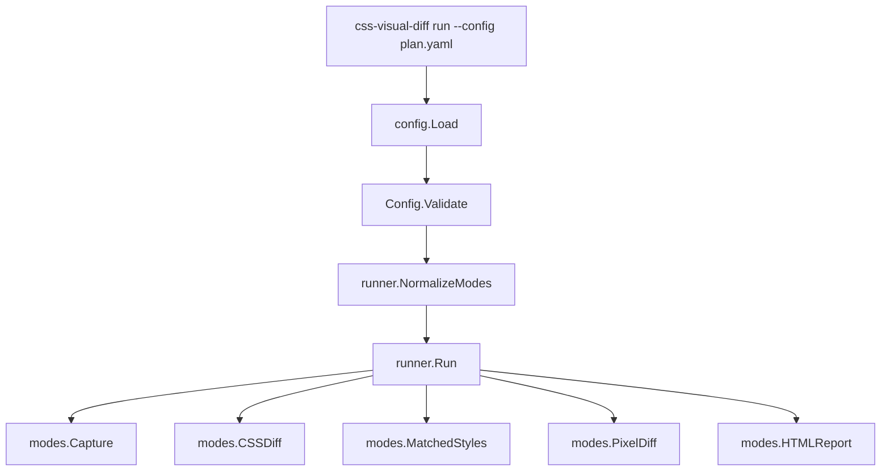
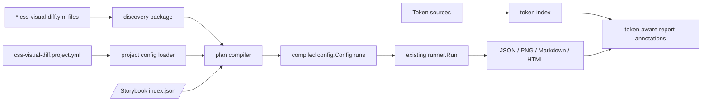

# css-visual-diff agility improvement analysis and implementation guide

## 1. Executive summary

`css-visual-diff` is already useful as a low-level browser comparison engine: it can open two targets, prepare each target, capture screenshots, compare section PNGs, diff selected computed CSS properties, inspect matched CSS rules, and render a static HTML report. The Pyxis project proved that this core is valuable, but it also exposed a workflow problem: the current user experience asks humans to maintain large central YAML files and wrapper shell scripts that hard-code paths across repositories.

This document proposes a shift from **one central comparison plan** to **many small co-located manifests** named `*.css-visual-diff.yml` or `*.css-visual-diff.yaml`. Each component or page directory can declare the prototype selector, Storybook story, CSS properties, viewport, variants, and sections that matter for that unit. A new discovery/compile layer should combine these manifests with one project-level config containing shared endpoints, prepare recipes, token sources, baseline settings, and output defaults. The existing `config.Config` runner can remain the execution core while the new layer compiles agile manifests into today's full config shape.

The proposed roadmap is:

1. Add manifest discovery and a new manifest schema while preserving `run --config` compatibility.
2. Add Storybook story resolution so manifests can reference story IDs or story titles instead of hand-written `iframe.html?id=...` URLs.
3. Add standardized prepare recipes so repeated prototype rendering logic moves out of ad hoc JavaScript files.
4. Add baseline caching for the prototype/original side to avoid recapturing stable design sources on every edit loop.
5. Add token-aware CSS diff reporting so reports explain not only `6px` versus `8px`, but also which design token, CSS variable, inline style, or hard-coded component value produced the difference.

The intended audience is a new intern who knows Go, YAML, basic browser automation, and React/Storybook, but has not yet worked on `css-visual-diff`.

## 2. Glossary

- **Original target**: The design source side of a comparison. In Pyxis this is usually a prototype HTML export served from `prototype-design/`.
- **React target**: The implementation side of a comparison. In Pyxis this is usually Storybook iframe content.
- **Section**: A named DOM selector used for screenshots and pixel diffs, for example `nav`, `main`, or `button-primary`.
- **Style comparison**: A named DOM selector plus a property list used for computed CSS comparisons.
- **Prepare step**: JavaScript executed after navigation and before capture so a prototype shell can render the desired component/page into a clean capture root.
- **Prepare recipe**: A named, reusable prepare behavior such as `prototype-page` or `prototype-component-grid` that expands into a concrete prepare step.
- **Manifest**: A small `*.css-visual-diff.yml` file living near a component/page source directory.
- **Project config**: A shared file at the repo or package root that declares base URLs, Storybook settings, prepare recipes, token sources, output defaults, and baseline policy.
- **Baseline**: A cached original-side screenshot/HTML/style artifact for a stable prototype state.

## 3. Problem statement and scope

### 3.1 What worked in Pyxis

The Pyxis workflow demonstrated that `css-visual-diff` can compare real prototype and Storybook surfaces. The atom config compares a prototype atom render against a Storybook fixture and defines 23 sections plus 9 style comparisons in one YAML file (`css-visual-diff/examples/pyxis-atoms-prototype-vs-storybook.yaml:30`, `css-visual-diff/examples/pyxis-atoms-prototype-vs-storybook.yaml:54`). The page config compares a direct-rendered prototype page against a user-site Storybook page (`css-visual-diff/examples/pyxis-storybook-shows-desktop.yaml:14`, `css-visual-diff/examples/pyxis-storybook-shows-desktop.yaml:27`).

The reports are also useful. The capture mode writes screenshots, prepared HTML, inspect JSON, validation results, and coverage data (`css-visual-diff/internal/cssvisualdiff/modes/capture.go:60`, `css-visual-diff/internal/cssvisualdiff/modes/capture.go:88`, `css-visual-diff/internal/cssvisualdiff/modes/capture.go:225`, `css-visual-diff/internal/cssvisualdiff/modes/capture.go:239`). CSS diff mode compares computed properties via `window.getComputedStyle` (`css-visual-diff/internal/cssvisualdiff/modes/cssdiff.go:155`, `css-visual-diff/internal/cssvisualdiff/modes/cssdiff.go:171`). Matched styles mode can inspect winning CSS rules through Chrome DevTools Protocol and emits winner summaries (`css-visual-diff/internal/cssvisualdiff/modes/matched_styles.go:321`). Pixel diff mode consumes `capture.json` and emits image diffs (`css-visual-diff/internal/cssvisualdiff/modes/pixeldiff.go:43`, `css-visual-diff/internal/cssvisualdiff/modes/pixeldiff.go:56`).

### 3.2 What became painful

The same usage revealed several friction points:

1. **The config is centralized and far from the components.** The Pyxis atom diff lives under `css-visual-diff/examples/`, but its selectors describe atoms located in a different repo. A component author working in `Button/` would not naturally discover or update the comparison contract.
2. **Wrapper scripts contain workflow knowledge that the CLI should own.** The atom diff script hard-codes the Pyxis repo, the css-visual-diff repo, the config path, the output path, Storybook port/pid/log files, a 90 second Storybook indexing loop, and the final `go run` invocation (`11-run-pyxis-atom-diff.sh:5`, `11-run-pyxis-atom-diff.sh:31`, `11-run-pyxis-atom-diff.sh:44`). The page script repeats the same pattern (`14-run-pyxis-storybook-shows-desktop.sh:5`, `14-run-pyxis-storybook-shows-desktop.sh:14`).
3. **Prepare scripts are powerful but fragile.** The atom config points at an absolute `script_file` outside the `css-visual-diff` repo (`css-visual-diff/examples/pyxis-atoms-prototype-vs-storybook.yaml:18`). That file manually clears the DOM, builds a capture fixture, lays out rows, and renders each component global (`10-atom-original-prepare.js:7`, `10-atom-original-prepare.js:35`, `10-atom-original-prepare.js:86`). If the prototype globals change, every script with embedded assumptions can break.
4. **The atom fixture can hide story-specific regressions.** The current atom config targets `atoms-atom-diff-fixture--default` (`css-visual-diff/examples/pyxis-atoms-prototype-vs-storybook.yaml:23`). However, real Storybook files expose many individual stories and variants. For example, Pyxis Button has `Default`, `AllVariants`, `AllSizes`, `WithIcons`, `Loading`, `Disabled`, `FullWidth`, `DangerVariant`, `DiscordVariant`, `IconOnly`, and `Playground` exports (`Button.stories.tsx:57`, `Button.stories.tsx:66`, `Button.stories.tsx:108`, `Button.stories.tsx:116`, `Button.stories.tsx:174`). A grid fixture can look acceptable while one story's wrapper, args, or play state is wrong.
5. **The original/prototype side is recaptured repeatedly.** Current capture mode always captures original and react in sequence (`css-visual-diff/internal/cssvisualdiff/modes/capture.go:75`, `css-visual-diff/internal/cssvisualdiff/modes/capture.go:80`). CSS diff and matched styles also independently navigate and prepare both sides (`css-visual-diff/internal/cssvisualdiff/modes/cssdiff.go:91`, `css-visual-diff/internal/cssvisualdiff/modes/cssdiff.go:101`, `css-visual-diff/internal/cssvisualdiff/modes/matched_styles.go:97`, `css-visual-diff/internal/cssvisualdiff/modes/matched_styles.go:107`). During component implementation work, the prototype often does not change, so repeated original-side capture wastes time.
6. **CSS diffs are correct but not diagnostic enough.** A report can say `border-radius: 6px` versus `8px`, but it does not explain whether `6px` came from a prototype token, `8px` came from `--radius-md`, or the React component hard-coded an inline value. Pyxis already has CSS custom-property token files that explicitly state components should reference tokens rather than hard-coded values (`tokens.css:3`, `tokens.css:4`) and define values such as `--radius-md: 0.5rem` (`tokens.css:171`). The diff engine should use that information.

### 3.3 Scope

This design covers implementation of the following feature set:

- Co-located manifest discovery using `*.css-visual-diff.yml` / `*.css-visual-diff.yaml`.
- A project-level config for shared endpoints, recipes, token sources, output defaults, and baseline policy.
- Storybook story ID/title mapping and variant expansion.
- Standard prepare recipes that compile to existing prepare mechanics.
- Original-side baseline caching with explicit invalidation.
- Token-aware CSS diff annotations.
- CLI/report/test changes needed to make the workflow usable.

This design does **not** require replacing the current `run --config` path. Backward compatibility is important because the existing example YAML files and tests exercise a working comparator.

## 4. Current-state architecture

### 4.1 Repository shape

The repository is a Go CLI. `AGENT.md` summarizes the high-level layout: CLI entrypoint under `cmd/css-visual-diff/`, comparison engine under `internal/cssvisualdiff/`, and legacy Python prototype under `legacy/python-prototype/` (`css-visual-diff/AGENT.md`). The README describes the live tool as centered on chromedp browser capture, element compare workflows, computed CSS diffs, matched-style/cascade inspection, and pixel diff artifacts (`css-visual-diff/README.md`).

Key directories:

```text
css-visual-diff/
├── cmd/css-visual-diff/                 # Cobra/Glazed CLI entrypoint
├── internal/cssvisualdiff/config/       # YAML config structs, validation, load
├── internal/cssvisualdiff/driver/       # chromedp Browser/Page wrapper
├── internal/cssvisualdiff/modes/        # capture/cssdiff/pixeldiff/matched-styles/html-report/story-discovery
├── internal/cssvisualdiff/runner/       # mode normalization + sequential execution
├── internal/cssvisualdiff/dsl/          # embedded JS DSL commands
└── examples/                            # central example configs and outputs
```

### 4.2 Current YAML config model

The current config schema is intentionally simple. It has metadata, one `original` target, one `react` target, an array of `sections`, an array of `styles`, output options, and a mode list (`css-visual-diff/internal/cssvisualdiff/config/config.go:124`). Targets contain `name`, `url`, `wait_ms`, `viewport`, `root_selector`, and optional `prepare` (`css-visual-diff/internal/cssvisualdiff/config/config.go:34`). Prepare specs support inline scripts, script files, wait expressions, direct React global rendering, and basic root sizing/background fields (`css-visual-diff/internal/cssvisualdiff/config/config.go:43`).

```go
// Current conceptual shape.
type Config struct {
    Metadata Metadata
    Original Target
    React    Target
    Sections []SectionSpec
    Styles   []StyleSpec
    Output   OutputSpec
    Modes    []string
}
```

Validation currently enforces:

- `metadata.slug` is required (`config.go:153`).
- `original.url` and `react.url` are required and must be URLs (`config.go:156`, `config.go:161`).
- `output.dir` is required (`config.go:166`).
- Section and style entries need either one shared selector or both original/react selectors.
- Prepare type can only be `script` or `direct-react-global` (`config.go:229`, `config.go:233`, `config.go:244`).

The output directory is normalized relative to the config file path (`config.go:146`, `config.go:206`). This is convenient for central example configs, but co-located manifests need a more explicit output strategy because the output should usually land under a project-level `.css-visual-diff/out/` directory rather than next to every component.

### 4.3 Current CLI and runner

The primary CLI path is `css-visual-diff run --config <yaml>` (`cmd/css-visual-diff/main.go:35`, `cmd/css-visual-diff/main.go:51`). The run command requires `--config`, loads one config file, normalizes the mode list, and runs the sequential runner (`cmd/css-visual-diff/main.go:107`, `cmd/css-visual-diff/main.go:110`, `cmd/css-visual-diff/main.go:120`, `cmd/css-visual-diff/main.go:141`). The root command also exposes a single-element `compare`, `llm-review`, `chromedp-probe`, and embedded DSL script commands (`cmd/css-visual-diff/main.go:279`, `cmd/css-visual-diff/main.go:280`, `cmd/css-visual-diff/main.go:281`, `cmd/css-visual-diff/main.go:282`).

The runner defaults to `capture,cssdiff` and expands `full` to `capture,pixeldiff,cssdiff,matched-styles,ai-review,html-report` (`runner.go:28`, `runner.go:30`). It executes modes in order and stops on the first mode error (`runner.go:75`, `runner.go:77`, `runner.go:83`, `runner.go:85`, `runner.go:87`, `runner.go:95`).



### 4.4 Current prepare mechanics

Prepare is executed after page navigation and optional `wait_ms` (`capture.go:112`, `capture.go:116`, `capture.go:123`). The `prepareTarget` function first waits for a JS condition if `wait_for` is configured, then executes either `script` or `direct-react-global`, then waits a short post-prepare delay (`prepare.go:17`, `prepare.go:28`, `prepare.go:40`, `prepare.go:42`).

The script prepare reads inline `script` or `script_file` and evaluates it in the page (`prepare.go:62`). The direct React global prepare builds a script that expects `window.React`, `window.ReactDOM`, and `window[componentName]`, then clears the body, creates a root, and renders `React.createElement(Component, props)` (`prepare.go:100`, `prepare.go:147`, `prepare.go:148`, `prepare.go:153`, `prepare.go:165`, `prepare.go:169`).

This is a good execution primitive, but it is too low-level for day-to-day component diff authoring. Component authors should reference named recipes rather than writing DOM-reset/render scripts.

### 4.5 Current capture / CSS / pixel / report modes

Capture mode:

1. Creates one browser (`capture.go:69`).
2. Captures original target (`capture.go:75`).
3. Captures react target (`capture.go:80`).
4. Computes coverage (`capture.go:88`).
5. Writes JSON/Markdown if configured.

Each target capture creates a new page, sets viewport, navigates, waits, prepares, writes optional prepared HTML and inspect JSON, captures a root/full screenshot, then loops all sections and captures each section (`capture.go:105`, `capture.go:147`, `capture.go:155`, `capture.go:184`).

CSS diff mode creates one browser, opens one page per side, navigates/prepares both, then loops styles, evaluates computed CSS, builds diffs, and writes JSON/Markdown (`cssdiff.go:57`, `cssdiff.go:66`, `cssdiff.go:72`, `cssdiff.go:78`, `cssdiff.go:112`, `cssdiff.go:121`, `cssdiff.go:125`, `cssdiff.go:129`, `cssdiff.go:147`).

Pixel diff mode is artifact-based: it reads `capture.json`, pairs original and react section screenshots by array index, pads images to a common size, computes changed pixels, writes diff images, sorts entries by changed percent, and writes JSON/Markdown (`pixeldiff.go:43`, `pixeldiff.go:56`, `pixeldiff.go:120`, `pixeldiff.go:130`).

HTML report mode loads available JSON files from the output directory and renders a static artifact browser (`html_report.go:24`, `html_report.go:34`). This mode is already compatible with additive JSON fields, which makes it a good place to surface token-aware annotations and baseline cache status.

### 4.6 Current Storybook support

There is a `story-discovery` mode, but it is only a listing mode. It derives `/index.json` from `cfg.React.URL`, fetches it, and writes story IDs/titles/names to `stories.json`/`stories.md` (`stories.go:33`, `stories.go:38`, `stories.go:89`, `stories.go:94`). It does not compile story IDs into react target URLs, expand variants, or connect manifests to Storybook stories.

The current Pyxis configs manually point to Storybook iframe URLs:

- Atom fixture: `http://localhost:6006/iframe.html?id=atoms-atom-diff-fixture--default` (`pyxis-atoms-prototype-vs-storybook.yaml:23`).
- Page story: `http://localhost:6007/iframe.html?id=public-site-pages--shows-desktop&viewMode=story` (`pyxis-storybook-shows-desktop.yaml:27`).

## 5. Observed Pyxis workflow and pain points

### 5.1 Wrapper scripts own too much behavior

The atom runner script performs all of the following:

- Defines the Pyxis repo and css-visual-diff repo paths (`11-run-pyxis-atom-diff.sh:5`, `11-run-pyxis-atom-diff.sh:6`).
- Defines a central config and output directory (`11-run-pyxis-atom-diff.sh:7`, `11-run-pyxis-atom-diff.sh:8`).
- Restarts Storybook and kills existing processes (`11-run-pyxis-atom-diff.sh:16`, `11-run-pyxis-atom-diff.sh:24`).
- Waits up to 90 seconds for a specific story ID in `/index.json` (`11-run-pyxis-atom-diff.sh:31`).
- Runs `go run ./cmd/css-visual-diff run --config ... --modes ...` (`11-run-pyxis-atom-diff.sh:44`).
- Reads result JSON and prints a summary (`11-run-pyxis-atom-diff.sh:52`, `11-run-pyxis-atom-diff.sh:54`).

The page runner script repeats the central path and CLI invocation pattern (`14-run-pyxis-storybook-shows-desktop.sh:5`, `14-run-pyxis-storybook-shows-desktop.sh:14`). The prototype server script separately knows that the prototype is a Python HTTP server over `prototype-design` on port 7070 (`05-serve-pyxis-prototype.sh:4`, `05-serve-pyxis-prototype.sh:22`).

These scripts were reasonable during exploration, but they are not a durable product interface. They should become either:

- project-level config fields (`storybook.start`, `storybook.wait_for_index`, `prototype.serve`), or
- documented preconditions that the CLI validates and reports clearly.

### 5.2 Central configs drift from component ownership

The atom config contains comparison contracts for buttons, badges, tags, avatars, icons, inputs, and selects in one file. This makes the first setup easy, but long-term maintenance hard. When a Button story adds a `Loading` state, the component owner has to remember to update a central file in another repo path. Co-located manifests solve this by putting the comparison declaration next to the component source and Storybook stories.

### 5.3 Fixture-only comparison creates false confidence

The atom fixture is good for a dashboard-like overview, but individual Storybook exports are the real examples developers and designers review. Pyxis Button stories show several states that are not necessarily equivalent to the fixture grid (`Button.stories.tsx:57`, `Button.stories.tsx:66`, `Button.stories.tsx:82`, `Button.stories.tsx:94`, `Button.stories.tsx:108`, `Button.stories.tsx:116`). The tool should make it easy to say:

```yaml
storybook:
  title: Atoms/Button
  stories: [Default, Loading, Disabled, DangerVariant]
```

and have the CLI resolve those to Storybook IDs from `/index.json`.

### 5.4 Tokens are available but unused by reports

Pyxis token files explicitly document that all visual decisions should be tokenized (`tokens.css:3`, `tokens.css:4`). CSS variables define concrete values like `--color-accent`, `--space-4`, and `--radius-md` (`tokens.css:49`, `tokens.css:155`, `tokens.css:171`). React code references these variables in components (`Button.tsx:71`, `Button.css:8`). Current cssdiff output only records raw computed values, so it misses the next diagnostic step: mapping values back to token names and source files.

## 6. Proposed architecture

### 6.1 High-level idea

Keep the existing runner as the stable execution backend. Add a new **plan-building layer** in front of it:



The plan-building layer should introduce these internal packages:

```text
internal/cssvisualdiff/project/      # project-level config, endpoint defaults, recipes, token sources
internal/cssvisualdiff/manifest/     # co-located manifest structs and validation
internal/cssvisualdiff/discovery/    # filesystem discovery and filtering
internal/cssvisualdiff/compile/      # manifest + project config -> config.Config run plans
internal/cssvisualdiff/storybook/    # index.json client, story ID/title/name resolver
internal/cssvisualdiff/recipes/      # recipe registry and prepare expansion
internal/cssvisualdiff/baselines/    # cache keys, metadata, read/write/invalidation
internal/cssvisualdiff/tokens/       # token source parsers and value resolver
```

The names can be adjusted, but keep package responsibilities narrow. Avoid adding everything to `config` or `modes`.

### 6.2 Backward compatibility

`css-visual-diff run --config examples/foo.yaml` must keep working. The current config schema is still a useful low-level format and should remain the compiled representation for early phases. New commands can compile manifests into this existing config shape and call `runner.Run`.

Compatibility rules:

- Do not remove `original`, `react`, `sections`, `styles`, `output`, or `modes` from `config.Config`.
- Add new behavior through new commands first: `discover`, `plan`, `run-manifest`, `run-all`.
- Later, `run` may accept `--manifest` and `--root`, but `--config` should remain explicit.
- Existing example configs should pass validation without migration.

## 7. Proposed config model

### 7.1 Project-level config

Use a project-level file for shared settings. Suggested search names:

1. `.css-visual-diff.yml`
2. `.css-visual-diff.yaml`
3. `css-visual-diff.project.yml`
4. `css-visual-diff.project.yaml`

Example:

```yaml
version: 1
project:
  name: pyxis
  root: .

prototype:
  name: pyxis-prototype
  url: http://localhost:7070/Pyxis%20Public%20Site.html
  serve:
    command: python3 -m http.server 7070 --directory prototype-design
    health_url: http://localhost:7070/Pyxis%20Public%20Site.html
    ready_timeout: 5s

storybook:
  components:
    base_url: http://localhost:6006
    iframe_path: /iframe.html
    index_url: http://localhost:6006/index.json
    start:
      command: pnpm --filter pyxis-components storybook -- --ci
      cwd: web
      ready_story: atoms-button--default
      ready_timeout: 90s
  user_site:
    base_url: http://localhost:6007
    iframe_path: /iframe.html
    index_url: http://localhost:6007/index.json

output:
  dir: .css-visual-diff/out
  write_json: true
  write_markdown: true
  write_pngs: true
  write_prepared_html: true
  write_inspect_json: true
  validate_pngs: true

baselines:
  dir: .css-visual-diff/baselines
  policy: reuse          # reuse | refresh | verify
  original_side: true

prepare_recipes:
  atom-fixture:
    type: prototype-component-grid
    wait_for: window.React && window.ReactDOM
    root_selector: '#atom-capture-root'
    width: 920
    padding: 24
    gap: 18
    background: '#F3F1EB'
    components: [Btn, Badge, Tag, Avatar, Icon, IconBtn, Input, Select]

  page-shows:
    type: prototype-page
    wait_for: window.React && window.ReactDOM && window.PPXDesktop
    component: PPXDesktop
    props: { page: shows }
    root_selector: '#capture-root'
    width: 920
    background: '#fff'

tokens:
  sources:
    - id: pyxis-css
      type: css-custom-properties
      path: web/packages/pyxis-components/src/tokens/tokens.css
    - id: pyxis-ts
      type: typescript-object
      path: web/packages/pyxis-components/src/tokens/tokens.ts
    - id: prototype-js
      type: javascript-object
      path: prototype-design/lib/tokens.js
```

Why project-level config matters:

- It removes repeated URLs from component manifests.
- It makes start/wait logic declarative instead of hidden in shell scripts.
- It provides one place to update prototype rendering recipes when prototype globals change.
- It gives token-aware reporting a known list of token sources.

### 7.2 Co-located manifest naming

Use `*.css-visual-diff.yml` rather than only `.diff.yaml`. The file prefix allows multiple manifests per directory:

```text
web/packages/pyxis-components/src/atoms/Button/
├── Button.tsx
├── Button.css
├── Button.stories.tsx
├── button-primary.css-visual-diff.yml
├── button-loading.css-visual-diff.yml
└── button-all-variants.css-visual-diff.yml
```

Benefits:

- Multiple workflows can coexist: primary state, loading/disabled states, a token-only quick run, a full visual run.
- The file name appears in CLI filters and output paths.
- The suffix is globally discoverable with `find`/`rg --files` and hard to confuse with other YAML files.

Discovery patterns:

```text
**/*.css-visual-diff.yml
**/*.css-visual-diff.yaml
```

### 7.3 Manifest schema

Example for a component:

```yaml
version: 1
id: atoms-button-primary
kind: component
title: Button primary visual parity
owners: [design-system]
tags: [atom, button, pyxis]

prototype:
  recipe: atom-fixture
  selector: "[data-comp='button-primary'] button"
  state:
    component: Btn
    props: { variant: primary, iconRight: chev, children: Get tickets }

storybook:
  project: components
  title: Atoms/Button
  story: Default
  # Alternative: id: atoms-button--default

compare:
  viewport: { width: 1200, height: 200 }
  root_selector_react: "#storybook-root"
  props:
    - background-color
    - color
    - border-radius
    - height
    - padding
    - font-size
    - font-weight
  sections:
    - name: button
      selector_original: "[data-comp='button-primary'] button"
      selector_react: "button"
  modes: [capture, cssdiff, pixeldiff, html-report]
```

Example for a page component:

```yaml
version: 1
id: public-pubhero-shows
kind: page-section
title: PubHero on shows page

prototype:
  recipe: page-shows
  selector: "[data-part='pub-hero']"

storybook:
  project: components
  title: Public/PubHero
  story: Default

compare:
  viewport: { width: 1200, height: 700 }
  props: [padding, gap, font-family, font-size, background]
  sections:
    - name: full
      selector_original: "[data-part='pub-hero']"
      selector_react: "[data-part='pub-hero']"
    - name: date-block
      selector: ".pyxis-hero__date"
    - name: content
      selector: ".pyxis-hero__content"
```

### 7.4 Manifest Go types

Suggested structs:

```go
package manifest

type Manifest struct {
    Version   int               `yaml:"version"`
    ID        string            `yaml:"id"`
    Kind      string            `yaml:"kind"`
    Title     string            `yaml:"title"`
    Owners    []string          `yaml:"owners"`
    Tags      []string          `yaml:"tags"`
    Prototype PrototypeBinding  `yaml:"prototype"`
    Storybook StorybookBinding  `yaml:"storybook"`
    Variants  []VariantBinding  `yaml:"variants"`
    Compare   CompareBinding    `yaml:"compare"`
}

type PrototypeBinding struct {
    Recipe   string         `yaml:"recipe"`
    Selector string         `yaml:"selector"`
    State    map[string]any `yaml:"state"`
}

type StorybookBinding struct {
    Project string   `yaml:"project"`
    ID      string   `yaml:"id"`
    Title   string   `yaml:"title"`
    Story   string   `yaml:"story"`
    Stories []string `yaml:"stories"`
    Include []string `yaml:"include"` // glob or regexp over story names, optional
    Exclude []string `yaml:"exclude"`
}

type VariantBinding struct {
    Name      string         `yaml:"name"`
    Prototype map[string]any `yaml:"prototype"`
    Storybook map[string]any `yaml:"storybook"`
}

type CompareBinding struct {
    Viewport          config.Viewport       `yaml:"viewport"`
    RootSelectorReact string                `yaml:"root_selector_react"`
    Props             []string              `yaml:"props"`
    Sections          []config.SectionSpec  `yaml:"sections"`
    Styles            []config.StyleSpec    `yaml:"styles"`
    Modes             []string              `yaml:"modes"`
}
```

Validation rules:

- `version` must be supported.
- `id` must be present and path-safe.
- `prototype.recipe` must exist in project config.
- Storybook binding must resolve by either `id`, `title + story`, or `title + stories/include`.
- At least one of `compare.props`, `compare.styles`, or `compare.sections` must exist.
- If `compare.props` exists and no explicit styles are given, compiler should generate one style comparison from `prototype.selector` and Storybook root/selector.

### 7.5 Compiled low-level config

Each manifest/story/variant combination should compile into the current `config.Config`:

```go
func CompileCase(project project.Config, m manifest.Manifest, story storybook.Entry, variant Variant) (*config.Config, error) {
    originalTarget := recipes.Expand(project.PrepareRecipes[m.Prototype.Recipe], m.Prototype.State, variant.Prototype)
    reactTarget := config.Target{
        Name:     story.ID,
        URL:      storybook.IFrameURL(project.Storybook[m.Storybook.Project], story.ID),
        WaitMS:   project.Defaults.ReactWaitMS,
        Viewport: m.Compare.Viewport,
        RootSelector: firstNonEmpty(m.Compare.RootSelectorReact, project.Defaults.ReactRootSelector),
    }

    sections := compileSections(m)
    styles := compileStyles(m)

    return &config.Config{
        Metadata: config.Metadata{Slug: slug(m.ID, story.ID, variant.Name), Title: m.Title},
        Original: originalTarget,
        React: reactTarget,
        Sections: sections,
        Styles: styles,
        Output: compileOutput(project, m, story, variant),
        Modes: compileModes(project, m),
    }, nil
}
```

This approach minimizes invasive changes: early phases can implement discovery/compile and then call existing modes.

## 8. Storybook story mapping design

### 8.1 Story resolution

Storybook's `/index.json` already provides story IDs, titles, and names. The current `StoryDiscovery` mode fetches this file but only writes a listing (`stories.go:33`, `stories.go:64`). Promote that logic into a reusable `storybook.Client`.

Suggested API:

```go
package storybook

type Client struct {
    BaseURL  string
    IndexURL string
    HTTP     *http.Client
}

type Entry struct {
    ID     string
    Title  string
    Name   string
    ImportPath string // if Storybook index version provides it
}

func (c *Client) FetchIndex(ctx context.Context) (*Index, error)
func (idx *Index) ResolveID(id string) (Entry, bool)
func (idx *Index) ResolveTitleStory(title, story string) (Entry, bool)
func (idx *Index) ResolveTitleStories(title string, include, exclude []string) []Entry
func IFrameURL(baseURL, iframePath, storyID string, args map[string]string, globals map[string]string) string
```

Resolution examples:

```yaml
storybook:
  title: Atoms/Button
  story: Default
```

resolves to the `Atoms/Button` entry named `Default`.

```yaml
storybook:
  title: Atoms/Button
  include: [Default, Loading, Disabled]
```

resolves to three entries, one compiled run per entry.

### 8.2 Variants and play functions

There are two types of variants:

1. **Story exports**: Each export in a `.stories.tsx` file usually becomes one Storybook index entry. The Button file has many exports, and each can be resolved through `/index.json` without parsing TypeScript.
2. **Arg variants inside one story**: If a manifest wants to compare a matrix of args inside one story ID, use Storybook's `args` query parameters when practical, or require explicit extra story exports for stable visual baselines.

Play functions should run naturally when the Storybook iframe renders the story. The runner should not need to understand play code in phase 1. It does need to wait for the story to settle. Add optional `storybook.wait_for` fields:

```yaml
storybook:
  id: atoms-button--loading
  wait_for: "window.__STORYBOOK_PREVIEW__"
  after_wait_ms: 500
```

For interaction-heavy stories, add a later explicit Playwright/chromedp interaction recipe rather than trying to introspect Storybook play functions from Go.

### 8.3 Readiness and startup

Pyxis wrapper scripts currently restart Storybook and poll `/index.json` for a known story (`11-run-pyxis-atom-diff.sh:16`, `11-run-pyxis-atom-diff.sh:31`). Decide whether `css-visual-diff` should start Storybook itself or only validate that Storybook is ready.

Recommended phased approach:

- **Phase 1**: Do not start Storybook. Validate `index_url` and print helpful errors if unavailable.
- **Phase 2**: Add optional `--ensure-services` that runs project-configured start commands, records pid/log paths under `.css-visual-diff/run/`, and waits for health URLs/stories.

This avoids surprising process management in the first implementation while keeping the project config ready for service orchestration later.

## 9. Prepare recipes design

### 9.1 Why recipes

The current prepare types are execution-level primitives. The new recipe layer should be authoring-level. A manifest says `recipe: page-shows`; the project config says how to render `page-shows`; the compiler expands that into a current `config.PrepareSpec`.

### 9.2 Recipe types

Recommended initial recipe types:

#### `prototype-page`

Renders a global React component with props into a capture root. This is a named wrapper around `direct-react-global`.

```yaml
page-shows:
  type: prototype-page
  wait_for: window.React && window.ReactDOM && window.PPXDesktop
  component: PPXDesktop
  props: { page: shows }
  root_selector: '#capture-root'
  width: 920
  background: '#fff'
```

Compile to:

```go
config.PrepareSpec{
    Type: "direct-react-global",
    WaitFor: recipe.WaitFor,
    Component: recipe.Component,
    Props: merged(recipe.Props, manifest.Prototype.State, variant.Prototype),
    RootSelector: recipe.RootSelector,
    Width: recipe.Width,
    Background: recipe.Background,
}
```

#### `prototype-component-grid`

Builds a capture root and renders one or more prototype globals into known `[data-comp]` wrappers. This replaces hand-written files like `10-atom-original-prepare.js`.

Minimal version:

```yaml
atom-grid:
  type: prototype-component-grid
  wait_for: window.React && window.ReactDOM
  root_selector: '#atom-capture-root'
  width: 920
  background: '#F3F1EB'
  components:
    - id: button-primary
      global: Btn
      props: { variant: primary, iconRight: chev, children: Get tickets }
    - id: badge-confirmed
      global: Badge
      props: { status: confirmed }
```

Generated script pseudocode:

```javascript
(() => {
  const e = window.React.createElement;
  setupDocument({ rootSelector, width, background, padding, gap });
  const rows = components.map(c => {
    const Component = window[c.global];
    if (!Component) throw new Error(`Missing component global: ${c.global}`);
    return e('span', { 'data-comp': c.id }, e(Component, c.props, c.children));
  });
  renderRows(rows);
})();
```

This can start simple: support one component from manifest state first, then support grids.

#### `script`

Keep script recipes as an escape hatch:

```yaml
legacy-atom-grid:
  type: script
  script_file: ttmp/.../10-atom-original-prepare.js
```

The compiler can map this directly to `PrepareSpec{Type:"script"}`. Mark it as an escape hatch in docs so new manifests prefer structured recipes.

### 9.3 Recipe registry API

```go
package recipes

type Registry struct {
    Recipes map[string]Recipe
}

type Expander interface {
    Expand(ctx ExpandContext, recipe Recipe, binding manifest.PrototypeBinding, variant manifest.VariantBinding) (config.Target, error)
}

type ExpandContext struct {
    PrototypeURL string
    Viewport     config.Viewport
    Defaults     project.Defaults
}
```

Compiler flow:

```go
recipe, ok := project.PrepareRecipes[m.Prototype.Recipe]
if !ok { return errorf("unknown prepare recipe") }
originalTarget, err := recipes.Expand(ctx, recipe, m.Prototype, variant)
```

## 10. Baseline caching design

### 10.1 Goal

If the prototype side does not change, reusing its screenshots and style snapshots can cut edit-loop time substantially. The first implementation should cache **original-side capture artifacts** because pixel diff currently depends on `capture.json`. Later phases can cache CSS snapshots and matched styles.

### 10.2 Cache layout

Use a project-level cache directory:

```text
.css-visual-diff/
├── baselines/
│   └── v1/
│       └── pyxis/
│           └── atoms-button-primary/
│               └── default/
│                   ├── metadata.json
│                   ├── original-full.png
│                   ├── original-button.png
│                   ├── original-prepared.html
│                   └── original-inspect.json
└── out/
    └── atoms-button-primary/default/...
```

`metadata.json`:

```json
{
  "version": 1,
  "manifest_id": "atoms-button-primary",
  "variant": "default",
  "side": "original",
  "created_at": "2026-04-23T21:10:00Z",
  "cache_key": "sha256:...",
  "inputs": {
    "prototype_url": "http://localhost:7070/Pyxis%20Public%20Site.html",
    "recipe_name": "atom-fixture",
    "recipe_hash": "sha256:...",
    "selector": "[data-comp='button-primary'] button",
    "viewport": { "width": 1200, "height": 200 },
    "sections_hash": "sha256:..."
  },
  "artifacts": {
    "full_screenshot": "original-full.png",
    "sections": [{ "name": "button", "screenshot": "original-button.png" }]
  }
}
```

### 10.3 Cache key

The cache key should include everything that can change the original-side pixels:

```go
func OriginalCacheKey(project project.Config, m manifest.Manifest, variant Variant) string {
    input := struct {
        Version      int
        PrototypeURL string
        RecipeName   string
        RecipeBody   any
        Binding      manifest.PrototypeBinding
        Variant      Variant
        Viewport     config.Viewport
        Sections     []config.SectionSpec
        TokenHints   []project.TokenSource // optional if recipe imports tokens
    }{...}
    return sha256JSON(input)
}
```

Do not include React/storybook fields in the original cache key.

### 10.4 CLI flags

Add flags to manifest-running commands:

```text
--baseline-policy reuse|refresh|verify
--reset-baselines          # alias for --baseline-policy refresh
--no-baseline-cache        # bypass reads/writes
```

Policy behavior:

| Policy | Behavior |
| --- | --- |
| `reuse` | If metadata key matches, copy baseline original artifacts into current output and capture only React side. Otherwise capture original and write baseline. |
| `refresh` | Always recapture original and replace baseline. |
| `verify` | Capture original and compare against baseline; fail or warn if prototype changed. Useful before accepting a design update. |

### 10.5 Refactor needed in capture mode

Current `RunCapture` captures both sides in one function (`capture.go:75`, `capture.go:80`). Baseline caching needs a smaller API:

```go
type CaptureSideOptions struct {
    Prefix  string // original or react
    Target  config.Target
    Sections []config.SectionSpec
    Output  config.OutputSpec
}

func CaptureSide(browser *driver.Browser, opts CaptureSideOptions) (PageResult, []ValidationResult, error)
func WriteCaptureResult(output config.OutputSpec, result CaptureResult) error
```

Then the manifest runner can do:

```go
if cache.HasOriginal(key) && policy == Reuse {
    original := cache.CopyOriginalToOutput(key, outputDir)
    react := CaptureSide(browser, reactOpts)
    WriteCaptureResult(output, CaptureResult{Original: original, React: react, Coverage: computeCoverage(original, react)})
} else {
    original := CaptureSide(browser, originalOpts)
    cache.StoreOriginal(key, original)
    react := CaptureSide(browser, reactOpts)
    WriteCaptureResult(...)
}
```

### 10.6 Important caveat

Pixel diff can use cached original screenshots immediately. CSS diff and matched-styles currently re-open both sides and do not read capture artifacts. For phase 1 baseline caching, it is acceptable to accelerate `capture,pixeldiff,html-report` loops. For token-aware CSS and matched styles, add separate snapshot caching later.

## 11. Token-aware CSS diff design

### 11.1 Goal

Change CSS reports from raw value tables to explanations:

```text
border-radius
  original: 6px
    candidate tokens:
      prototype-js radius.sm = 6px (prototype-design/lib/tokens.js:42)
  react: 8px
    winning declaration:
      .pyxis-button { border-radius: var(--radius-md) } (Button.css:8)
    resolved token:
      pyxis-css --radius-md = 0.5rem = 8px (tokens.css:171)
```

This lets an implementer decide whether to:

- update a token value,
- use a different token,
- remove a hard-coded inline style,
- change a selector/winner, or
- accept intentional divergence.

### 11.2 Token sources

Start with CSS custom properties because they are common and easy to parse:

```yaml
tokens:
  sources:
    - id: pyxis-css
      type: css-custom-properties
      path: web/packages/pyxis-components/src/tokens/tokens.css
```

Parser output:

```go
type Token struct {
    SourceID string
    Name     string // --radius-md
    Value    string // 0.5rem
    File     string
    Line     int
    Category string // optional: radius, color, space
}
```

For TypeScript object tokens, phase 1 can either skip parsing or use a simple regex/object parser for `export const radius = { md: '0.5rem' }`. Full TypeScript AST parsing can be a later enhancement.

### 11.3 Value normalization

Computed CSS values may be canonicalized by the browser (`0.5rem` becomes `8px`; colors become `rgb(200, 39, 13)`). Token resolution needs normalization.

Suggested API:

```go
type NormalizedValue struct {
    Raw      string
    Kind     string // length, color, number, string
    Pixels   *float64
    ColorRGB *[3]int
    Text     string
}

func NormalizeCSSValue(value string, context CSSContext) NormalizedValue
func Equivalent(a, b NormalizedValue, tolerance float64) bool
```

For phase 1:

- Lengths: support `px`, `rem`, and `0`; use root font size from browser when available, default to 16px.
- Colors: support hex and `rgb()/rgba()`.
- Strings/families: normalize whitespace and quotes lightly.

### 11.4 Winning declaration source

There are two levels of explanation:

1. **Value-to-token candidate**: Which tokens equal the computed value?
2. **Actual winning declaration**: Which CSS rule or inline style produced the property?

Matched styles mode already computes winner information from CDP matched CSS rules (`matched_styles.go:321`, `matched_styles.go:345`). It records selector, value, origin, specificity, and source order. Extend this to retain source location when CDP provides stylesheet IDs/ranges. If exact file/line is not available at first, report selector/origin and token candidates.

New fields:

```go
type StyleDiff struct {
    Property string `json:"property"`
    Original string `json:"original"`
    React    string `json:"react"`
    OriginalExplanation *ValueExplanation `json:"original_explanation,omitempty"`
    ReactExplanation    *ValueExplanation `json:"react_explanation,omitempty"`
}

type ValueExplanation struct {
    RawValue       string             `json:"raw_value"`
    Normalized     string             `json:"normalized"`
    TokenCandidates []TokenCandidate  `json:"token_candidates,omitempty"`
    Winner          *WinnerAnnotation `json:"winner,omitempty"`
}

type TokenCandidate struct {
    SourceID string `json:"source_id"`
    Name     string `json:"name"`
    Value    string `json:"value"`
    File     string `json:"file"`
    Line     int    `json:"line,omitempty"`
}

type WinnerAnnotation struct {
    Selector string `json:"selector"`
    Value    string `json:"value"`
    Origin   string `json:"origin"`
    File     string `json:"file,omitempty"`
    Line     int    `json:"line,omitempty"`
    UsesVar  string `json:"uses_var,omitempty"`
}
```

### 11.5 Token resolution pseudocode

```go
func AnnotateCSSDiff(result *CSSDiffResult, tokenIndex tokens.Index, matched *MatchedStylesResult) {
    for i := range result.Styles {
        style := &result.Styles[i]
        matchedStyle := matched.Find(style.Name)
        for j := range style.Diffs {
            diff := &style.Diffs[j]
            diff.OriginalExplanation = ExplainValue(diff.Property, diff.Original, tokenIndex, matchedStyle.Original)
            diff.ReactExplanation = ExplainValue(diff.Property, diff.React, tokenIndex, matchedStyle.React)
        }
    }
}

func ExplainValue(prop, raw string, idx tokens.Index, snapshot MatchedSnapshot) *ValueExplanation {
    norm := NormalizeCSSValue(raw, CSSContext{Property: prop})
    candidates := idx.FindEquivalent(norm)
    winner := FindWinnerForProperty(snapshot, prop)
    annotation := WinnerAnnotationFrom(winner)
    if varName := ExtractCSSVar(winner.Value); varName != "" {
        annotation.UsesVar = varName
        candidates = appendExactVarCandidateFirst(candidates, idx.FindByName(varName))
    }
    return &ValueExplanation{RawValue: raw, Normalized: norm.String(), TokenCandidates: candidates, Winner: annotation}
}
```

### 11.6 Report behavior

Markdown should remain concise but include useful detail:

```markdown
| Property | Original | React | Diagnosis |
| --- | --- | --- | --- |
| border-radius | 6px | 8px | React uses `--radius-md = 0.5rem (8px)` from `tokens.css:171`; original matches prototype `radius.sm = 6px`. Token values differ. |
```

HTML report can show expandable details:

```html
<details>
  <summary>border-radius: 6px → 8px</summary>
  <h4>Original</h4>
  <ul>...</ul>
  <h4>React</h4>
  <ul>...</ul>
</details>
```

## 12. CLI design

### 12.1 New commands

Add these commands without changing `run --config`:

```text
css-visual-diff discover --root web/packages/pyxis-components
css-visual-diff plan --manifest path/to/button.css-visual-diff.yml --project .css-visual-diff.yml
css-visual-diff run-manifest --manifest path/to/button.css-visual-diff.yml --project .css-visual-diff.yml
css-visual-diff run-all --root web/packages --project .css-visual-diff.yml --filter tag=atom
css-visual-diff baselines list --project .css-visual-diff.yml
css-visual-diff baselines reset --manifest path/to/button.css-visual-diff.yml
```

`discover` output columns:

| Column | Meaning |
| --- | --- |
| `manifest` | Path to manifest file |
| `id` | Manifest ID |
| `kind` | component/page-section/page |
| `storybook` | Resolved or unresolved Storybook reference |
| `recipe` | Prototype recipe name |
| `valid` | Validation status |
| `message` | Error/warning text |

`plan` should compile and print the low-level config(s) without launching a browser. This is the key debug tool for interns.

### 12.2 Flag examples

```bash
# List all manifests and validation status.
css-visual-diff discover --root web/packages/pyxis-components

# Compile one manifest and inspect generated run configs.
css-visual-diff plan \
  --project .css-visual-diff.yml \
  --manifest web/packages/pyxis-components/src/atoms/Button/button-primary.css-visual-diff.yml \
  --output yaml

# Fast edit loop: reuse prototype baseline if valid.
css-visual-diff run-manifest \
  --project .css-visual-diff.yml \
  --manifest web/packages/pyxis-components/src/atoms/Button/button-primary.css-visual-diff.yml \
  --baseline-policy reuse \
  --modes capture,cssdiff,pixeldiff,html-report

# After prototype changes.
css-visual-diff run-manifest \
  --project .css-visual-diff.yml \
  --manifest web/packages/pyxis-components/src/atoms/Button/button-primary.css-visual-diff.yml \
  --reset-baselines
```

### 12.3 Intern-friendly error messages

Bad errors will slow adoption. Prefer messages with file path, manifest ID, and next action:

```text
manifest web/.../Button/button-primary.css-visual-diff.yml (id atoms-button-primary):
  storybook.title=Atoms/Button story=Primary did not resolve in http://localhost:6006/index.json

Available stories for title Atoms/Button:
  - Default (atoms-button--default)
  - Loading (atoms-button--loading)
  - Disabled (atoms-button--disabled)

Next step: change story: Primary to one of the available names, or add that Storybook export.
```

## 13. Implementation plan

### Phase 0: Preserve baseline behavior and add tests

Goal: make sure refactors do not break current configs.

Tasks:

1. Run `GOWORK=off go test ./...` before starting. Current result during this investigation: all packages pass.
2. Add golden tests for existing Pyxis example configs if not already present.
3. Add tests that ensure `config.Load` still accepts `pyxis-atoms-prototype-vs-storybook.yaml` and `pyxis-storybook-shows-desktop.yaml`.
4. Add a small fake Storybook `index.json` test fixture.

Files:

- `css-visual-diff/internal/cssvisualdiff/config/config_test.go`
- `css-visual-diff/internal/cssvisualdiff/runner/runner.go`
- new `css-visual-diff/internal/cssvisualdiff/testdata/`

### Phase 1: Manifest structs, validation, and discovery

Goal: find and validate `*.css-visual-diff.yml` files.

Tasks:

1. Add `internal/cssvisualdiff/manifest` package.
2. Implement YAML load/validate.
3. Add `internal/cssvisualdiff/discovery` package.
4. Add `discover` CLI command.
5. Add tests with valid and invalid manifests.

Pseudocode:

```go
func Discover(root string, patterns []string) ([]ManifestFile, error) {
    var out []ManifestFile
    filepath.WalkDir(root, func(path string, d fs.DirEntry, err error) error {
        if err != nil || d.IsDir() { return err }
        if IsManifestName(path) {
            m, loadErr := manifest.Load(path)
            out = append(out, ManifestFile{Path: path, Manifest: m, Err: loadErr})
        }
        return nil
    })
    return out, nil
}
```

Acceptance criteria:

- `discover` lists multiple manifests in one directory.
- Invalid manifests do not abort the entire discovery run unless `--strict` is set.
- JSON/table output works through Glazed.

### Phase 2: Project config and compiler

Goal: compile one manifest into one or more current `config.Config` values.

Tasks:

1. Add `internal/cssvisualdiff/project` package.
2. Implement project config search/load.
3. Implement minimal Storybook-independent compiler where manifest uses explicit `storybook.id` and project provides base URL.
4. Add `plan` CLI command.
5. Ensure compiled config passes existing `config.Validate`.

Acceptance criteria:

- `plan --manifest button.css-visual-diff.yml --output yaml` shows a valid low-level config.
- Output dir is stable and project-rooted, for example `.css-visual-diff/out/atoms-button-primary/default`.
- Existing `run --config` behavior unchanged.

### Phase 3: Storybook resolver

Goal: use `/index.json` to resolve `title + story`, explicit story IDs, and include/exclude lists.

Tasks:

1. Refactor `modes/stories.go` index-fetching into reusable `internal/cssvisualdiff/storybook` package.
2. Keep `story-discovery` mode by delegating to the new package.
3. Support title/story resolution and helpful errors.
4. Add `--refresh-storybook-index` if index caching is introduced.

Acceptance criteria:

- A manifest can say `title: Atoms/Button`, `story: Default`.
- A manifest can expand `include: [Default, Loading, Disabled]` into multiple plans.
- Bad story names produce available alternatives.

### Phase 4: Prepare recipes

Goal: replace custom script files with reusable recipes.

Tasks:

1. Add `internal/cssvisualdiff/recipes` package.
2. Implement `prototype-page` expansion to `direct-react-global`.
3. Implement minimal `prototype-component-grid` expansion.
4. Add generated-script tests similar to current `prepare_test.go`.
5. Allow manifest-level state overrides.

Acceptance criteria:

- Pyxis page config can be represented by `recipe: page-shows`.
- One Button atom manifest can be represented without an external JS file.
- Escape-hatch `script` recipe still works.

### Phase 5: Manifest runner

Goal: execute compiled plans.

Tasks:

1. Add `run-manifest` command.
2. For each compiled plan, call existing `runner.Run`.
3. Emit one result row per plan/mode.
4. Add `run-all` for discovered manifests.
5. Add `--continue-on-error` for batch runs.

Acceptance criteria:

- One manifest produces a familiar output directory with `capture.json`, `cssdiff.json`, `pixeldiff.json`, and `index.html`.
- Multiple manifests run with stable sorting by path/id.
- Batch output makes failures easy to locate.

### Phase 6: Baseline caching

Goal: avoid recapturing unchanged original/prototype side.

Tasks:

1. Refactor capture mode to expose `CaptureSide` and `WriteCaptureResult`.
2. Add `internal/cssvisualdiff/baselines` package.
3. Implement `reuse`, `refresh`, and `verify` policies.
4. Copy cached original artifacts into output directories so existing pixel/html modes keep working.
5. Report cache hits/misses in JSON/Markdown/HTML.

Acceptance criteria:

- First run captures original and stores baseline.
- Second run with same key reuses original and captures only react.
- `--reset-baselines` refreshes original.
- If manifest/recipe/viewport/section changes, cache misses automatically.

### Phase 7: Token-aware CSS annotations

Goal: explain CSS differences with token/source context.

Tasks:

1. Add `internal/cssvisualdiff/tokens` package.
2. Parse CSS custom properties with file/line metadata.
3. Normalize lengths and colors.
4. Annotate `cssdiff.json` with token candidates.
5. Use matched-style winners when `matched-styles` is available.
6. Update Markdown and HTML report renderers.

Acceptance criteria:

- A diff involving `8px` can identify `--radius-md = 0.5rem` from `tokens.css:171`.
- A diff involving `#C8270D` / `rgb(200, 39, 13)` can identify `--color-accent` from `tokens.css:49`.
- Inline styles are clearly labeled as inline/hard-coded when no token variable is used.

### Phase 8: Documentation and examples

Goal: make the new workflow teachable.

Tasks:

1. Add README sections for project config, co-located manifests, Storybook mapping, recipes, baselines, and tokens.
2. Add `examples/manifests/` with a minimal fake component example.
3. Add a migration guide from central config to manifests.
4. Keep central Pyxis example configs until real project manifests exist.

Acceptance criteria:

- A new contributor can create a manifest by copying one example.
- The CLI examples show both quick-loop and reset-baseline flows.

## 14. Testing strategy

### 14.1 Unit tests

Add tests for:

- manifest load/validate,
- discovery pattern matching,
- project config loading and relative path normalization,
- Storybook index resolution,
- recipe expansion,
- cache key stability,
- token parsing and normalization,
- CSS diff annotation.

Example test names:

```text
TestDiscoverFindsMultipleManifestFilesInOneDirectory
TestManifestValidateRequiresPrototypeRecipe
TestProjectLoadNormalizesRelativeTokenPaths
TestStorybookResolveTitleStory
TestRecipePrototypePageExpandsToDirectReactGlobal
TestBaselineKeyIgnoresReactStoryID
TestTokenIndexResolvesRemToPx
TestAnnotateCSSDiffReportsCSSVariableCandidate
```

### 14.2 Integration tests without real browser

Use fake Storybook HTTP servers for `/index.json` and plan compilation. Avoid browser startup where possible.

```go
server := httptest.NewServer(http.HandlerFunc(func(w http.ResponseWriter, r *http.Request) {
    if r.URL.Path == "/index.json" { io.WriteString(w, fakeIndexJSON) }
}))
```

### 14.3 Browser smoke tests

Keep a small static HTML fixture under `testdata/` for end-to-end capture. Do not require Pyxis. The test should:

1. serve two static pages,
2. run one generated plan,
3. assert that capture/cssdiff/pixeldiff JSON files exist,
4. assert a known CSS diff is reported.

### 14.4 Manual validation with Pyxis

After implementation, validate against Pyxis using commands like:

```bash
# In css-visual-diff repo
GOWORK=off go test ./...
GOWORK=off go run ./cmd/css-visual-diff discover --root /home/manuel/code/wesen/2026-04-23--pyxis/web/packages
GOWORK=off go run ./cmd/css-visual-diff plan --project /home/manuel/code/wesen/2026-04-23--pyxis/.css-visual-diff.yml --manifest /home/manuel/code/wesen/2026-04-23--pyxis/web/packages/pyxis-components/src/atoms/Button/button-primary.css-visual-diff.yml
GOWORK=off go run ./cmd/css-visual-diff run-manifest --project ... --manifest ... --baseline-policy reuse
```

Compare output against current wrapper scripts:

- Atom wrapper: `11-run-pyxis-atom-diff.sh`.
- Page wrapper: `14-run-pyxis-storybook-shows-desktop.sh`.

## 15. Migration guide from current Pyxis configs

### Step 1: Create project config

Move shared prototype URL, Storybook endpoints, output defaults, and prepare recipes into `.css-visual-diff.yml` in the Pyxis repo.

### Step 2: Convert page config

Current page config:

```yaml
original.prepare.type: direct-react-global
original.prepare.component: PPXDesktop
original.prepare.props: { page: shows }
react.url: http://localhost:6007/iframe.html?id=public-site-pages--shows-desktop&viewMode=story
sections: nav/main/footer/shows-content
styles: shell/nav/main/footer
```

New page manifest:

```yaml
version: 1
id: public-site-shows-desktop
kind: page
prototype:
  recipe: page-shows
  selector: '#capture-root'
storybook:
  project: user_site
  title: Public Site/Pages
  story: ShowsDesktop
compare:
  viewport: { width: 1200, height: 2200 }
  root_selector_react: "[data-story-frame='pyxis-page-shell']"
  sections:
    - name: full
      selector_original: '#capture-root'
      selector_react: "[data-story-frame='pyxis-page-shell']"
    - name: nav
      selector_original: '#capture-root nav'
      selector_react: "[data-region='nav'] nav"
    - name: main
      selector_original: '#capture-root main'
      selector_react: "[data-region='main']"
    - name: footer
      selector_original: '#capture-root footer'
      selector_react: "[data-region='footer'] footer"
  styles:
    - name: shell
      selector_original: '#capture-root'
      selector_react: "[data-story-frame='pyxis-page-shell']"
      include_bounds: true
      props: [width, min-height, background-color, color, font-family, font-size, line-height]
```

### Step 3: Convert atom grid into per-component manifests

Start with Button only. The old atom config can remain as a broad fixture check while Button gets high-fidelity story checks.

```yaml
version: 1
id: atoms-button-default
kind: component
prototype:
  recipe: atom-button
  selector: "[data-comp='button-primary'] button"
storybook:
  project: components
  title: Atoms/Button
  story: Default
compare:
  viewport: { width: 1200, height: 200 }
  props: [height, padding, background-color, color, border, border-radius, font-size, font-weight, line-height, gap]
  sections:
    - name: button
      selector_original: "[data-comp='button-primary'] button"
      selector_react: "button"
```

Then add `atoms-button-loading`, `atoms-button-disabled`, and `atoms-button-danger` as separate manifests or one manifest with `include`.

### Step 4: Enable baselines

Run once with refresh:

```bash
css-visual-diff run-all --root web/packages/pyxis-components --baseline-policy refresh
```

Then use reuse during implementation:

```bash
css-visual-diff run-all --root web/packages/pyxis-components --filter tag=button --baseline-policy reuse
```

### Step 5: Add token sources

Point the project config at `tokens.css` first. Add prototype token sources when available.

## 16. Risks, tradeoffs, and alternatives

### 16.1 Risk: too many config concepts

A project config plus manifests plus compiled configs can feel complex. Mitigation: make `plan` output excellent, document the layers clearly, and keep `run --config` for simple cases.

### 16.2 Risk: Storybook index differences across versions

Storybook index JSON shape can vary. Mitigation: parse only stable fields first (`id`, `title`, `name`), preserve unknown fields, and add fixtures for Storybook versions used by Pyxis.

### 16.3 Risk: baseline cache staleness

If cache keys omit an input, users may compare against stale prototypes. Mitigation: include recipe, selector, viewport, sections, and manifest state in the key; provide `verify`; always display cache hit metadata in reports.

### 16.4 Risk: token resolution false positives

Many tokens can share values (`8px` may be `--space-2` and `--radius-md`). Mitigation: rank candidates by property category (`border-radius` prefers radius tokens; `padding` prefers space tokens), actual winning `var()` name if available, and source proximity.

### 16.5 Alternative: keep one giant YAML but add includes

YAML includes would reduce duplication but not solve discoverability or component ownership. Co-located manifests are better because the comparison contract lives with the code it verifies.

### 16.6 Alternative: make Storybook visual tests own everything

Storybook test-runner/Chromatic-style tools are valuable, but this tool's differentiator is comparing prototype/design-source DOM against React implementation and producing CSS/token diagnostics. Storybook-only tests would not replace prototype parity checks.

## 17. File-level implementation reference

| File / package | Current role | Proposed change |
| --- | --- | --- |
| `cmd/css-visual-diff/main.go` | Defines `run`, `compare`, `llm-review`, `chromedp-probe`; loads one config from `--config`. | Add `discover`, `plan`, `run-manifest`, `run-all`, and baseline subcommands. Keep `run --config`. |
| `internal/cssvisualdiff/config/config.go` | Low-level YAML config and validation. | Preserve as compiled plan schema. Possibly add optional token annotation fields only if needed. |
| `internal/cssvisualdiff/runner/runner.go` | Sequential mode execution. | Reuse unchanged initially; later accept richer run context for cache/report metadata. |
| `internal/cssvisualdiff/modes/capture.go` | Captures both targets and sections. | Extract side-level capture API for baseline reuse. |
| `internal/cssvisualdiff/modes/cssdiff.go` | Computes raw computed-style diffs. | Add optional token explanations or a post-processing annotation step. |
| `internal/cssvisualdiff/modes/matched_styles.go` | Computes cascade winners. | Preserve winner details and add source/var annotations where possible. |
| `internal/cssvisualdiff/modes/stories.go` | Fetches Storybook index as a report mode. | Move client/resolution logic into `storybook` package; keep mode as wrapper. |
| `internal/cssvisualdiff/modes/html_report.go` | Static artifact browser. | Render manifest identity, cache status, story/variant labels, and token explanations. |
| `internal/cssvisualdiff/modes/prepare.go` | Executes low-level prepare specs. | Keep execution primitive; recipe expansion should happen before this layer. |
| new `internal/cssvisualdiff/manifest` | N/A | Co-located manifest schema and validation. |
| new `internal/cssvisualdiff/project` | N/A | Project config schema and defaults. |
| new `internal/cssvisualdiff/discovery` | N/A | Filesystem manifest discovery. |
| new `internal/cssvisualdiff/compile` | N/A | Manifest + project + storybook -> low-level configs. |
| new `internal/cssvisualdiff/recipes` | N/A | Named prepare recipe expansion. |
| new `internal/cssvisualdiff/baselines` | N/A | Cache keys, artifact storage, policies. |
| new `internal/cssvisualdiff/tokens` | N/A | Token parsing, normalization, matching. |

## 18. Suggested first intern task

A good first implementation slice is **manifest discovery + plan compilation without running a browser**. It is self-contained, testable, and teaches the intern the current config model.

Deliverables:

1. `manifest` package with tests.
2. `project` package with tests.
3. `discovery` package with tests.
4. `plan` command that emits compiled `config.Config` YAML/JSON.
5. README example for one Button manifest.

Do **not** start with baseline caching or token-aware diffs. Those require more runtime refactoring and are easier after the manifest compiler exists.

## 19. Open questions

1. Should `css-visual-diff` start Storybook/prototype servers, or only validate that they are already running? Recommendation: validate first, add `--ensure-services` later.
2. Should manifests allow arbitrary `script` prepare snippets? Recommendation: yes as an escape hatch, but docs should strongly prefer recipes.
3. Should baseline caching include CSS snapshots in phase 1? Recommendation: no; start with original-side screenshots/prepared HTML/inspect JSON, then extend.
4. Should token parsing support TypeScript AST from day one? Recommendation: no; start with CSS custom properties and add TypeScript later.
5. Should automatic story variant expansion include every story under a title by default? Recommendation: no; require explicit `stories/include` to avoid surprise long runs.

## 20. References

### css-visual-diff repository

- `/home/manuel/workspaces/2026-04-21/hair-v2/css-visual-diff/README.md`
- `/home/manuel/workspaces/2026-04-21/hair-v2/css-visual-diff/AGENT.md`
- `/home/manuel/workspaces/2026-04-21/hair-v2/css-visual-diff/cmd/css-visual-diff/main.go`
- `/home/manuel/workspaces/2026-04-21/hair-v2/css-visual-diff/internal/cssvisualdiff/config/config.go`
- `/home/manuel/workspaces/2026-04-21/hair-v2/css-visual-diff/internal/cssvisualdiff/modes/prepare.go`
- `/home/manuel/workspaces/2026-04-21/hair-v2/css-visual-diff/internal/cssvisualdiff/modes/capture.go`
- `/home/manuel/workspaces/2026-04-21/hair-v2/css-visual-diff/internal/cssvisualdiff/modes/cssdiff.go`
- `/home/manuel/workspaces/2026-04-21/hair-v2/css-visual-diff/internal/cssvisualdiff/modes/matched_styles.go`
- `/home/manuel/workspaces/2026-04-21/hair-v2/css-visual-diff/internal/cssvisualdiff/modes/pixeldiff.go`
- `/home/manuel/workspaces/2026-04-21/hair-v2/css-visual-diff/internal/cssvisualdiff/modes/stories.go`
- `/home/manuel/workspaces/2026-04-21/hair-v2/css-visual-diff/internal/cssvisualdiff/modes/html_report.go`
- `/home/manuel/workspaces/2026-04-21/hair-v2/css-visual-diff/internal/cssvisualdiff/runner/runner.go`
- `/home/manuel/workspaces/2026-04-21/hair-v2/css-visual-diff/examples/pyxis-atoms-prototype-vs-storybook.yaml`
- `/home/manuel/workspaces/2026-04-21/hair-v2/css-visual-diff/examples/pyxis-storybook-shows-desktop.yaml`

### Pyxis usage evidence

- `/home/manuel/code/wesen/2026-04-23--pyxis/ttmp/2026/04/23/PYXIS-SCREENSHOT-EXTRACTION--pyxis-screenshot-css-extraction-from-prototype-html/scripts/05-serve-pyxis-prototype.sh`
- `/home/manuel/code/wesen/2026-04-23--pyxis/ttmp/2026/04/23/PYXIS-SCREENSHOT-EXTRACTION--pyxis-screenshot-css-extraction-from-prototype-html/scripts/10-atom-original-prepare.js`
- `/home/manuel/code/wesen/2026-04-23--pyxis/ttmp/2026/04/23/PYXIS-SCREENSHOT-EXTRACTION--pyxis-screenshot-css-extraction-from-prototype-html/scripts/11-run-pyxis-atom-diff.sh`
- `/home/manuel/code/wesen/2026-04-23--pyxis/ttmp/2026/04/23/PYXIS-SCREENSHOT-EXTRACTION--pyxis-screenshot-css-extraction-from-prototype-html/scripts/14-run-pyxis-storybook-shows-desktop.sh`
- `/home/manuel/code/wesen/2026-04-23--pyxis/web/packages/pyxis-components/src/atoms/Button/Button.stories.tsx`
- `/home/manuel/code/wesen/2026-04-23--pyxis/web/packages/pyxis-user-site/stories/PublicPages.stories.tsx`
- `/home/manuel/code/wesen/2026-04-23--pyxis/web/packages/pyxis-components/src/tokens/tokens.css`
- `/home/manuel/code/wesen/2026-04-23--pyxis/web/packages/pyxis-components/src/tokens/tokens.ts`
