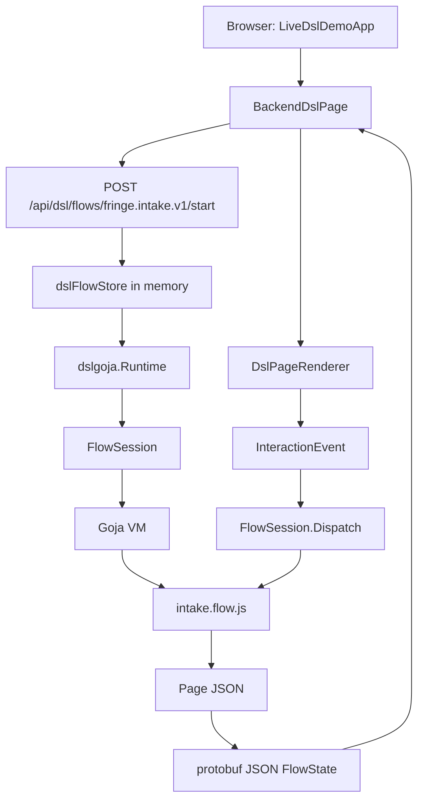

# DSL Persistence and Session Handling Guide

## Executive Summary

The current backend-driven UI DSL is functional, but it is not yet durable. The Goja flow keeps user choices in `ctx.state`, and `ctx.state` currently lives inside one in-memory Goja VM. The server keeps active flow sessions in an in-memory Go map. The browser remembers a `sessionId` in tab-scoped `sessionStorage`, but that id can only be resumed while the backend process still has the matching `FlowSession` object in memory. The site content used by the flow, such as services, tone options, budget tiers, days, time slots, and price ranges, is still hard-coded as JavaScript arrays in `pkg/dslgoja/flows/intake.flow.js`.

HAIR-038 should turn this prototype into a durable, session-aware runtime. The target architecture gives the Goja DSL two pre-provisioned database objects:

1. A **read-only `configDb`** for application configuration and content. In the current hair-booking app this includes service options, tone options, budget ranges, pricing ranges, availability windows, copy blocks, stylist display data, feature flags, and upload slot definitions. In another app it could contain onboarding questions, product plans, course modules, survey choices, or any other read-only content that drives a DSL flow.
2. A **read-write `stateDb`** for user-specific and session-specific state: flow sessions, current page/version, `ctx.state` snapshots, durable draft choices, uploads, preference key/value records, event audit records, and recovery metadata.

The implementation should keep the same high-level UI loop. JavaScript still writes the flow. React still renders page JSON. The browser still posts opaque action ids. The backend still owns callbacks and state transitions. The difference is that the runtime can now resume after refresh, survive backend restart, and draw page content from pre-provisioned data instead of from hard-coded arrays.

The design should be implemented in phases. Start by making the current `ctx.state` durable in the existing DSL read-write SQLite database. Then split site content into a read-only config database and expose both databases to Goja as database objects named `configDb` and `stateDb`. App-specific query helpers can live in the JavaScript flow or in app-owned JavaScript modules; they should not be hard-coded as Go host modules such as `host/config` because the DSL runtime should support a whole set of apps, not only service-appointment flows. Finally, harden session ownership, cleanup, migrations, tests, and operational tooling.

## 1. Current System in One Page

The DSL runtime already has a clear control loop. A browser component starts a flow, the Go backend creates a Goja session, the JavaScript flow renders a JSON page, the browser renders that page, and user interactions are posted back as backend events.



The central backend files are:

| File | Current responsibility |
| --- | --- |
| `pkg/dslgoja/runtime.go` | Creates `FlowSession`, owns Goja VM, stores `ctx.state`, registers callbacks, dispatches events, commits rendered pages. |
| `pkg/dslgoja/modules_dsl.go` | Installs `require("fringe/dsl")`, `require("host/user")`, `require("host/images")`, and optional `require("db")`. |
| `pkg/dslgoja/flows/intake.flow.js` | Real intake flow script. Holds hard-coded content arrays and mutates `ctx.state`. |
| `pkg/dslhost/db.go` | Opens and provisions the current DSL SQLite database. |
| `pkg/dslhost/schema.sql` | Creates current RW tables: `dsl_flow_sessions`, `dsl_intake_drafts`, `dsl_uploads`, `dsl_audit_events`. |
| `pkg/server/handlers_dsl.go` | Start/get/event HTTP handlers and in-memory session store. |
| `pkg/server/handlers_dsl_uploads.go` | DSL upload endpoint, user snapshot helper, and current DB persistence for session/upload rows. |
| `web/src/page-dsl/BackendDslPage.tsx` | Starts/resumes flow in React memory and dispatches events. |
| `web/src/LiveDslDemoApp.tsx` | Stores `sessionId` in tab-scoped `sessionStorage` and projects backend page ids into URLs. |

The most important runtime struct is `FlowSession`:

```go
type FlowSession struct {
    ID      string
    FlowID  string
    Version int64

    VM          *goja.Runtime
    flow        *goja.Object
    state       goja.Value
    CurrentPage Page

    CurrentActions  map[string]ActionRegistration
    RetiredActions  map[string]RetiredActionInfo
    ProcessedEvents map[string]InteractionResult
    UploadIntents   map[string]UploadIntent
    Uploads         map[string]UploadedImage
    User            UserSnapshot

    mu sync.Mutex
    rt *Runtime
}
```

Everything in that struct is process-local today. The new design must decide what remains process-local and what becomes durable.

## 2. The Persistence Gap

The current runtime has four kinds of state, but only one of them is partially durable.

| State kind | Current location | Current durability | Problem |
| --- | --- | --- | --- |
| User choices such as service, tone, photos, budget, day, time | `ctx.state` inside Goja VM | In memory only | Lost on backend restart; cannot resume if `FlowSession` disappears. |
| Active callback registry | `FlowSession.CurrentActions` | In memory only | Must remain in memory because callbacks are Goja closures; must be regenerated on resume. |
| Site content such as options and ranges | constants in `intake.flow.js` | Code only | Changing content requires code edit/deploy; no content versions. |
| Upload metadata | `FlowSession.Uploads` plus `dsl_uploads` DB row | Partially durable | DB row exists, but resumed flow must reload or query uploads. |
| Flow session row | `dsl_flow_sessions` | Created at start only | Current page/version not consistently updated after every dispatch; `state_json` is still `{}`. |
| Browser session pointer | `sessionStorage` | Per-tab browser storage | Works only while backend memory session still exists. |

The design goal is not to persist Goja closures. The design goal is to persist enough state to recreate a Goja session, run the flow script again, regenerate the current page, and create fresh action ids.

This distinction matters. A callback id such as `act_...` is a short-lived capability for one page version. It should not survive restart. A user choice such as `ctx.state.budget = "flexible"` should survive restart. A session id such as `flow_...` should survive restart if the user is allowed to resume it.

## 3. Target Model: Two Databases for Goja

HAIR-038 should split DSL persistence into two logical databases.

```mermaid
flowchart LR
  Goja[Goja flow script]
  ConfigObj[require("configDb")]
  StateObj[require("stateDb")]
  AppHelpers[App-owned JS query helpers]
  ConfigDB[(Read-only config DB)]
  StateDB[(Read-write state DB)]
  Runtime[Go runtime]
  Browser[Browser]

  Goja --> ConfigObj --> ConfigDB
  Goja --> StateObj --> StateDB
  Goja --> AppHelpers
  AppHelpers --> ConfigObj
  AppHelpers --> StateObj
  Runtime --> StateDB
  Runtime --> ConfigDB
  Browser --> Runtime
```

### 3.1 Read-only site configuration database

The read-only database stores content that defines the site experience. It should be readable from Goja but not writable from Goja.

Examples:

- service categories,
- service options,
- tone options,
- damage scale labels,
- budget tiers,
- pricing ranges,
- calendar day availability,
- time slots,
- stylist cards,
- copy blocks,
- feature flags,
- upload slot definitions,
- per-flow content version metadata.

The read-only property is a host invariant. Even if JavaScript code tries to write, the host should reject it. The exposed API should be a pre-provisioned database object, `require("configDb")`, with `query(...)` enabled and `exec(...)` disabled. App-specific convenience functions may be written in JavaScript on top of `configDb`, but the Go runtime should not ship a service-appointment-specific `host/config` API.

### 3.2 Read-write user state database

The read-write database stores session and user-specific data.

Examples:

- flow session rows,
- current step/page id,
- current page version,
- serialized `ctx.state`,
- event audit rows,
- processed event id records,
- upload metadata,
- user preference key/value rows,
- drafts,
- abandoned/completed status,
- expiration timestamps,
- content version used by the session.

This database may start as the existing `./var/fringe-dsl.sqlite` database. The current `dslhost/schema.sql` already contains a useful foundation. The implementation can extend it rather than replacing it in one step.

## 4. Naming and Configuration

The current serve command has one DSL SQLite path:

```text
--dsl-sqlite-path ./var/fringe-dsl.sqlite
--dsl-sqlite-migrate true
```

HAIR-038 should introduce explicit paths for the two-store model:

```text
--dsl-config-sqlite-path ./var/fringe-dsl-config.sqlite
--dsl-config-sqlite-migrate true
--dsl-config-readonly true

--dsl-state-sqlite-path ./var/fringe-dsl-state.sqlite
--dsl-state-sqlite-migrate true
```

For backwards compatibility during development, `--dsl-sqlite-path` can be kept as an alias for `--dsl-state-sqlite-path` for one phase. The guide recommends making the new names the canonical names in new code and docs.

The Go structs should evolve from:

```go
type RuntimeHost struct {
    DB        *sql.DB
    DBPath    string
    BlobStore storage.BlobStore
}
```

to something like:

```go
type RuntimeHost struct {
    ConfigDB     *sql.DB // read-only site content
    ConfigDBPath string

    StateDB      *sql.DB // read-write sessions/preferences
    StateDBPath  string

    BlobStore storage.BlobStore
}

func (h RuntimeHost) HasConfigDB() bool { return h.ConfigDB != nil }
func (h RuntimeHost) HasStateDB() bool  { return h.StateDB != nil }
```

This makes the dependency direction explicit. The runtime receives databases; it does not open them.

## 5. Database Schema Design

The read-only `configDb` schema and the read-write `stateDb` schema should be separate files. Suggested package layout:

```text
pkg/dslhost/
  config_db.go
  config_schema.sql
  config_seed.sql
  state_db.go
  state_schema.sql
  db.go                 # optional compatibility wrapper during migration
```

The current `schema.sql` can become `state_schema.sql` after the split.

### 5.1 Config database schema

A practical first config schema should support versioned content. Versioning matters because a user may start a session under one content version and finish it after content changes.

```sql
CREATE TABLE IF NOT EXISTS dsl_config_versions (
  id TEXT PRIMARY KEY,
  label TEXT NOT NULL,
  status TEXT NOT NULL DEFAULT 'draft', -- draft, active, archived
  created_at TEXT NOT NULL DEFAULT (datetime('now')),
  activated_at TEXT
);

CREATE TABLE IF NOT EXISTS dsl_service_options (
  id TEXT PRIMARY KEY,
  config_version_id TEXT NOT NULL,
  category TEXT NOT NULL,
  value TEXT NOT NULL,
  title TEXT NOT NULL,
  subtitle TEXT,
  badge TEXT,
  sort_order INTEGER NOT NULL DEFAULT 0,
  enabled INTEGER NOT NULL DEFAULT 1,
  metadata_json TEXT NOT NULL DEFAULT '{}',
  FOREIGN KEY(config_version_id) REFERENCES dsl_config_versions(id)
);

CREATE TABLE IF NOT EXISTS dsl_tone_options (
  id TEXT PRIMARY KEY,
  config_version_id TEXT NOT NULL,
  value TEXT NOT NULL,
  label TEXT NOT NULL,
  sort_order INTEGER NOT NULL DEFAULT 0,
  enabled INTEGER NOT NULL DEFAULT 1,
  FOREIGN KEY(config_version_id) REFERENCES dsl_config_versions(id)
);

CREATE TABLE IF NOT EXISTS dsl_budget_options (
  id TEXT PRIMARY KEY,
  config_version_id TEXT NOT NULL,
  value TEXT NOT NULL,
  title TEXT NOT NULL,
  subtitle TEXT,
  min_cents INTEGER,
  max_cents INTEGER,
  sort_order INTEGER NOT NULL DEFAULT 0,
  enabled INTEGER NOT NULL DEFAULT 1,
  metadata_json TEXT NOT NULL DEFAULT '{}',
  FOREIGN KEY(config_version_id) REFERENCES dsl_config_versions(id)
);

CREATE TABLE IF NOT EXISTS dsl_price_ranges (
  id TEXT PRIMARY KEY,
  config_version_id TEXT NOT NULL,
  service_value TEXT NOT NULL,
  budget_value TEXT,
  label TEXT NOT NULL,
  min_cents INTEGER,
  max_cents INTEGER,
  FOREIGN KEY(config_version_id) REFERENCES dsl_config_versions(id)
);

CREATE TABLE IF NOT EXISTS dsl_availability_days (
  id TEXT PRIMARY KEY,
  config_version_id TEXT NOT NULL,
  date TEXT NOT NULL,
  day_label TEXT NOT NULL,
  enabled INTEGER NOT NULL DEFAULT 1,
  has_dot INTEGER NOT NULL DEFAULT 0,
  disabled_reason TEXT,
  sort_order INTEGER NOT NULL DEFAULT 0,
  FOREIGN KEY(config_version_id) REFERENCES dsl_config_versions(id)
);

CREATE TABLE IF NOT EXISTS dsl_time_slots (
  id TEXT PRIMARY KEY,
  config_version_id TEXT NOT NULL,
  date TEXT,
  value TEXT NOT NULL,
  title TEXT NOT NULL,
  enabled INTEGER NOT NULL DEFAULT 1,
  sort_order INTEGER NOT NULL DEFAULT 0,
  FOREIGN KEY(config_version_id) REFERENCES dsl_config_versions(id)
);

CREATE TABLE IF NOT EXISTS dsl_copy_blocks (
  id TEXT PRIMARY KEY,
  config_version_id TEXT NOT NULL,
  key TEXT NOT NULL,
  text TEXT NOT NULL,
  metadata_json TEXT NOT NULL DEFAULT '{}',
  FOREIGN KEY(config_version_id) REFERENCES dsl_config_versions(id)
);
```

The first seed should mirror the arrays currently in `intake.flow.js`:

- `serviceOptions`,
- `toneOptions`,
- `budgetOptions`,
- `dayOptions`,
- `timeOptions`,
- estimate range rules.

### 5.2 State database schema

The existing state schema already has the right beginning:

```sql
CREATE TABLE IF NOT EXISTS dsl_flow_sessions (...);
CREATE TABLE IF NOT EXISTS dsl_intake_drafts (...);
CREATE TABLE IF NOT EXISTS dsl_uploads (...);
CREATE TABLE IF NOT EXISTS dsl_audit_events (...);
```

HAIR-038 should extend it for durable session recovery:

```sql
ALTER TABLE dsl_flow_sessions ADD COLUMN config_version_id TEXT;
ALTER TABLE dsl_flow_sessions ADD COLUMN expires_at TEXT;
ALTER TABLE dsl_flow_sessions ADD COLUMN completed_at TEXT;
ALTER TABLE dsl_flow_sessions ADD COLUMN last_event_id TEXT;
ALTER TABLE dsl_flow_sessions ADD COLUMN route_path TEXT;
```

For fresh schemas, define it directly:

```sql
CREATE TABLE IF NOT EXISTS dsl_flow_sessions (
  id TEXT PRIMARY KEY,
  flow_id TEXT NOT NULL,
  user_id TEXT,
  browser_tab_id TEXT,
  status TEXT NOT NULL DEFAULT 'active', -- active, completed, abandoned, expired
  current_step TEXT,
  current_page_id TEXT,
  current_page_version INTEGER NOT NULL DEFAULT 0,
  config_version_id TEXT,
  state_json TEXT NOT NULL DEFAULT '{}',
  route_path TEXT,
  last_event_id TEXT,
  created_at TEXT NOT NULL DEFAULT (datetime('now')),
  updated_at TEXT NOT NULL DEFAULT (datetime('now')),
  expires_at TEXT,
  completed_at TEXT
);
```

Add an event table for idempotency and audit:

```sql
CREATE TABLE IF NOT EXISTS dsl_flow_events (
  id TEXT PRIMARY KEY,
  session_id TEXT NOT NULL,
  page_version INTEGER NOT NULL,
  node_id TEXT,
  node_kind TEXT,
  action_id TEXT,
  event TEXT NOT NULL,
  value_json TEXT,
  meta_json TEXT,
  result_page_id TEXT,
  result_page_version INTEGER,
  created_at TEXT NOT NULL DEFAULT (datetime('now')),
  FOREIGN KEY(session_id) REFERENCES dsl_flow_sessions(id) ON DELETE CASCADE
);
```

Add normalized preferences for values that should outlive one session:

```sql
CREATE TABLE IF NOT EXISTS dsl_user_preferences (
  user_id TEXT NOT NULL,
  namespace TEXT NOT NULL,
  key TEXT NOT NULL,
  value_json TEXT NOT NULL,
  source_session_id TEXT,
  updated_at TEXT NOT NULL DEFAULT (datetime('now')),
  PRIMARY KEY(user_id, namespace, key)
);
```

Keep `dsl_intake_drafts` for session-level draft payloads. Use `dsl_user_preferences` for cross-session remembered values such as preferred budget or preferred tones.

## 6. Goja Database Object API Design

The JavaScript flow should receive two pre-provisioned database objects. The runtime should not expose appointment-specific host APIs such as `host/config` or `host/preferences`. The goal is to support many DSL apps with the same runtime: appointment booking, onboarding, surveys, product configurators, education flows, internal tools, and future apps that do not share the hair-booking schema.

The generic contract is:

```js
const configDb = require("configDb"); // read-only, pre-provisioned by Go
const stateDb = require("stateDb");   // read-write, pre-provisioned by Go
```

The underlying go-go-goja database module already exposes the right low-level shape:

```js
db.query(sql, ...args)  // returns array of row objects
db.exec(sql, ...args)   // returns { success, rowsAffected, lastInsertId }
db.close()
db.configure(...)       // disabled when preconfigured by Go
```

For both database objects, `configure(...)` must be disabled. JavaScript should not be able to point either object at a different database. Go owns provisioning, opening, path selection, pragmas, migrations, and read-only enforcement.

### 6.1 `configDb`: read-only app configuration

`configDb` is the generic read-only content store. It should support `query(...)` and reject all writes. The Go wrapper should reject `exec(...)` unconditionally, and should also reject non-read SQL passed to `query(...)`.

```go
type QueryOnlyDB struct { DB *sql.DB }

func (q QueryOnlyDB) Query(query string, args ...any) (*sql.Rows, error) {
    if !looksLikeReadOnlySQL(query) {
        return nil, fmt.Errorf("configDb only allows SELECT/WITH queries")
    }
    return q.DB.Query(query, args...)
}

func (q QueryOnlyDB) Exec(query string, args ...any) (sql.Result, error) {
    return nil, fmt.Errorf("configDb is read-only")
}
```

A hair-booking flow can build app-specific JavaScript helpers on top of `configDb`:

```js
const configDb = require("configDb");

function activeConfigVersion() {
  var rows = configDb.query(
    "SELECT id FROM dsl_config_versions WHERE status = ? ORDER BY activated_at DESC LIMIT 1",
    "active"
  );
  return rows.length ? rows[0].id : "default";
}

function serviceOptions(ctx) {
  return configDb.query(
    `SELECT value, title, subtitle, badge
       FROM dsl_service_options
      WHERE config_version_id = ? AND category = ? AND enabled = 1
      ORDER BY sort_order`,
    ctx.state.configVersionId,
    ctx.state.category
  );
}
```

A different app can define different helpers against different tables while using the same runtime-level `configDb` object. That is the main reason to keep the Go module generic.

### 6.2 `stateDb`: read-write session and preference state

`stateDb` is the generic read-write database object. It stores runtime-managed session rows and app-managed preference/draft rows. The Go runtime should write core session snapshots itself, while JavaScript may write app-specific rows when it needs durable normalized data.

Example JavaScript helpers for the hair-booking flow:

```js
const stateDb = require("stateDb");
const user = require("host/user");

function currentUserId(ctx) {
  var current = user.current();
  return current.id || ("anon:" + ctx.sessionId);
}

function savePreference(ctx, namespace, key, value) {
  stateDb.exec(
    `INSERT INTO dsl_user_preferences(user_id, namespace, key, value_json, source_session_id, updated_at)
     VALUES (?, ?, ?, ?, ?, datetime('now'))
     ON CONFLICT(user_id, namespace, key)
     DO UPDATE SET value_json = excluded.value_json,
                   source_session_id = excluded.source_session_id,
                   updated_at = datetime('now')`,
    currentUserId(ctx),
    namespace,
    key,
    JSON.stringify(value),
    ctx.sessionId
  );
}

function loadPreference(ctx, namespace, key, fallback) {
  var rows = stateDb.query(
    `SELECT value_json FROM dsl_user_preferences
      WHERE user_id = ? AND namespace = ? AND key = ?`,
    currentUserId(ctx),
    namespace,
    key
  );
  return rows.length ? JSON.parse(rows[0].value_json) : fallback;
}
```

The runtime should still persist the entire `ctx.state` after successful render/dispatch. App-level `stateDb` writes are for normalized preferences, drafts, audit records, or app-specific data that should be queryable outside the VM state snapshot.

### 6.3 Runtime-managed rows versus app-managed rows

The two database objects are generic, but not every table should be written by arbitrary app code.

Runtime-managed tables:

- `dsl_flow_sessions`,
- `dsl_flow_events`,
- upload metadata rows created by the upload endpoint,
- cleanup/expiry bookkeeping.

App-managed tables:

- app-specific config tables in `configDb`, read-only to Goja,
- `dsl_user_preferences`,
- `dsl_intake_drafts` or future app draft tables,
- app-specific audit tables if needed.

The implementation should document this boundary in code comments and tests. The database object is generic; the ownership of specific tables still matters.

## 7. Runtime Session Persistence

Durable session persistence requires the runtime to export and import `ctx.state`.

### 7.1 Export state after successful render or dispatch

After `commitRenderTransaction`, the server should persist:

- session id,
- flow id,
- user id,
- status,
- current page id,
- current page version,
- current step if present,
- config version id,
- serialized state JSON,
- updated timestamp,
- expiration timestamp.

Pseudocode:

```text
handleDSLEvent(request):
    session = get or hydrate session
    result = session.Dispatch(event)
    if result is success or stale result:
        persistSessionSnapshot(session, result)
        persistEvent(event, result)
    return FlowState(result)
```

State export can be implemented on `FlowSession`:

```go
func (s *FlowSession) StateJSON() ([]byte, error) {
    s.mu.Lock()
    defer s.mu.Unlock()
    exported := s.state.Export()
    return json.Marshal(exported)
}
```

If `state` contains non-JSON values, export should fail. That failure is useful because `ctx.state` must remain durable and JSON-safe. Page authors should not store callbacks, module objects, dates, or database rows with driver-specific types in `ctx.state`.

### 7.2 Hydrate state when memory session is missing

The current `GET /api/dsl/flows/{sessionId}` only works if `dslFlowStore.get(sessionId)` succeeds. HAIR-038 should add hydration:

```text
getSession(sessionId, requestUser):
    if session exists in memory:
        validate ownership
        return session

    row = SELECT * FROM dsl_flow_sessions WHERE id = ?
    if no row:
        return dsl_session_not_found
    if row expired or completed:
        return appropriate error/recovery response
    validate row.user_id against request user

    session = runtime.ResumeFlow(
        flowID = row.flow_id,
        sessionID = row.id,
        source = DemoIntakeFlowSource,
        stateJSON = row.state_json,
        user = current user snapshot,
        configVersion = row.config_version_id,
        previousVersion = row.current_page_version,
    )
    store session in memory
    return session
```

The resumed session must re-run the flow source and regenerate action ids. It should not try to restore `CurrentActions` from the database. Callback closures are not durable.

### 7.3 ResumeFlow API

Add a runtime API like:

```go
type ResumeFlowOptions struct {
    SessionID          string
    User               UserSnapshot
    StateJSON          []byte
    ConfigVersionID    string
    PreviousPageVersion int64
}

func (rt *Runtime) ResumeFlow(ctx context.Context, flowID, source string, options ResumeFlowOptions) (*FlowSession, *InteractionResult, error)
```

The algorithm is:

```text
ResumeFlow:
    create goja.Runtime
    create FlowSession with the existing session id
    install host modules
    run flow source
    parse StateJSON into a Goja value
    assign session.state
    set session.Version = PreviousPageVersion
    call session.Render(ctx)
    return new page with fresh action ids
```

Because `Render` increments `Version`, a resumed session may return `previousVersion + 1`. That is acceptable. It tells the browser it has a fresh page and fresh actions.

## 8. Session Identity and Ownership

There are three identities in play:

| Identity | Meaning | Current source |
| --- | --- | --- |
| `flowId` | The flow definition, e.g. `fringe.intake.v1`. | URL path in start endpoint. |
| `sessionId` | One running instance of a flow. | Generated by Go runtime and stored in browser `sessionStorage`. |
| `userId` | Authenticated user or anonymous session-derived id. | `dslUserSnapshot(r)`. |

HAIR-038 should enforce ownership when resuming, dispatching, and uploading.

For authenticated users:

```text
row.user_id must equal currentUser.ID
```

For anonymous users, use a signed browser cookie or signed session token instead of trusting only `sessionStorage`. A practical first implementation can create an anonymous DSL owner id and store it in an HTTP-only signed cookie:

```text
fringe_dsl_owner=opaque-signed-owner-id
```

Then `dslUserSnapshot(r)` can use that owner id when no auth claims exist. This prevents another browser from guessing a `sessionId` and resuming an anonymous session.

The rule is:

```text
The browser may remember the session id, but the server must decide whether the request owns that session.
```

## 9. Content Versioning and Deterministic Rerendering

When a user starts a flow, the runtime should record the active config version on the session row. The runtime does not need to know what the version means for every app. It only needs to preserve the value selected at session start and expose it to JavaScript through `ctx.state`, `ctx.configVersionId`, or another JSON-safe context field.

```text
session.config_version_id = selected active config version id
```

Subsequent renders for that session should use the same config version unless the product explicitly opts into live content changes. This avoids confusing behavior where a user selects an option, the config changes, and the next render no longer contains the selected value.

With generic database objects, the app-level JavaScript helper carries the version into SQL:

```js
function serviceOptions(ctx) {
  return configDb.query(
    `SELECT value, title, subtitle, badge
       FROM dsl_service_options
      WHERE config_version_id = ? AND category = ? AND enabled = 1
      ORDER BY sort_order`,
    ctx.state.configVersionId,
    ctx.state.category
  );
}
```

A different DSL app can use the same pattern with different tables. The runtime rule is app-agnostic: choose a config version, store it on the session, and make it available to the flow.

The session row should store both the version and a small content snapshot if needed. For example, if a price estimate must remain fixed after it is shown, store the exact estimated range in `ctx.state` or an app-specific `stateDb` table when it is first computed.

## 10. How `intake.flow.js` Changes

The current flow starts with hard-coded arrays:

```js
const serviceOptions = [...];
const toneOptions = [...];
const budgetOptions = [...];
const dayOptions = [...];
const timeOptions = [...];
```

After HAIR-038, those arrays should move behind app-local JavaScript query helpers that use `configDb` and `stateDb`:

```js
const { page, n } = require("fringe/dsl");
const configDb = require("configDb");
const stateDb = require("stateDb");
const images = require("host/images");
const user = require("host/user");
```

The helpers can live in `intake.flow.js` at first:

```js
function servicesForCategory(ctx) {
  return configDb.query(
    `SELECT value, title, subtitle, badge
       FROM dsl_service_options
      WHERE config_version_id = ? AND category = ? AND enabled = 1
      ORDER BY sort_order`,
    ctx.state.configVersionId,
    ctx.state.category
  );
}

function budgetOptions(ctx) {
  return configDb.query(
    `SELECT value, title, subtitle
       FROM dsl_budget_options
      WHERE config_version_id = ? AND enabled = 1
      ORDER BY sort_order`,
    ctx.state.configVersionId
  );
}
```

`initialState()` should remain JSON-safe and may stay pure. Because it currently receives no `ctx`, the simplest first implementation is to let the Go runtime hydrate `state_json` before render and let the flow fill missing defaults in an `ensureState(ctx)` helper during render:

```js
function initialState() {
  return { step: "service" };
}

function ensureState(ctx) {
  if (!ctx.state.configVersionId) {
    var rows = configDb.query(
      "SELECT id FROM dsl_config_versions WHERE status = ? ORDER BY activated_at DESC LIMIT 1",
      "active"
    );
    ctx.state.configVersionId = rows.length ? rows[0].id : "default";
  }
  if (!ctx.state.category) ctx.state.category = "color";
  if (!ctx.state.photos) ctx.state.photos = { front: null, side: null, back: null };
}

function render(ctx) {
  ensureState(ctx);
  switch (ctx.state.step) {
    case "color": return colorStep(ctx);
    default: return serviceStep(ctx);
  }
}
```

Callbacks should still mutate `ctx.state` and return `render(ctx)`. If a value should also be queryable outside the session snapshot, the callback can write to `stateDb` through an app-local helper:

```js
actions: {
  change: ctx.action("setBudget", function (event) {
    ctx.state.budget = event.value;
    savePreference(ctx, "intake", "budget", event.value);
    return render(ctx);
  }, "change"),
}
```

The runtime remains responsible for persisting the entire `ctx.state` after dispatch. `stateDb` calls inside the flow are additional app-level writes, not a replacement for the runtime session snapshot.

## 11. API References

### 11.1 Existing HTTP endpoints

Current DSL endpoints:

```text
POST /api/dsl/flows/{flowId}/start
GET  /api/dsl/flows/{sessionId}
POST /api/dsl/flows/{sessionId}/events
POST /api/dsl/flows/{sessionId}/uploads/{uploadId}
```

HAIR-038 should keep these endpoints and change their behavior to hydrate from the state DB when needed.

### 11.2 Future session endpoints

Optional but useful additions:

```text
POST /api/dsl/flows/{flowId}/start
  Starts a new flow. May accept input such as resume policy or initial route.

GET /api/dsl/flows/{sessionId}
  Returns current FlowState. If not in memory, attempts durable hydration.

POST /api/dsl/flows/{sessionId}/events
  Dispatches event. Persists state/event snapshot after successful dispatch.

POST /api/dsl/flows/{sessionId}/abandon
  Marks a session abandoned. Useful when user exits intentionally.

POST /api/dsl/flows/{sessionId}/complete
  Marks completed after final submission.
```

### 11.3 Protobuf messages

The current transport already defines:

```protobuf
message FlowState {
  string session_id = 1;
  uint32 page_version = 2;
  Page page = 3;
  repeated Effect effects = 4;
}

message InteractionEvent {
  string event_id = 1;
  string session_id = 2;
  uint32 page_version = 3;
  string node_id = 4;
  string node_kind = 5;
  string action_id = 6;
  string event = 7;
  google.protobuf.Value value = 8;
  google.protobuf.Struct meta = 9;
}
```

HAIR-038 does not need to change the page transport immediately. If start-flow inputs or resume policies become important, add fields to `StartFlowRequest` later. The first implementation can keep the current URL-driven start endpoint.

## 12. Implementation Plan

### Phase 1: Rename and split host database configuration

Goal: introduce explicit `ConfigDB` and `StateDB` host dependencies without changing flow behavior yet.

Tasks:

- Add `pkg/dslhost/config_db.go` and `pkg/dslhost/state_db.go`.
- Move current schema into `state_schema.sql` or keep compatibility wrapper while adding new schema files.
- Add serve flags for `configDb`/`stateDb` paths.
- Open both DBs in `cmd/hair-booking/cmds/serve.go`.
- Extend `server.ServerOptions`, `server.HandlerOptions`, `appHandler`, `dslFlowStore`, and `dslgoja.RuntimeHost`.
- Keep existing `require("db")` mapped to `stateDb` during transition, or remove it after callers switch to explicit names.

Validation:

```bash
go test ./pkg/dslhost ./pkg/dslgoja ./pkg/server -count=1
```

### Phase 2: Persist `ctx.state` snapshots

Goal: make current flow choices survive backend restart.

Tasks:

- Add `FlowSession.StateJSON()` and possibly `FlowSession.Step()` helpers.
- Update `recordDSLFlowSession` into `persistDSLSessionSnapshot`.
- Call snapshot persistence after start and after every dispatch.
- Record current page id/version and state JSON.
- Add tests that dispatch events and verify `dsl_flow_sessions.state_json` changes.

Pseudocode:

```go
func (h *appHandler) persistDSLSessionSnapshot(ctx context.Context, session *dslgoja.FlowSession, result *dslgoja.InteractionResult) error {
    stateJSON, err := session.StateJSON()
    if err != nil { return err }
    _, err = h.dslFlows.stateDB.ExecContext(ctx, `
      INSERT INTO dsl_flow_sessions(... state_json ...)
      VALUES (... ? ...)
      ON CONFLICT(id) DO UPDATE SET
        current_page_id = excluded.current_page_id,
        current_page_version = excluded.current_page_version,
        state_json = excluded.state_json,
        updated_at = datetime('now')`, string(stateJSON))
    return err
}
```

### Phase 3: Hydrate missing sessions from the state DB

Goal: make browser refresh and backend restart recovery work.

Tasks:

- Add `Runtime.ResumeFlow(...)`.
- Add `dslFlowStore.getOrHydrate(...)`.
- Update `handleDSLGetFlow`, `handleDSLEvent`, and `handleDSLUpload` to use hydration where appropriate.
- Validate ownership before returning hydrated sessions.
- Add tests that create a session, persist state, create a new store/runtime, and resume by session id.

Important invariant:

```text
Do not persist or restore action ids. Hydration re-renders the page and creates fresh action ids.
```

### Phase 4: Add read-only config DB and `configDb`

Goal: move app content out of `intake.flow.js` arrays without creating an appointment-specific Go host API.

Tasks:

- Add config schema and seed data matching current sample app constants.
- Open config DB in read-only mode after migration/seed.
- Register a pre-provisioned Goja database module named `configDb`.
- Wrap `configDb` so `exec(...)` fails and `query(...)` accepts only read-only SQL.
- Keep `configure(...)` disabled.
- Update `intake.flow.js` to define app-local helper functions that query `configDb`.
- Add tests that render pages from seeded config data through `configDb`.

Pseudocode for module registration:

```go
configModule := databasemod.New(
    databasemod.WithName("configDb"),
    databasemod.WithPreconfiguredDB(QueryOnlyDB{DB: rt.host.ConfigDB}),
    databasemod.WithConfigureEnabled(false),
)
registry.RegisterNativeModule(configModule.Name(), configModule.Loader)
```

### Phase 5: Add explicit `stateDb` and app-level preference helpers

Goal: expose a pre-provisioned read-write database object for app-specific durable rows while keeping runtime-managed session snapshots in Go.

Tasks:

- Register a pre-provisioned Goja database module named `stateDb`.
- Keep `configure(...)` disabled.
- Keep runtime snapshot writes in Go, not in JavaScript.
- Add app-local JavaScript helpers such as `savePreference(ctx, namespace, key, value)` and `loadPreference(ctx, namespace, key, fallback)` on top of `stateDb`.
- Scope helper queries by the current `host/user` snapshot and/or `ctx.sessionId`.
- Update flow callbacks to call those app-level helpers only for values that should outlive the session snapshot.
- Add tests for authenticated and anonymous preference isolation.

Example helper API inside the app flow:

```js
savePreference(ctx, namespace, key, value)
loadPreference(ctx, namespace, key, fallback)
saveDraft(ctx, value)
loadDraft(ctx)
```

### Phase 6: Session ownership, expiry, and cleanup

Goal: make persisted sessions safe and operationally manageable.

Tasks:

- Add signed anonymous owner cookie or equivalent server-side owner token.
- Enforce ownership on get/event/upload.
- Add expiry timestamps to sessions.
- Add cleanup command or startup cleanup for expired sessions and orphaned upload intents.
- Add tests for wrong-user resume, expired session, completed session, and anonymous ownership.

## 13. Testing Strategy

Add tests at every layer.

### 13.1 `pkg/dslhost`

Test config and state database provisioning:

- schema creates expected tables,
- seed data inserts active config version,
- read-only open rejects writes,
- state schema remains idempotent.

### 13.2 `pkg/dslgoja`

Test runtime persistence helpers:

- `StateJSON()` exports JSON state,
- non-JSON state fails predictably,
- `ResumeFlow` restores state and renders current page,
- `configDb` returns expected seeded values and rejects writes,
- `stateDb` accepts app-level preference writes and scopes helper queries by user/session.

### 13.3 `pkg/server`

Test HTTP behavior:

- start persists session row with state JSON,
- dispatch updates state JSON and current page version,
- get hydrates a missing in-memory session from DB,
- wrong user cannot hydrate or dispatch,
- stale page version returns current page/effect,
- upload still works after hydration.

### 13.4 Frontend tests

The frontend should need few changes. Keep tests around:

- missing session recovery,
- state update after backend dispatch,
- route projection after hydrated `FlowState`,
- no `undefined` protobuf values.

## 14. Failure Modes and How to Handle Them

### Backend restart between page render and click

The browser has a page with old action ids. The backend has no memory session. The event endpoint hydrates the session and rerenders fresh actions. The old action id cannot be dispatched. Return the current page with an effect such as:

```json
{ "kind": "toast", "tone": "info", "message": "This page was refreshed. Please try again." }
```

### Config changes while a user is mid-flow

Use the session's stored `config_version_id` for the rest of that session. Do not silently switch active content versions mid-flow unless explicitly requested.

### JavaScript stores non-JSON state

`StateJSON()` fails. Treat that as a flow authoring error. Return a dangerous effect in development and log the error. Add tests to keep `ctx.state` JSON-safe.

### Anonymous session id theft

Do not rely on `sessionStorage` alone. Add a signed owner cookie or another server-side ownership proof. Validate owner on every get/event/upload.

### DB write fails after callback mutated VM state

This is a real consistency risk. The first implementation can return a danger effect and log the failure, but the better long-term pattern is to persist after successful render and treat DB failure as request failure. For high-value actions, callbacks should write through `stateDb` before returning the page, so errors occur before the UI advances.

### Operational cleanup for expired sessions

Expired sessions should stop hydrating immediately. A lightweight cleanup operation should periodically mark active rows as expired when `expires_at <= datetime('now')`:

```sql
UPDATE dsl_flow_sessions
SET status = 'expired', updated_at = datetime('now')
WHERE status = 'active'
  AND expires_at IS NOT NULL
  AND expires_at <= datetime('now');
```

This cleanup does not need to delete rows in the first implementation. Marking rows as expired preserves auditability and makes it possible to inspect abandoned flows. A later retention job can delete expired sessions and cascade uploads/drafts after a product-defined retention window.

## 15. Design Decisions

### Decision 1: Persist state snapshots, not callbacks

Callbacks are Goja closures and should remain process-local. Persisting them would require serializing executable code and captured VM state, which is not appropriate. Persist `ctx.state` and rerender to regenerate callbacks.

### Decision 2: Expose pre-provisioned database objects, not app-specific host modules

The runtime should provide `configDb` and `stateDb` as generic database objects. App-specific helpers may wrap SQL inside the JavaScript flow or app-owned JavaScript modules, but the Go runtime should not hard-code concepts such as services, budgets, appointments, or intake preferences. This keeps the DSL runtime usable for a whole set of apps.

### Decision 3: Version site configuration

Sessions should record the config version they started with. This makes rerendering deterministic and prevents mid-flow content changes from invalidating selected values.

### Decision 4: Keep browser route as projection

The route should continue to follow backend page ids after successful backend responses. The route should not drive the DSL state directly.

### Decision 5: Start with SQLite, keep repository boundaries

SQLite is appropriate for the current development/runtime shape. Repository interfaces should keep the design open for Postgres or a managed store later.

## 16. Alternatives Considered

### Alternative: Put everything in the existing application Postgres database

This would centralize storage, but it couples the experimental DSL runtime to the main app data model too early. The current DSL host database already exists and is easier to evolve quickly. A later migration can move durable tables to Postgres if needed.

### Alternative: Keep all content in JavaScript constants

This is simple, but it fails the content-management requirement. Services, budgets, days, and ranges would remain code changes instead of data changes.

### Alternative: Add app-specific semantic Go host modules

The previous design proposed modules such as `host/config` and `host/preferences`. That would make the first hair-booking implementation pleasant, but it would also push appointment-specific semantics into the reusable Goja runtime. HAIR-038 should instead expose `configDb` and `stateDb` and let each app define its own JavaScript query helpers.

### Alternative: Persist the current rendered page JSON only

Persisting page JSON helps reload the last view, but it does not restore callbacks. The next click would still fail unless the flow rerenders and registers fresh actions. Persisting `ctx.state` is the necessary durable unit.

## 17. File Reference Map for the Intern

Read these files in order:

1. `pkg/dslgoja/schema.go` — understand page, node, action, event, and result shapes.
2. `pkg/dslgoja/runtime.go` — understand session state, render transactions, action registration, dispatch, and page export.
3. `pkg/dslgoja/modules_dsl.go` — understand how Goja modules are installed.
4. `pkg/dslgoja/flows/intake.flow.js` — understand how the real flow uses `ctx.state`, config arrays, actions, and navigation.
5. `pkg/dslhost/db.go` and `pkg/dslhost/schema.sql` — understand the current SQLite host foundation.
6. `pkg/server/handlers_dsl.go` — understand start/get/event HTTP behavior.
7. `pkg/server/handlers_dsl_uploads.go` — understand current examples of durable DB writes and user snapshot extraction.
8. `web/src/page-dsl/BackendDslPage.tsx` — understand frontend session state and event dispatch.
9. `web/src/LiveDslDemoApp.tsx` — understand browser sessionStorage and route projection.
10. `proto/fringe/dsl/v1/dsl.proto` — understand transport envelopes.

## 18. Minimal First Implementation Slice

If the intern can only implement one slice, implement this one:

1. Add `FlowSession.StateJSON()`.
2. Update `recordDSLFlowSession` so it writes real `state_json`, current page id, and page version after start and dispatch.
3. Add a server test proving state JSON changes after selecting service or budget.
4. Add `Runtime.ResumeFlow(...)` with state JSON input.
5. Update `GET /api/dsl/flows/{sessionId}` so a missing memory session is hydrated from `dsl_flow_sessions`.
6. Add a test that starts a flow with one handler/store, dispatches a choice, creates a new handler/store using the same DB, calls GET, and sees the selected choice in the rendered page.

That slice proves the most important claim: `ctx.state` is no longer only process memory.

## 19. Working Rule

The persistent unit of a Goja UI flow is not the rendered DOM, and it is not the action registry. The persistent unit is the session state plus the content version that interprets that state. The backend should be able to recreate a Goja VM, load the same flow script, inject the same state and config version, render a new page, and issue fresh action ids. The browser should not care that this happened. It should receive a `FlowState` and render it.

That rule should guide every implementation decision in HAIR-038.
