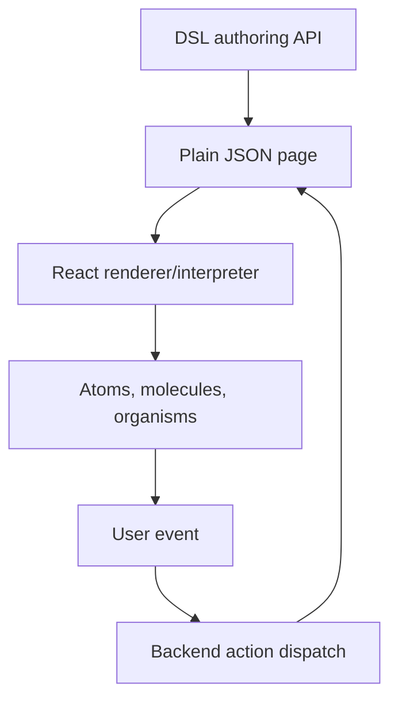
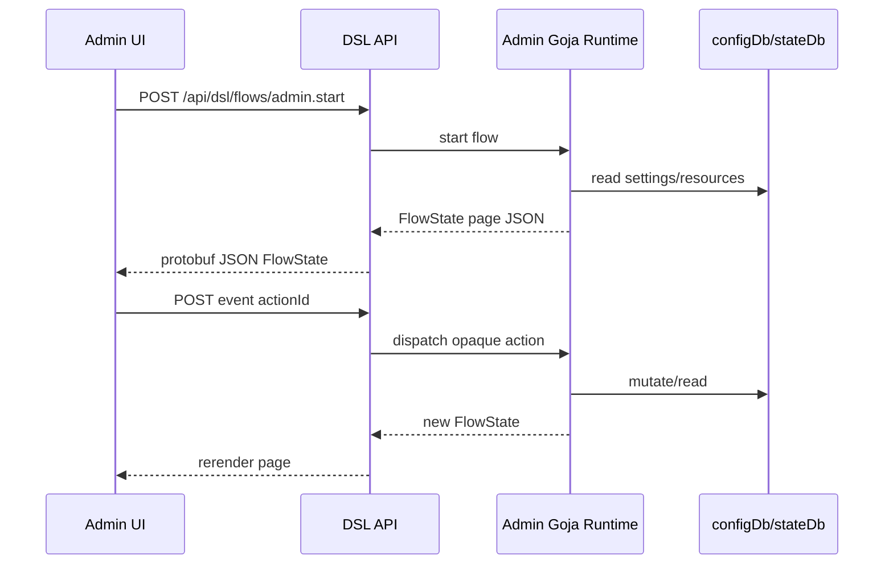

# Admin Design System and DSL Implementation Guide

## Executive Summary

HAIR-039 creates the design plan for a new admin-side design system and DSL. The current Fringe UI DSL is oriented toward intake-style pages: a user moves through a sequence of focused screens, selects options, uploads photos, and dispatches backend actions. The next product surface is different. A self-employed stylist needs to manage the business: appointments, intake requests, clients, services, availability, website content, photos, policies, and settings.

The admin DSL should reuse the architectural pattern that already works: ergonomic JavaScript builders emit plain JSON, React interprets that JSON into design-system components, and backend actions are represented by opaque action refs. The admin DSL should not become a separate ad hoc React app for every screen. It should also not become a rigid set of one function per screen, such as `makeAppointmentsPage()` and `makeServicesPage()`. The target is an elegant middle layer: high-level primitives for admin patterns, and enough composition to build many different management UIs.

The concrete MVP is a one-stylist salon. That case is small enough to implement, but rich enough to force the important admin patterns:

- dashboard summaries,
- calendar/appointment management,
- intake review,
- client records,
- service/pricing editing,
- availability editing,
- website content editing,
- media/gallery management,
- settings and policies,
- modals, drawers, confirmations, empty states, loading states, and error states.

The first implementation should be Storybook-first. Build the admin DSL schema, builder, examples, and renderer locally before connecting everything to live backend endpoints. Once the UI language is stable, backend-driven admin pages can use the same transport/action model as the current Goja DSL.

## 1. Current System Context

The current DSL system has four major frontend files:

| File | Role |
| --- | --- |
| `web/src/page-dsl/schema.ts` | Defines JSON-safe page/node/action types. |
| `web/src/page-dsl/builder.ts` | Provides fluent `page(...)` and `n.*` authoring helpers. |
| `web/src/page-dsl/render.tsx` | Interprets JSON nodes into React atoms, molecules, and organisms. |
| `web/src/page-dsl/BackendDslPage.tsx` | Starts/resumes backend flows and dispatches backend events. |

The key architectural rule is simple: authoring can be ergonomic, but the output must be JSON. The browser renderer receives plain objects. Backend callbacks are never serialized; they become action refs.



The admin DSL should keep this loop. It should add a new vocabulary for admin pages, not replace the runtime model.

## 2. Problem Statement

A one-stylist salon still needs a surprisingly broad management UI. Even when there is only one staff member, the system must support daily operational tasks:

- What is happening today?
- Which requests need review?
- Which appointments are upcoming?
- Which clients have important notes?
- Which services are visible on the website?
- Which days and times are bookable?
- Which homepage content, policies, and images are public?

These tasks do not fit well into the existing intake shell. They require list/detail layouts, tables, calendars, drawers, modals, forms, image grids, settings pages, and empty/error states.

At the same time, we should avoid building a monolithic admin framework too early. The admin DSL should be small enough for an intern to implement in phases. It should be expressive enough to build the MVP screens and generic enough to support other small websites later.

## 3. Design Goal: Simple and Expressive

The goal is an elegant mix of simplicity and expressiveness.

Simplicity means:

- a small number of concepts,
- predictable JSON output,
- obvious renderer mappings,
- clear Storybook examples,
- no hidden React code inside the DSL,
- no app-specific Go host API baked into the frontend DSL.

Expressiveness means:

- pages can combine dashboard cards, lists, forms, calendars, modals, and drawers,
- resource pages can define list/detail/form behavior without hard-coding one screen shape,
- actions can open modals, run mutations, refresh queries, navigate, or confirm destructive work,
- the same primitives can build salon admin, course admin, event admin, product admin, or personal-site admin.

The right API is layered. Low-level nodes still exist for layout and display. Higher-level admin nodes capture common management patterns.

```text
admin.page        page shell + regions
resource.page     list/detail/form CRUD composition
view.*            list/table/calendar/board views
field.*           form/display fields
action.*          backend/modal/navigation actions
modal/drawer      secondary interaction surfaces
```

## 4. One-Stylist Salon MVP Screens

The MVP admin product should include these screens.

### 4.1 Dashboard

The dashboard is the default admin landing page. It should answer: what needs attention now?

MVP content:

- today / next appointment,
- pending consultation requests,
- quick revenue or booking summary,
- quick actions: edit availability, review intakes, update services,
- recent activity.

Required states:

- no appointments today,
- no pending requests,
- failed dashboard query,
- loading skeleton.

### 4.2 Calendar and appointments

The calendar is the operational center.

MVP content:

- day/week calendar,
- appointment blocks,
- appointment detail drawer,
- create manual appointment,
- reschedule,
- cancel,
- mark complete/no-show,
- internal notes.

Required modals/drawers:

- appointment detail drawer,
- quick edit appointment drawer,
- confirm cancel appointment,
- block time off modal.

### 4.3 Intake requests

The intake request screen is the review queue for consultations.

MVP content:

- pending/requested/approved filters,
- request cards,
- request detail,
- uploaded photos,
- budget/service/availability summary,
- estimate editor,
- approve/reject/request-more-info actions.

Required modals:

- image preview,
- approve confirmation,
- reject/request-more-info form.

### 4.4 Clients

The clients screen is a lightweight CRM.

MVP content:

- client list,
- client profile,
- contact details,
- visit history,
- hair notes/formulas,
- uploaded/reference photos,
- preferences/allergies/warnings.

Required states:

- empty client list,
- no visit history,
- unsaved notes warning.

### 4.5 Services and pricing

The services screen manages public website offerings and estimate inputs.

MVP content:

- visible/hidden service lists,
- service editor,
- service category,
- duration,
- base price or range,
- display order,
- active/hidden toggle.

Required modals:

- add/edit service modal or drawer,
- archive/delete confirmation,
- reorder confirmation if changes are persisted immediately.

### 4.6 Availability

Availability controls what clients can book or request.

MVP content:

- weekly hours,
- breaks/buffers,
- blackout dates,
- lead time,
- slot duration,
- preview of generated slots.

Required modals:

- quick block time off,
- edit day hours,
- confirm remove blackout date.

### 4.7 Website content and settings

The stylist should be able to change public copy without editing code.

MVP content:

- hero title/subtitle,
- booking CTA text,
- about section,
- FAQ/policy copy,
- contact details,
- location notes,
- social links,
- preview pane.

Required states:

- unsaved changes guard,
- publish success/failure,
- preview unavailable.

### 4.8 Media/gallery

MVP content:

- gallery image grid,
- before/after images,
- upload images,
- captions,
- reorder/hide/delete.

Required modals:

- image preview,
- delete confirmation,
- upload error/retry.

### 4.9 Account/settings

MVP content:

- stylist display name,
- profile photo,
- bio,
- timezone,
- contact email/phone,
- cancellation/deposit policy,
- notification preferences.

## 5. Often-Forgotten Admin States

The admin DSL must treat these as first-class because they appear on every real screen:

- `emptyState` — no rows, no appointments, no uploads.
- `loadingState` — page, list, card, or form loading.
- `errorState` — query failed, save failed, upload failed.
- `confirmDialog` — destructive or important actions.
- `formDialog` — quick create/edit.
- `drawer` — side detail without leaving the list/calendar.
- `unsavedChangesDialog` — leaving dirty forms.
- `staleDataBanner` — record changed since page loaded.
- `permissionState` — admin-only/owner-only actions.
- `retryAction` — failed network/backend operation.

These are not decorations. They are product behavior. The DSL should make them easy to author.

## 6. Proposed Admin DSL API

The authoring API should be concise, composable, and JSON-emitting.

```js
const { admin, resource, field, view, action, query } = require("fringe/admin-dsl");
```

### 6.1 Page shell

```js
admin.page("dashboard", "Dashboard")
  .shell("admin", {
    nav: "main",
    active: "dashboard",
    user: { name: "Mia", role: "Owner" },
  })
  .toolbar(
    action.open("blockTimeOff", "Block time off"),
    action.navigate("website", "Edit website"),
  )
  .content(...)
  .modals(...)
  .toJSON();
```

This emits a normal JSON page with `shell.kind = "admin"` and admin node kinds inside `nodes`.

### 6.2 Dashboard page

```js
admin.dashboard("home")
  .cards(
    admin.metric("Today", "3").caption("Appointments"),
    admin.metric("Pending", "2").caption("Consultations"),
    admin.next("Next appointment").query("appointments.next"),
  )
  .sections(
    admin.section("Needs attention")
      .list("intakes.pending")
      .row(intakeRow),
  );
```

The dashboard primitive is high-level but not rigid. It accepts cards and sections; those cards and sections can be composed.

### 6.3 Resource page

```js
resource.page("services")
  .title("Services & pricing")
  .query("services.list", { includeHidden: true })
  .views(
    view.list("visible").label("Visible").filter({ active: true }),
    view.list("hidden").label("Hidden").filter({ active: false }),
  )
  .row(serviceRow)
  .detail(serviceDetail)
  .actions(
    action.open("editService", "Add service", { mode: "create" }),
  )
  .modals(
    admin.modal("editService").form(serviceForm),
    admin.confirm("archiveService").title("Archive service?").danger(),
  );
```

The resource primitive captures the recurring pattern: query data, show views, render rows, render details, expose actions. It does not force every resource to look identical.

### 6.4 Row composition

```js
function serviceRow(service) {
  return resource.row(service.id)
    .title(service.name)
    .subtitle(service.duration + " · " + service.priceRange)
    .badge(service.active ? "Visible" : "Hidden")
    .actions(
      action.open("editService", "Edit", { id: service.id }),
      action.confirm("archiveService", "Archive", { id: service.id }),
    );
}
```

Rows should be data-driven. A row object should not contain JSX. It emits a JSON node that the renderer maps to an admin row component.

### 6.5 Detail composition

```js
function serviceDetail(service) {
  return resource.detail(service.id)
    .header(service.name)
    .sections(
      admin.section("Pricing").rows(
        field.readonly("Duration", service.duration),
        field.readonly("Price range", service.priceRange),
      ),
      admin.section("Website copy").markdown(service.description),
    )
    .actions(
      action.open("editService", "Edit service", { id: service.id }),
    );
}
```

### 6.6 Forms

```js
const serviceForm = admin.form("serviceForm")
  .title("Edit service")
  .fields(
    field.text("name").label("Name").required(),
    field.textarea("description").label("Description"),
    field.money("basePrice").label("Base price"),
    field.duration("durationMinutes").label("Duration"),
    field.switch("active").label("Visible on website"),
  )
  .submit(action.mutation("services.save"));
```

Fields are reusable across resource pages, settings pages, and modals.

### 6.7 Calendar page

```js
admin.page("calendar", "Calendar")
  .shell("calendar")
  .content(
    admin.calendar("appointmentsCalendar")
      .query("appointments.range", { range: "week" })
      .event(appointmentBlock)
      .emptySlotAction(action.open("newAppointment"))
      .eventAction(action.open("appointmentDetail")),
  )
  .side(admin.drawer("appointmentDetail").content(appointmentDetail))
  .modals(admin.modal("newAppointment").form(appointmentForm));
```

### 6.8 Settings page

```js
admin.settings("website")
  .title("Website")
  .section("Homepage")
  .fields(
    field.text("heroTitle"),
    field.textarea("heroSubtitle"),
    field.image("heroImage"),
  )
  .preview("homepagePreview")
  .submit(action.mutation("website.save"));
```

Settings pages are forms with sections, preview regions, and save status.

## 7. JSON Contract Shape

The first implementation should use a sibling package:

```text
web/src/admin-dsl/
  schema.ts
  builder.ts
  render.tsx
  examples.ts
  AdminDsl.stories.tsx
```

It should emit either a new `AdminPage` shape or the existing `DslPage` shape with admin node kinds. The recommended first implementation is to reuse `DslPage` structure and extend node kinds through TypeScript unions inside `admin-dsl/schema.ts`.

```ts
export interface AdminPage {
  schemaVersion: 1;
  id: string;
  title: string;
  shell: {
    kind: "admin" | "resource" | "calendar" | "settings" | "bare";
    props?: JsonObject;
  };
  nodes: AdminNode[];
  modals?: AdminNode[];
  drawers?: AdminNode[];
  effects?: AdminEffect[];
}

export interface AdminNode {
  kind: AdminNodeKind;
  props?: JsonObject;
  children?: AdminNode[];
  meta?: {
    id?: string;
    region?: "main" | "side" | "toolbar" | "modal" | "drawer";
    dataSection?: string;
    dataPart?: string;
  };
}
```

The renderer can adapt this back into the existing `DslPageRenderer` later if needed, but the first implementation should keep admin concerns clear.

## 8. Admin Node Kinds

Start small. These node kinds cover the one-stylist MVP without becoming a full UI framework.

### Shell/layout

- `adminShell`
- `resourceShell`
- `calendarShell`
- `settingsShell`
- `section`
- `toolbar`
- `splitPane`
- `cardGrid`
- `panel`
- `drawer`
- `modal`
- `tabs`
- `emptyState`

### Display

- `metricCard`
- `summaryCard`
- `statusBadge`
- `activityFeed`
- `timeline`
- `kvList`
- `imageGrid`
- `imageTile`
- `markdownBlock`
- `jsonViewer`

### Resource/list

- `resourceList`
- `resourceRow`
- `resourceDetail`
- `filterBar`
- `searchBox`
- `statusTabs`
- `actionMenu`
- `pagination`

### Forms

- `form`
- `fieldGroup`
- `textField`
- `textareaField`
- `moneyField`
- `durationField`
- `dateField`
- `timeField`
- `selectField`
- `switchField`
- `imageField`
- `richTextField`
- `saveBar`

### Calendar

- `calendarWeek`
- `calendarDay`
- `appointmentBlock`
- `availabilityBlock`
- `timeOffBlock`
- `calendarLegend`

### Dialogs and feedback

- `confirmDialog`
- `formDialog`
- `imagePreviewDialog`
- `unsavedChangesDialog`
- `loadingState`
- `inlineError`
- `retryPanel`
- `toast`

## 9. Action Model

Use the current backend action ref model. Admin actions should be higher-level authoring helpers that emit action refs or local action names.

```js
action.open("editService", "Edit", { id: service.id })
action.close("editService")
action.navigate("clients.detail", { id: client.id })
action.mutation("services.save", formPayload)
action.confirm("appointments.cancel", "Cancel appointment", { id })
action.refresh("services.list")
action.upload("gallery.upload", { accept: ["image/jpeg", "image/png"] })
```

The JSON shape should stay explicit:

```json
{
  "kind": "resourceRow",
  "props": {
    "title": "Highlights",
    "actions": {
      "edit": { "id": "act_...", "event": "open" },
      "archive": { "id": "act_...", "event": "confirm" }
    }
  },
  "meta": { "id": "service-highlights" }
}
```

## 10. Query Model

The admin DSL should describe data needs, but the first frontend-only implementation can use fixtures.

A query reference can be simple:

```js
query.ref("services.list", { active: true })
query.ref("appointments.range", { from, to })
```

A backend-authored page can resolve data before rendering. A frontend Storybook page can use fixture data. The DSL should not require React components to execute SQL directly.

For future Goja-backed admin pages, the flow can query `configDb` and `stateDb` or app-specific backend modules, then emit already-shaped rows.

## 11. Renderer Mapping Strategy

The renderer should be written like `web/src/page-dsl/render.tsx`: an interpreter with explicit cases. Do not generate React dynamically from component names.

```ts
export function renderAdminNode(node: AdminNode, ctx?: AdminRenderContext): ReactNode {
  switch (node.kind) {
    case "metricCard":
      return <MetricCard ... />;
    case "resourceList":
      return <ResourceList ...>{renderChildren(node.children, ctx)}</ResourceList>;
    case "resourceRow":
      return <ResourceRow onClick={...} actions={...} />;
    case "form":
      return <AdminForm fields={...} onSubmit={...} />;
    case "confirmDialog":
      return <ConfirmDialog ... />;
  }
}
```

This keeps the mapping reviewable. Every node kind has a known component and prop extraction logic.

## 12. Component Implementation Plan

Create a parallel admin component namespace:

```text
web/src/admin/
  atoms/
  molecules/
  organisms/
```

Start with these components:

### Atoms

- `AdminButton` or reuse `Button`
- `StatusBadge`
- `FieldLabel`
- `IconButton`
- `AdminInput` wrappers around existing fields

### Molecules

- `MetricCard`
- `ResourceRow`
- `FilterBar`
- `ActionMenu`
- `FormField`
- `SaveBar`
-- `EmptyState`
- `InlineError`
- `ConfirmPanel`

### Organisms

- `AdminShell`
- `ResourcePage`
- `DashboardPage`
- `CalendarPage`
- `SettingsPage`
- `DetailDrawer`
- `FormModal`
- `ImageGalleryManager`

The component system should be designed with CSS variables and predictable data attributes, following the style already used by the intake DSL renderer.

## 13. Storybook Plan

Storybook should be the first validation surface. The sidebar should mirror the filesystem and keep admin stories separate from intake stories.

Recommended story structure:

```text
Admin DSL/
  Overview
  Dashboard
  Calendar
  Intake Requests
  Clients
  Services and Pricing
  Availability
  Website Content
  Media Gallery
  Settings
  States/
    Empty
    Loading
    Error
    Confirm Dialog
    Unsaved Changes
```

Component stories should live under:

```text
Admin/Atoms/...
Admin/Molecules/...
Admin/Organisms/...
```

Each page story should show:

- the rendered page,
- the JSON emitted by the builder,
- at least one empty state,
- at least one modal/drawer state,
- at least one action dispatch log.

## 14. Backend Integration Plan

The first implementation can be frontend-only fixtures. The second implementation should support backend-driven admin pages using the same lifecycle as the intake DSL:



Use the existing files as references:

- `pkg/dslgoja/runtime.go` for sessions/actions/render transactions.
- `pkg/dslgoja/modules_dsl.go` for module installation.
- `pkg/dslgoja/db_modules.go` for `configDb` and `stateDb` module registration.
- `pkg/server/handlers_dsl.go` for HTTP flow start/get/event endpoints.
- `proto/fringe/dsl/v1/dsl.proto` for `FlowState`, `InteractionEvent`, and `DslError`.

Do not build app-specific admin host modules first. Prefer a clear DSL contract and explicit backend flow scripts. Add host modules only when there is a recurring platform primitive, such as uploads, auth, or typed resource access.

## 15. MVP Data Resources

These are the domain resources implied by the one-stylist MVP.

| Resource | Purpose | First admin screens |
| --- | --- | --- |
| `appointments` | Booked visits and manual blocks | Calendar, dashboard, clients |
| `intake_requests` | Client consultation submissions | Intake requests, dashboard |
| `clients` | Customer records | Clients, appointments, intakes |
| `services` | Public service menu and pricing inputs | Services/pricing, website |
| `availability_rules` | Weekly bookable hours | Availability, calendar |
| `blackout_dates` | Time off and unavailable dates | Availability, calendar |
| `website_content` | Public copy and settings | Website content/settings |
| `media_assets` | Gallery and uploaded images | Media/gallery, website |
| `policies` | Cancellation, deposit, prep instructions | Settings, website |

For HAIR-039 implementation, the first pass can use fixture arrays in `web/src/admin-dsl/examples.ts`. Backend persistence can be introduced after the visual and DSL contracts are stable.

## 16. Concrete Example: Services and Pricing Page

This is the best first page to implement because it combines list rows, actions, forms, modals, confirmation, and website-facing configuration.

```js
const servicesPage = resource.page("services")
  .title("Services & pricing")
  .description("Control what clients can request and what appears on the website.")
  .query("services.list")
  .views(
    view.list("visible").label("Visible").filter({ active: true }),
    view.list("hidden").label("Hidden").filter({ active: false }),
  )
  .toolbar(
    action.open("editService", "Add service", { mode: "create" }),
  )
  .row((service) =>
    resource.row(service.id)
      .title(service.title)
      .subtitle(`${service.durationMinutes} min · ${service.priceLabel}`)
      .badge(service.active ? "Visible" : "Hidden")
      .actions(
        action.open("editService", "Edit", { id: service.id }),
        action.confirm("archiveService", "Archive", { id: service.id }),
      ),
  )
  .empty(
    admin.emptyState("No services yet")
      .body("Add the services clients can request from the booking flow.")
      .action(action.open("editService", "Add first service")),
  )
  .modals(
    admin.modal("editService").form(serviceForm),
    admin.confirm("archiveService")
      .title("Archive this service?")
      .body("Hidden services will not appear in the public booking flow."),
  )
  .toJSON();
```

The emitted JSON should be inspectable in Storybook. The renderer should not need to know about salons; it only knows `resourcePage`, `resourceRow`, `modal`, `form`, and `confirmDialog` nodes.

## 17. Concrete Example: Calendar Page

The calendar page proves the DSL can handle non-list admin layouts.

```js
const calendarPage = admin.page("calendar", "Calendar")
  .shell("calendar", { active: "calendar", range: "week" })
  .toolbar(
    action.open("newAppointment", "New appointment"),
    action.open("blockTimeOff", "Block time off"),
  )
  .content(
    admin.calendar("weekCalendar")
      .query("appointments.range", { range: "week" })
      .event((appointment) =>
        admin.appointmentBlock(appointment.id)
          .title(appointment.clientName)
          .time(appointment.startsAt, appointment.endsAt)
          .status(appointment.status)
          .action(action.open("appointmentDetail", "Open", { id: appointment.id })),
      )
      .emptySlotAction(action.open("newAppointment")),
  )
  .drawers(
    admin.drawer("appointmentDetail").content(appointmentDetail),
  )
  .modals(
    admin.modal("newAppointment").form(appointmentForm),
    admin.modal("blockTimeOff").form(timeOffForm),
  )
  .toJSON();
```

## 18. Concrete Example: Dashboard Page

The dashboard should not be a single hard-coded template. It should compose metric cards, action cards, lists, and sections.

```js
const dashboard = admin.dashboard("dashboard")
  .title("Today")
  .cards(
    admin.metric("Appointments", "3").caption("Scheduled today"),
    admin.metric("Pending", "2").caption("Consultations to review"),
    admin.metric("Revenue", "$420").caption("Booked today"),
  )
  .sections(
    admin.section("Needs attention").children(
      admin.resourceList("pendingIntakes")
        .query("intakes.pending")
        .row(intakeRow)
        .empty(admin.emptyState("No pending requests")),
    ),
    admin.section("Quick actions").children(
      admin.actionCard("Edit availability", action.navigate("availability")),
      admin.actionCard("Update service menu", action.navigate("services")),
    ),
  )
  .toJSON();
```

## 19. Implementation Phases

### Phase 1: Admin DSL skeleton

Create:

- `web/src/admin-dsl/schema.ts`
- `web/src/admin-dsl/builder.ts`
- `web/src/admin-dsl/render.tsx`
- `web/src/admin-dsl/examples.ts`
- `web/src/admin-dsl/AdminDsl.stories.tsx`

Deliverables:

- admin page JSON type,
- admin node type,
- builder helpers,
- dashboard/services/calendar examples,
- basic renderer with placeholder components,
- Storybook stories with JSON preview.

Validation:

```bash
cd web
pnpm test -- --runInBand
npx tsc --noEmit
pnpm storybook
```

### Phase 2: Admin component system

Create reusable components under `web/src/admin/` or `web/src/organisms` depending on final code organization.

Deliverables:

- `AdminShell`,
- `MetricCard`,
- `ResourceList`,
- `ResourceRow`,
- `ResourceDetail`,
- `AdminForm`,
- `Modal`,
- `Drawer`,
- `ConfirmDialog`,
- `EmptyState`,
- `CalendarWeek`.

Validation:

- Storybook visual review,
- interaction tests for row actions and modal actions,
- accessibility pass for labels/buttons/forms.

### Phase 3: MVP page stories

Build Storybook pages for:

- Dashboard,
- Calendar,
- Intake requests,
- Clients,
- Services/pricing,
- Availability,
- Website content,
- Media/gallery,
- Settings.

Each page should include at least one modal/drawer and one non-happy state.

### Phase 4: Backend-driven admin spike

Add one backend-authored admin page, likely services/pricing, because it can read from existing config tables.

Candidate flow:

```text
fringe.admin.services.v1
```

Flow responsibilities:

- read services from `configDb`,
- render resource page JSON,
- register edit/archive actions,
- persist changes to a state/config editing surface if appropriate,
- rerender page with fresh action ids.

Do not edit seeded production config tables directly until an explicit write model exists. A first backend spike may read live config and use in-memory mutations only.

### Phase 5: Persistence and publish model

Admin screens that edit public config need a publish model. Do not silently mutate public configuration with every keystroke.

Possible model:

```text
admin draft -> validate -> preview -> publish config version
```

This should be a follow-up ticket if it becomes large.

## 20. Testing Strategy

### Unit tests

- builder emits expected JSON,
- action helpers emit expected refs/payloads,
- renderer renders node kinds,
- form state serializes correctly,
- invalid node props fail safely.

### Interaction tests

- clicking resource row opens drawer,
- clicking edit opens modal,
- submitting form dispatches mutation action,
- confirming destructive action dispatches confirm action,
- error state retry dispatches refresh action.

### Storybook tests

- each MVP page renders,
- empty/loading/error variants render,
- JSON preview remains stable,
- admin shell responds to narrow and desktop widths.

### Backend tests later

- backend admin flow emits protobuf `FlowState`,
- stale action ids are rejected like intake flow actions,
- page version increments on mutation,
- hydration regenerates action ids,
- errors return protobuf `DslError`.

## 21. File References for Interns

Start here:

1. `web/src/page-dsl/schema.ts`
   - Learn the JSON-safe node/page shape.
2. `web/src/page-dsl/builder.ts`
   - Learn the fluent builder pattern.
3. `web/src/page-dsl/render.tsx`
   - Learn the renderer-as-interpreter pattern.
4. `web/src/page-dsl/examples.ts`
   - Learn how examples are authored for Storybook.
5. `web/src/page-dsl/BackendDslPage.tsx`
   - Learn how backend FlowState pages dispatch events.
6. `web/src/organisms/DesktopShell/DesktopShell.tsx`
   - Learn existing desktop shell structure.
7. `web/src/molecules/TopNav/TopNav.tsx`
   - Learn existing top navigation component shape.
8. `pkg/dslgoja/runtime.go`
   - Learn backend action lifecycle and page-version model.
9. `pkg/dslgoja/flows/intake.flow.js`
   - Learn backend-authored DSL flow style.
10. `pkg/dslhost/config_schema.sql`
   - Learn the current seeded config tables that future admin screens may manage.

## 22. Design Decisions

### Decision 1: Use a sibling `admin-dsl` package first

Do not overload `page-dsl` immediately. The admin DSL has different node kinds and page patterns. A sibling package keeps experiments safe while preserving the option to unify later.

### Decision 2: Keep JSON as the contract

Builders may use functions, closures, and fluent APIs during authoring, but `toJSON()` must return plain JSON. This keeps Storybook, backend transport, tests, and debugging simple.

### Decision 3: Build from MVP screens, not abstract theory

Use the one-stylist salon to choose node kinds. If a primitive cannot be used by at least one MVP screen, do not add it in Phase 1.

### Decision 4: Prefer composable patterns over screen generators

Good:

```js
resource.page("services").views(...).row(...).modals(...)
```

Avoid:

```js
makeServicesAdminPage(...)
```

The first one creates a language. The second one creates a one-off helper.

### Decision 5: Renderer mappings must be explicit

Use a switch statement or explicit map of kind to component. Do not dynamically import components by string. The DSL is a product contract and must be reviewable.

## 23. Alternatives Considered

### Alternative: Build ordinary React screens only

This is fastest for one screen, but loses the benefits of the existing DSL system: backend-driven pages, action refs, stable JSON previews, Storybook fixture generation, and reusable authoring patterns.

### Alternative: Make one helper per admin screen

This reduces boilerplate in the short term, but it becomes rigid. Each new variation requires another helper or many optional parameters.

### Alternative: Use a generic schema-form library for everything

Forms are only part of admin. The system also needs calendars, dashboards, resource details, image grids, timelines, drawers, and action lifecycle semantics.

### Alternative: Put SQL queries directly in frontend DSL

This couples React rendering to storage and creates security problems. Query refs and backend-authored data shaping are safer.

## 24. Intern Implementation Checklist

Before coding:

- [ ] Read this guide.
- [ ] Read `web/src/page-dsl/schema.ts`.
- [ ] Read `web/src/page-dsl/builder.ts`.
- [ ] Read `web/src/page-dsl/render.tsx`.
- [ ] Open Storybook and inspect current page DSL stories.

Phase 1 coding:

- [ ] Create `web/src/admin-dsl/schema.ts`.
- [ ] Create `web/src/admin-dsl/builder.ts`.
- [ ] Create `web/src/admin-dsl/examples.ts` with dashboard/services/calendar fixtures.
- [ ] Create `web/src/admin-dsl/render.tsx` with explicit node mappings.
- [ ] Create `web/src/admin-dsl/AdminDsl.stories.tsx`.
- [ ] Add tests that `toJSON()` emits stable objects.

Review:

- [ ] Every builder emits JSON only.
- [ ] Every node kind appears in at least one story.
- [ ] Every action has an inspectable payload/ref.
- [ ] Every page includes loading/empty/error thinking.
- [ ] The API is concise but not a single-purpose screen generator.

## 25. Open Questions

- Should admin page JSON extend `DslPage` exactly, or should `AdminPage` be a sibling that later converts to `DslPage`?
- Should backend-driven admin pages use the existing `/api/dsl/flows/...` endpoints or a distinct `/api/admin-dsl/...` namespace?
- Should admin config edits write to a draft table before publishing a new config version?
- Should the first backend admin spike be services/pricing or availability?
- How much of the desktop shell from HAIR-035 should be shared with admin shells?

## 26. Recommended Next Step

Implement Phase 1 with `services/pricing` as the first complete page. It exercises resource lists, rows, badges, forms, modals, confirmations, empty states, action dispatch, and config-shaped data without requiring a full calendar implementation.

The definition of done for Phase 1 is not a backend-connected admin product. It is a clear, inspectable, Storybook-visible admin DSL foundation that proves the API is simple, expressive, and implementable.
