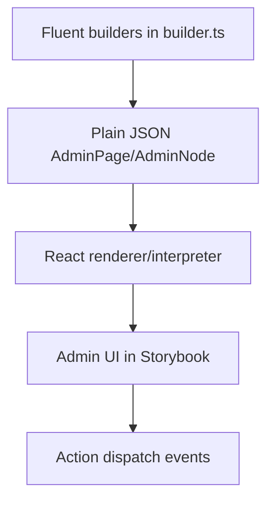
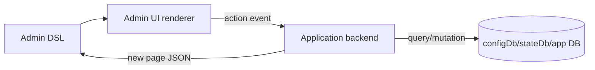

# Admin DSL Evolution Brainstorm and Design Guide

## Executive Summary

The current Admin DSL has reached an important proof point. It can describe salon admin pages, commerce order queues, course builders, CMS publishing forms, support inboxes, media libraries, analytics dashboards, team settings, desktop layouts, mobile layouts, and adaptive calendar behavior. That breadth is useful because it shows the DSL is not merely a one-off intake-page builder.

The same exercise also exposed the next design challenge. The DSL is expressive, but too much UI meaning is still implicit in renderer CSS or ad hoc node behavior. Row actions, overlays, form lifecycles, resource selection, mobile adaptation, and surface presentation are not yet first-class enough. If we keep adding cases directly to `render.tsx`, the implementation will become harder to reason about, and the DSL will drift toward a pile of visual widgets rather than a clear admin UI language.

This document proposes the next evolution: keep the current fluent, JSON-emitting, renderer-interpreted model, but introduce more semantic layers for admin applications:

- **actions** as first-class UI/behavior objects,
- **surfaces** for modals, drawers, sheets, detail panels, and confirmations,
- **resources** for query/list/detail/form/bulk workflows,
- **forms** with validation, dirty state, submit lifecycle, and sticky save behavior,
- **adaptive views** for desktop/mobile variants such as calendar grid vs agenda,
- **layout policies** that explicitly describe collapse, ordering, sticky regions, and density.

The guiding principle is the same as the user request: preserve an elegant mix of simplicity and expressiveness. The DSL should make common admin screens concise, but it should not force every application into the same screen template or a single visual design.

## 1. Current State

The Admin DSL currently lives under:

```text
web/src/admin-dsl/
  schema.ts
  builder.ts
  render.tsx
  calendar.tsx
  examples.ts
  layoutExamples.ts
  AdminDsl.stories.tsx
  AdminDslLayouts.stories.tsx
  AdminDsl.test.tsx
```

The current model has three layers:



This model is good and should remain. Builders can be ergonomic, but output must stay plain JSON. The renderer should remain explicit rather than dynamically loading arbitrary components by string name.

### 1.1 Current strengths

The current DSL is already good at:

- quickly sketching realistic admin pages,
- producing inspectable JSON examples,
- supporting Storybook visual review,
- sharing a renderer/action-dispatch model with the broader page DSL approach,
- allowing broad fixture-driven exploration before backend integration,
- supporting both desktop and mobile story variants.

### 1.2 Current weak points

The current weak points are semantic rather than superficial:

- actions are generic and do not encode enough UI intent;
- overlays exist as nodes but not as a true surface subsystem;
- forms are mostly field containers, not lifecycle-aware admin forms;
- resource pages are composed manually instead of having a strong but flexible resource model;
- layout collapse rules are mostly hidden in CSS;
- adaptive widgets like calendars need explicit desktop/mobile view policies;
- renderer utilities are duplicated across `render.tsx` and `calendar.tsx`;
- broad layout behavior depends on inline renderer code rather than reusable admin components.

## 2. Design Goal

The goal is not to make the DSL more rigid. The goal is to make important admin intent explicit while keeping authoring concise.

A good admin DSL should let an application author write something like:

```ts
resource.page("orders")
  .query(query.ref("orders.list", { status: "open" }))
  .views(
    view.queue("open").label("Open"),
    view.queue("risk").label("Risk"),
    view.archive("fulfilled").label("Fulfilled"),
  )
  .search({ placeholder: "Order, customer, tracking" })
  .row(orderRow)
  .detail(surface.drawer("orderDetail").desktop("right").mobile("sheet"))
  .actions(
    action.primary("order.open", "Open"),
    action.danger("order.refund", "Refund").placement("detail").confirm(),
  );
```

This is still compact. It does not say exactly which React component to use. It does say enough for the renderer to make good choices on desktop and mobile.

## 3. The Core Balance: Simple, Semantic, Escape-Hatch Friendly

The DSL should follow three rules.

### Rule 1: Simple common path

Common admin pages should be short. If every resource page requires twenty node declarations, authors will bypass the DSL and write React.

### Rule 2: Semantic enough to adapt

The DSL must encode why an element exists, not only how it looks. For example:

```ts
action.danger("refund", "Refund")
```

is more useful than:

```ts
button("Refund", { color: "red" })
```

because the renderer can place the danger action differently on mobile, require confirmation, and apply consistent accessibility patterns.

### Rule 3: Escape hatches without collapsing the model

Some screens will be unusual. The DSL should allow lower-level nodes:

```ts
admin.panel(...)
admin.section(...)
admin.markdown(...)
```

But the core product flows should use higher-level semantics where possible.

## 4. Proposed Next-Level DSL Concepts

## 4.1 Actions as first-class objects

Current actions are close, but need more intent.

Current shape:

```ts
action.open("orderDetail", "Open", { id })
action.confirm("refundOrder", "Refund", { id })
action.mutation("services.save", "Save", payload)
```

Proposed shape:

```ts
action.primary("order.open", "Open")
  .payload({ id })
  .placement("row")

action.danger("order.refund", "Refund")
  .payload({ id })
  .confirm({ title: "Refund order?" })
  .placement("detail")

action.secondary("order.hold", "Hold")
  .placement("overflow")
```

The JSON should contain semantic metadata:

```json
{
  "type": "mutation",
  "target": "order.refund",
  "label": "Refund",
  "intent": "danger",
  "priority": "secondary",
  "placement": "detail",
  "requiresConfirmation": true,
  "payload": { "id": "ord-1042" }
}
```

### Why this helps

The renderer can decide:

- on desktop: show `Open` inline, put `Refund` in overflow;
- on mobile: make row tappable, move destructive actions to detail sheet;
- in keyboard/focus context: expose the primary action first;
- for backend-driven flows: keep the action target opaque or scoped by backend action id.

### Implementation sketch

```ts
export interface AdminActionRef extends AdminJsonObject {
  type: "open" | "close" | "navigate" | "mutation" | "confirm" | "refresh" | "upload";
  target: string;
  label?: string;
  intent?: "primary" | "secondary" | "danger" | "neutral";
  priority?: "primary" | "secondary" | "tertiary";
  placement?: "toolbar" | "row" | "detail" | "footer" | "overflow";
  requiresConfirmation?: boolean;
  payload?: AdminJsonValue;
}
```

Builder sketch:

```ts
action.mutation("service.save", "Save")
  .intent("primary")
  .placement("footer")

action.mutation("service.archive", "Archive")
  .intent("danger")
  .placement("overflow")
  .confirm({ title: "Archive service?" })
```

## 4.2 Surfaces instead of loose modal/drawer nodes

Current overlays are static nodes:

```ts
surface.modal("editService", { title: "Edit service" }, serviceForm)
surface.drawer("orderDetail", { title: "Order #1042" }, detail)
```

This is useful for Storybook, but it does not model behavior strongly enough.

Proposed concept: **surface**.

A surface is a named interaction region that can adapt by viewport:

```ts
surface.drawer("orderDetail")
  .title("Order details")
  .desktop("right")
  .mobile("sheet")
  .content(orderDetail)

surface.modal("editService")
  .title("Edit service")
  .mobile("fullscreen")
  .footer(action.primary("service.save", "Save"))
```

JSON sketch:

```json
{
  "id": "orderDetail",
  "kind": "surface",
  "props": {
    "surfaceKind": "drawer",
    "title": "Order details",
    "presentation": {
      "desktop": "right",
      "mobile": "sheet"
    },
    "blocking": false,
    "close": true
  },
  "children": []
}
```

### Why this helps

It distinguishes:

- detail side panel,
- destructive confirm dialog,
- form modal,
- mobile sheet,
- full-screen editor,
- image preview.

It also creates a natural place for:

- close affordance,
- backdrop/scrim,
- focus trap,
- scroll lock,
- sticky footer,
- safe-area padding,
- selected resource context.

## 4.3 Resource pages as a formal but flexible pattern

The broad layout catalog repeatedly used this shape:

```text
metrics/toolbar
filters/search/views
resource list
selected detail surface
modals/confirmations
```

Current resource pages are manually composed. Proposed next step: make resource pages more formal while retaining escape hatches.

```ts
resource.page("orders")
  .title("Orders")
  .query(query.ref("orders.list"))
  .views(
    view.queue("open").label("Open"),
    view.queue("risk").label("Risk"),
    view.archive("fulfilled").label("Fulfilled"),
  )
  .search({ placeholder: "Search order, customer, tracking" })
  .metrics(orderMetrics)
  .row(orderRow)
  .detail(orderDetailSurface)
  .empty(admin.emptyState("No open orders"))
  .loading(admin.loadingState("Loading orders"))
  .error(admin.errorState("Orders failed to load"));
```

### Key design point

`resource.page` should not become one rigid template. It should emit a structured JSON node that the renderer can interpret with slots:

```json
{
  "kind": "resourcePage",
  "props": {
    "resource": "orders",
    "query": { "id": "orders.list" },
    "selection": { "mode": "single", "surface": "orderDetail" }
  },
  "slots": {
    "metrics": [],
    "filters": [],
    "list": [],
    "empty": [],
    "detail": []
  }
}
```

We do not need to implement `slots` immediately, but it may be cleaner than overloading `children` forever.

## 4.4 Forms as lifecycle-aware admin objects

Admin forms need more than fields.

Current:

```ts
admin.form("serviceForm", {},
  field.text("title", { label: "Name" }),
  admin.saveBar(...),
)
```

Needed semantics:

- initial values,
- validation rules,
- field-level errors,
- form-level errors,
- dirty state,
- pending/submitting state,
- sticky footer action,
- save/cancel/reset,
- optimistic vs blocking submit,
- conditional field visibility.

Proposed:

```ts
form.resource("serviceForm")
  .values(service)
  .fields(
    field.text("title").label("Name").required(),
    field.money("basePrice").label("Starting price"),
    field.switch("active").label("Visible"),
  )
  .validate("service.validate")
  .submit(action.primary("service.save", "Save"))
  .dirtyPolicy("stickyFooter")
```

JSON sketch:

```json
{
  "kind": "form",
  "props": {
    "id": "serviceForm",
    "values": { "title": "Color" },
    "state": "dirty",
    "dirtyPolicy": "stickyFooter",
    "submit": { "target": "service.save", "intent": "primary" }
  },
  "children": []
}
```

## 4.5 Adaptive views for desktop and mobile

The calendar forced an important realization. Some widgets should not merely shrink on mobile; they should change view mode.

Current implementation:

- desktop: week grid,
- mobile: agenda.

This should become a first-class idea:

```ts
admin.calendarWeek("week")
  .desktop(view.calendarGrid())
  .mobile(view.agenda())
```

or:

```ts
view.calendar({
  desktop: "weekGrid",
  mobile: "agenda",
})
```

Other adaptive views may include:

| Desktop | Mobile |
| --- | --- |
| table | cards |
| split pane | stacked panels or route/sheet |
| drawer | bottom sheet |
| grid | carousel or two-column compact grid |
| toolbar | action menu |
| bulk selection table | selection list |

### Principle

Responsive behavior should not be only CSS. When interaction changes, the DSL should encode the policy.

## 4.6 Layout policies

Today, layout behavior is mostly renderer CSS:

```css
@media (max-width: 720px) {
  .adminDslSplitPane { grid-template-columns: 1fr; }
}
```

That is fine for first pass, but complex admin screens need explicit policy:

```ts
admin.splitPane({
  desktop: { columns: ["320px", "1fr"] },
  mobile: { mode: "stack", order: ["detail", "list"] },
})
```

For resource pages:

```ts
resource.page("tickets")
  .layout({
    desktop: "list-detail",
    mobile: "list-sheet",
  })
```

## 5. What Should Stay Generic

The user clarified an important boundary: application builders own their config database schemas and write semantics. The Admin DSL should not prescribe how an application stores services, orders, lessons, products, or settings.

The generic DSL should provide:

- layout semantics,
- action semantics,
- resource workflow semantics,
- form lifecycle semantics,
- surface/presentation semantics,
- query/action references.

The application should provide:

- database schema,
- query implementation,
- mutation implementation,
- permission rules,
- domain-specific validation,
- publish/draft semantics if needed.



## 6. Proposed Package Structure

The renderer should be split before it grows further.

Proposed near-term structure:

```text
web/src/admin-dsl/
  schema.ts
  builder.ts
  actions.ts
  renderUtils.ts
  render.tsx
  calendar.tsx
  surfaces.tsx
  resource.tsx
  forms.tsx
  examples.ts
  layoutExamples.ts
```

Longer-term component structure:

```text
web/src/admin/
  atoms/
    AdminButton
    StatusBadge
    FieldLabel
  molecules/
    RowActions
    MetricCard
    SearchBox
    ActivityFeed
    ImageGrid
  organisms/
    AdminShell
    ResourcePage
    AdminSurface
    AdminForm
    AdminCalendar
```

## 7. Implementation Plan

## Phase 1: Extract shared renderer utilities

Create:

```text
web/src/admin-dsl/renderUtils.ts
web/src/admin-dsl/actions.ts
```

Move:

- `str`, `num`, `bool`, `jsonArray`, `jsonObject`, `style`,
- `isActionRef`, `actionList`, `dispatch`,
- `dataAttrs`, `nodeKey`,
- tone helpers.

Validation:

```bash
cd web && npx tsc --noEmit
cd web && pnpm test -- --runInBand
```

## Phase 2: Add richer action metadata without breaking current stories

Extend `AdminActionRef` with optional fields:

```ts
intent?: "primary" | "secondary" | "danger" | "neutral";
priority?: "primary" | "secondary" | "tertiary";
presentation?: "button" | "icon" | "menuItem" | "rowTap";
placement?: "toolbar" | "row" | "detail" | "footer" | "overflow";
requiresConfirmation?: boolean;
```

Update builder:

```ts
action.primary(...)
action.secondary(...)
action.danger(...)
.action.intent(...)
.action.placement(...)
.action.confirm(...)
```

Keep old helpers working.

## Phase 3: Introduce `surface.*` builder namespace

Add:

```ts
surface.drawer(id)
surface.modal(id)
surface.confirm(id)
surface.sheet(id)
```

These can initially emit existing `drawer`, `modal`, and `confirmDialog` nodes with richer props.

## Phase 4: Formalize `resource.page` metadata

Add optional resource-page props:

```ts
.resource("orders")
.query(...)
.views(...)
.search(...)
.selection(...)
.detailSurface(...)
.bulkActions(...)
.states({ empty, loading, error })
```

Do not remove low-level composition. The formal resource path should be additive.

## Phase 5: Improve form lifecycle semantics

Add form state props and builder helpers:

```ts
admin.form("serviceForm")
  .values(...)
  .state("dirty")
  .submit(...)
  .cancel(...)
  .errors(...)
  .dirtyPolicy("stickyFooter")
```

## Phase 6: Add adaptive view policies

Start with calendar because it already has two render modes:

```ts
admin.calendarWeek("week", {
  responsive: { desktop: "weekGrid", mobile: "agenda" }
})
```

Then apply similar ideas to:

- tables/lists,
- split panes,
- drawers/sheets,
- toolbars/action menus.

## 8. Testing Strategy

### Builder tests

- richer action metadata emits plain JSON,
- surface builders emit expected surface nodes,
- resource page metadata round-trips through JSON,
- form lifecycle props round-trip through JSON.

### Renderer tests

- row actions respect placement/intent,
- mobile agenda still renders for calendar,
- surface presentation props choose correct CSS classes/structure,
- form save bar appears for dirty state.

### Storybook coverage

Add stories for:

- row action density variants,
- surface presentation variants,
- form lifecycle states,
- resource page states,
- adaptive view examples.

### Visual regression

Use the existing HAIR-039 script pattern:

```bash
./ttmp/2026/05/15/HAIR-039--admin-design-system-and-dsl-for-one-stylist-salon-management/scripts/01-capture-mobile-admin-dsl.sh
```

Later, add a layout-catalog capture script for all desktop/mobile catalog stories.

## 9. Risks and Tradeoffs

### Risk: over-abstracting too early

If the DSL becomes too formal, it may stop being pleasant. Mitigation: keep low-level `admin.section`, `admin.panel`, and raw nodes.

### Risk: too much renderer magic

If the renderer silently moves actions and surfaces around, authors may be surprised. Mitigation: expose explicit policies like `placement`, `presentation`, and `mobile`.

### Risk: confusing backend responsibilities

The DSL should not own application schemas. Mitigation: query/action refs are references, not implementations.

### Risk: schema churn

The current stories may need updates. Mitigation: introduce richer metadata additively and keep current node kinds working.

## 10. Recommended Next Step

The next best implementation step is not a backend admin flow. It is:

1. extract shared renderer/action utilities,
2. add richer action metadata,
3. add a few Storybook stories specifically for row action and overlay variants.

This directly addresses the pain discovered while building many screens, while preserving the current useful layout catalog.

## 11. Intern Checklist

Before coding:

- [ ] Read `web/src/admin-dsl/schema.ts`.
- [ ] Read `web/src/admin-dsl/builder.ts`.
- [ ] Read `web/src/admin-dsl/render.tsx`.
- [ ] Read `web/src/admin-dsl/calendar.tsx`.
- [ ] Open the layout catalog stories in Storybook.
- [ ] Read this document fully.

When implementing:

- [ ] Keep output JSON-safe.
- [ ] Do not add app-specific schema assumptions.
- [ ] Add tests for every new builder semantic.
- [ ] Add at least one Storybook story for every new renderer behavior.
- [ ] Keep desktop and mobile behavior explicit where interaction changes.

Validation commands:

```bash
cd web && npx tsc --noEmit
cd web && pnpm test -- --runInBand
docmgr validate frontmatter --doc 2026/05/15/HAIR-039--admin-design-system-and-dsl-for-one-stylist-salon-management/design-doc/02-admin-dsl-evolution-brainstorm-and-design-guide.md --suggest-fixes
```

## 12. Final Position

The current Admin DSL is a good foundation. It should not be thrown away. It should evolve from a broad visual layout DSL into a semantic admin interaction DSL.

The main shift is:

```text
from: nodes that look like UI
  to: nodes/actions/surfaces/resources/forms that describe admin intent
```

That shift is what will preserve the balance of elegance and versatility.

## Implementation Checkpoint: Phase 16-18 Direction

The implemented Admin DSL direction is now a clean cut-over toward semantic subsystems:

- backend-authoritative Go builders in `pkg/admindsl`,
- dedicated Admin DSL protobuf transport under `proto/fringe/admin_dsl/v1`,
- explicit surface builders under `surface.*`,
- semantic action metadata,
- resource/form lifecycle state,
- reusable MSW scenario harnesses,
- explicit layout/adaptive policy props,
- focused backend, renderer, and Storybook author guides.

The code path should prefer `surface.*` for all modal, drawer, sheet, confirm, detail, and inline surface construction. Legacy surface helpers should not be used for new work.

Phase 16 is the reusable Storybook/test simulation layer. Phase 14B is the live protobuf/HTTP transport layer. Both are useful: MSW stories provide deterministic review; live backend transport proves real integration.
