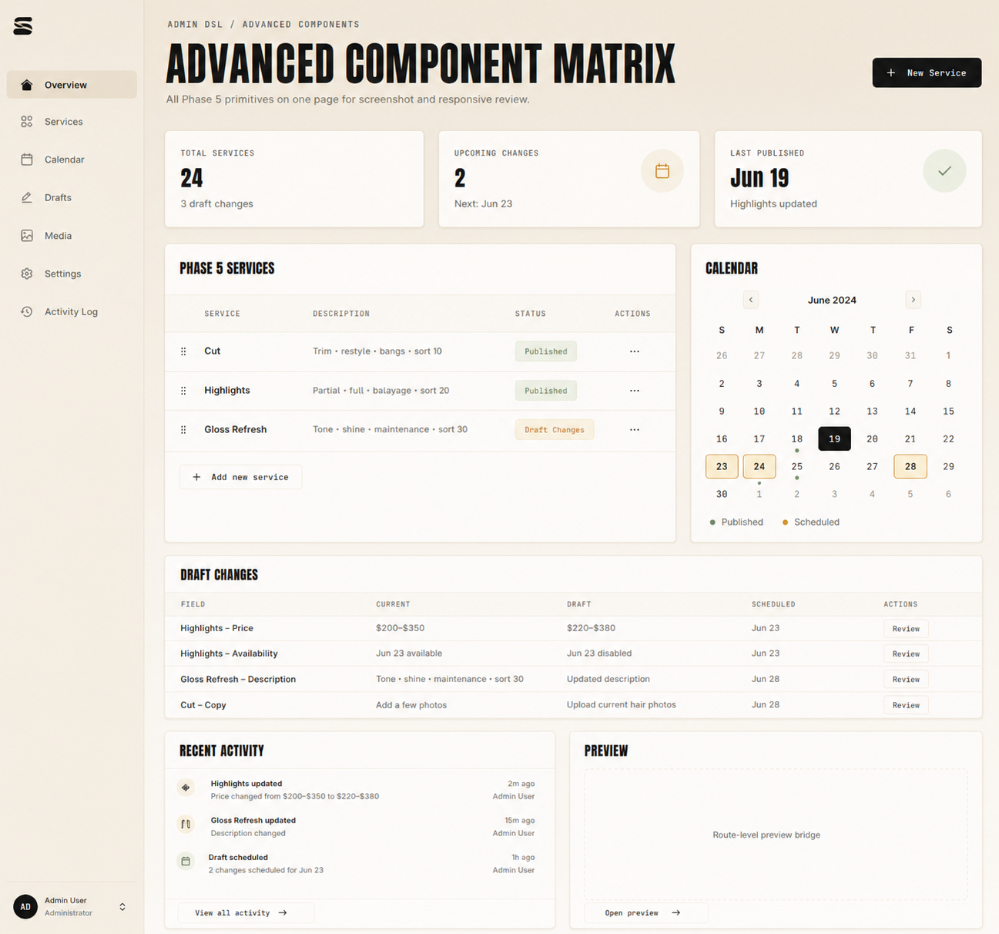
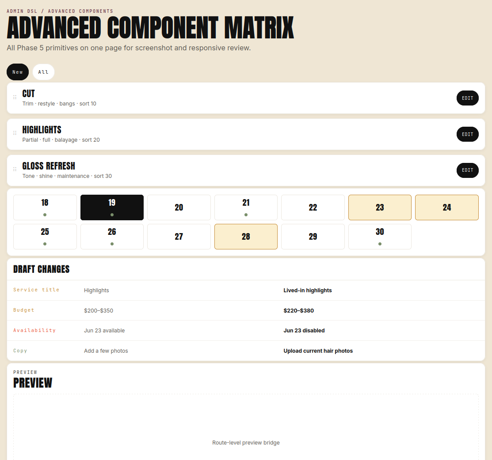

# Admin Layout Density Reference Analysis

## Executive Summary

Two reference screenshots were copied into this ticket. The first is the target direction: a dense operational admin workbench with a persistent sidebar, compact KPI cards, a two-column dashboard grid, data tables, calendar, activity feed, and preview panel. The second is the current/original layout: a mostly single-column page composed from large frontend-style cards, wide service rows, a pill-based date grid, a large diff block, and a large preview section.

The key finding is that the current Admin DSL already has many useful atoms (`metricCard`, `resourceTable`, `activityFeed`, `previewFrame`, `diffView`, `cardGrid`), but it lacks the higher-order admin page composition primitives that make dense back-office screens efficient: a semantic app shell, page header, named dashboard grid/areas, compact panels, richer data-table columns, row overflow actions, compact comparison tables, month calendar cards, and explicit density/layout policies. Without these constructs, flows are forced to compose admin pages out of frontend-inspired widgets that are attractive but space-inefficient for operational work.

## Source Images Copied Into the Ticket

Target/reference efficient admin layout:



Current/original admin layout as of this analysis:



Copied files:

- `ttmp/2026/05/15/HAIR-041--real-admin-backend-for-intake-app/various/design-reference/01-target-efficient-admin-layout.png`
- `ttmp/2026/05/15/HAIR-041--real-admin-backend-for-intake-app/various/design-reference/02-current-original-admin-layout.png`

## Problem Statement

The current Admin DSL renderer can build visually pleasing admin screens, but the defaults are still too close to frontend/product-page composition. Large cards and single-column stacks are good for guided customer flows and storytelling, but admin operators need to scan, compare, navigate, triage, and act on many records quickly.

This creates three practical problems:

1. **Low information density.** The current layout shows only a small number of services, dates, and draft changes above the fold despite having enough horizontal space.
2. **Weak admin navigation model.** The current page has no persistent app-level navigation, no user/account anchor, and only page-local pills/buttons.
3. **Missing semantic layout constructs.** The DSL describes widgets, but not enough of the admin intent: workbench shell, dashboard panels, table regions, row actions, status summaries, comparison grids, activity streams, and responsive placement policies.

The result is that backend flows can describe pages, but cannot yet describe the kind of efficient admin page shown in the target screenshot without lots of bespoke frontend behavior or oversized generic widgets.

## Detailed Target Layout Inventory

### 1. Persistent Admin Workbench Shell

The target screenshot has a fixed left sidebar occupying roughly the first 180–190px of the viewport. It contains:

- Compact logo mark at the top.
- Vertical primary navigation with icons and labels:
  - Overview
  - Services
  - Calendar
  - Drafts
  - Media
  - Settings
  - Activity Log
- Active item styling for `Overview`.
- Bottom user/account card with avatar initials, name, role, and a small control indicator.

This is not just decoration. It changes the DSL shape from “a page with content” to “an admin app shell with stable navigation plus page content.” The shell should be app-level and reusable across resources.

### 2. Page Header With Breadcrumbs and Primary Action

The target content area starts with:

- Breadcrumb/eyebrow: `ADMIN DSL / ADVANCED COMPONENTS`.
- Large page title: `ADVANCED COMPONENT MATRIX`.
- Short description.
- Right-aligned primary action: `+ New Service`.

The current layout has a title and local filter pills, but no canonical page header construct with breadcrumbs, subtitle, and page-level actions. The target requires a page header primitive that separates page identity from body widgets.

### 3. KPI Summary Ribbon

Below the header, the target has three compact metric cards in a horizontal row:

- `Total Services` → `24`, subtext `3 draft changes`.
- `Upcoming Changes` → `2`, subtext `Next: Jun 23`, with icon treatment.
- `Last Published` → `Jun 19`, subtext `Highlights updated`, with success icon treatment.

These cards are smaller and denser than the current big content cards. They act as dashboard summary signals, not primary content. The DSL should model KPI cards as a strip/ribbon with compact density, icon slots, tone, trend/subtext, and optional click behavior.

### 4. Two-Column Dashboard Grid

The target uses a dashboard grid:

- Main/wide left column: services table.
- Right/narrow column: calendar card.
- Full-width row: draft changes comparison table.
- Bottom row split: recent activity and preview.

This is more precise than a generic `cardGrid`. It needs span/area semantics and responsive rules. On desktop, the grid should express panel widths and relative priority. On mobile, it should collapse predictably by panel order or area priority.

### 5. Dense Services Table Panel

The `Phase 5 Services` panel is a compact table with:

- Panel title.
- Header row with columns:
  - Service
  - Description
  - Status
  - Actions
- Row drag handles.
- Service names in bold.
- Description text with inline separators.
- Status chips (`Published`, `Draft Changes`).
- Kebab/overflow actions per row.
- Inline footer CTA: `+ Add new service`.

The current layout represents the same services as three large horizontal cards with an `Edit` button at the far right. That is friendly and touchable, but inefficient for admin. The target needs table semantics: columns, width hints, cell renderers, row actions, row menus, inline CTA rows, and density tokens.

### 6. Month Calendar Panel

The target calendar is a real month view card:

- Month title and next/previous controls.
- Weekday header.
- Days from previous/current/next month.
- Selected day (`19`) with dark fill.
- Highlighted scheduled days (`23`, `24`, `28`) with warm border/fill.
- Published markers as small green dots.
- Legend for `Published` and `Scheduled`.

The current layout uses a simple date tile row/grid. That works as a primitive, but admins need month context and scheduling markers. The DSL needs a `monthCalendar` or expanded `monthAvailabilityGrid` that can render month navigation, markers, selected date, disabled days, out-of-month days, legend, and date actions.

### 7. Draft Changes Comparison Table

The target `Draft Changes` panel is a full-width comparison table:

- Columns:
  - Field
  - Current
  - Draft
  - Scheduled
  - Actions
- Multiple rows for price, availability, description, copy.
- Per-row `Review` button.

The current layout already has a draft changes section, but it is closer to a big diff/detail block. The target is more operational: each change is a row that can be reviewed independently. The DSL needs a compact `comparisonTable`/`diffTable` construct, or `resourceTable` must support comparison columns with semantic cell roles.

### 8. Recent Activity Feed

The target adds a lower-left `Recent Activity` panel:

- Feed rows with icons.
- Event title and detail.
- Right-aligned relative time and actor.
- Footer CTA: `View all activity →`.

This is an admin-native pattern. It connects mutations/audit events to dashboard context. The current page does not show activity in the layout reference. The DSL already has `activityFeed`, but it should support compact panel mode, actor/time placement, icon/tone mapping, and footer CTA.

### 9. Compact Preview Panel

The target preview is a lower-right panel, not a huge full-width section:

- Panel title `Preview`.
- Bordered/dashed preview viewport.
- Centered placeholder text `Route-level preview bridge`.
- Footer CTA `Open preview →`.

The current preview occupies a full-width, large area and pushes other information down. The target treats preview as a dashboard affordance. The DSL should let `previewFrame` live inside compact panels with explicit height, placeholder, and action footer.

## Current vs Target: Layout Changes

| Area | Current/original layout | Target/reference layout | DSL implication |
| --- | --- | --- | --- |
| App navigation | No persistent sidebar; content starts at left margin | Fixed sidebar with icon nav and user card | Add app/workbench shell and nav primitives |
| Page header | Breadcrumb/title/subtitle plus local filter pills | Breadcrumb/title/subtitle plus right-aligned primary action | Add page header actions and remove ad-hoc header buttons |
| Services | Large resource cards, one per service | Dense table rows with columns/status/actions | Make `resourceTable` first-class and compact |
| Calendar | Large date tiles in a simple grid | Month calendar with markers, navigation, legend | Add month calendar semantics |
| Draft changes | Large diff section with wide rows | Compact comparison table with review action per row | Add comparison table/diff matrix |
| Preview | Full-width large section | Half-width dashboard card | Allow preview as panel content with height/density |
| Activity | Not visible | Recent activity feed panel | Activity/audit feed should be a dashboard primitive |
| Density | Spacious, frontend-style | Compact, operational | Add density tokens and panel/body/header sizing |
| Responsiveness | Mostly stack-oriented | Desktop dashboard areas, mobile collapse needed | Add grid areas/spans/order policies |

## What the Current DSL Already Has

The current frontend and Go Admin DSL schemas already contain useful building blocks:

- Layout: `section`, `toolbar`, `cardGrid`, `panel`, `splitPane`, `tabs`.
- Data/display: `metricCard`, `summaryCard`, `statusBadge`, `activityFeed`, `kvList`, `emptyState`.
- Resource/list: `resourceTable`, `resourceList`, `resourceRow`, `resourceDetail`, `actionMenu`, `filterBar`, `searchBox`.
- Advanced components: `editableList`, `monthAvailabilityGrid`, `previewFrame`, `diffView`.
- Forms and surfaces: `form`, typed fields, `modal`, `drawer`, `sheet`, `confirmDialog`.

The issue is less “missing every widget” and more “missing the semantic page composition layer.” We need fewer page-specific frontend widgets and more admin-native layout grammar.

## Proposed Solution: Admin Workbench DSL Layer

Add an Admin Workbench layer on top of the existing node vocabulary. This layer should be semantic and backend-friendly: flows describe admin intent, and the renderer chooses the exact React composition.

### 1. `workbenchShell` / Richer `shell.props`

Represent persistent admin navigation and user/account anchors declaratively.

Candidate shape:

```json
{
  "shell": {
    "kind": "admin",
    "props": {
      "variant": "workbench",
      "density": "compact",
      "sidebar": {
        "logo": { "kind": "mark", "label": "Fringe" },
        "items": [
          { "id": "overview", "label": "Overview", "icon": "home", "target": "dashboard", "active": true },
          { "id": "services", "label": "Services", "icon": "grid", "target": "services" },
          { "id": "calendar", "label": "Calendar", "icon": "calendar", "target": "calendar" }
        ],
        "user": { "name": "Admin User", "role": "Administrator", "initials": "AD" }
      }
    }
  }
}
```

Renderer behavior:

- Desktop: persistent left sidebar.
- Tablet/mobile: collapsible nav drawer or top nav.
- Backend only declares items, active target, and action targets.

### 2. `pageHeader` Node

A first-class page header node prevents every flow from hand-building title/action layouts.

Needed props:

- `eyebrow` / `breadcrumbs`.
- `title`.
- `description`.
- `actions` with placement and priority.
- Optional `metadata` chips.

Candidate shape:

```json
{
  "kind": "pageHeader",
  "props": {
    "breadcrumbs": ["Admin DSL", "Advanced Components"],
    "title": "Advanced Component Matrix",
    "description": "All Phase 5 primitives on one page for screenshot and responsive review.",
    "actions": [
      { "type": "open", "target": "service.new", "label": "New Service", "intent": "primary", "presentation": "button" }
    ]
  }
}
```

### 3. `dashboardGrid` / Area-Based Grid

`cardGrid` is useful, but target pages need named areas, desktop spans, mobile order, and panel density.

Needed props:

- `columns`: breakpoint map.
- `gap`.
- `areas` or child-level `span`.
- `density`.
- `collapseOrder` for mobile.
- Optional `stickyAreas` for side panels.

Candidate child metadata:

```json
{
  "kind": "panel",
  "meta": { "id": "services" },
  "props": {
    "title": "Phase 5 Services",
    "layout": { "span": { "desktop": 8, "tablet": 12, "mobile": 12 }, "order": 10 },
    "density": "compact"
  }
}
```

### 4. Panel as a Structured Container

The target has consistent panels with title, optional subtitle, toolbar, body, footer, and compact chrome. `panel` should become the standard admin card container.

Needed panel props:

- `title`, `subtitle`, `eyebrow`.
- `density`: `compact | normal | spacious`.
- `padding`: `none | compact | normal`.
- `chrome`: `card | flat | bordered`.
- `toolbarActions`.
- `footerActions`.
- `emptyState`.
- `scroll` behavior.

This lets `resourceTable`, `monthCalendar`, `activityFeed`, and `previewFrame` be content inside panels instead of every component owning its own card style.

### 5. Rich `resourceTable` Column Grammar

The services table in the target needs real table semantics.

Needed column types:

- `text`: value, bold, truncate, secondary text.
- `description`: muted text, separator handling.
- `badge`: enum-to-tone mapping.
- `actions`: buttons, links, overflow menu.
- `dragHandle` / `reorderHandle`.
- `date`, `money`, `number`, `relativeTime`.
- `custom` should be avoided unless absolutely necessary.

Needed table props:

- `density`.
- `columns` with width/alignment/hideAt breakpoints.
- `rows` or `query`.
- `rowId`.
- `rowActions`.
- `inlineCreateAction` / CTA row.
- `emptyState`.
- `sort`, `pagination`, `selection`, `bulkActions`.

Candidate shape:

```json
{
  "kind": "resourceTable",
  "props": {
    "density": "compact",
    "columns": [
      { "id": "drag", "kind": "dragHandle", "width": 32 },
      { "id": "name", "label": "Service", "kind": "text", "primary": true },
      { "id": "description", "label": "Description", "kind": "text", "tone": "muted" },
      { "id": "status", "label": "Status", "kind": "badge", "map": { "published": "success", "draft": "warning" } },
      { "id": "actions", "label": "Actions", "kind": "overflowActions" }
    ],
    "rows": [],
    "footerActions": [
      { "type": "open", "target": "service.new", "label": "Add new service", "presentation": "button" }
    ]
  }
}
```

### 6. `comparisonTable` / `diffMatrix`

The target `Draft Changes` panel is not a visual diff block; it is a review queue. It needs table semantics with current/draft/scheduled/action columns.

Needed props:

- `rows`: field, current, draft, scheduled, severity, action.
- `columns` configurable but default to `field/current/draft/scheduled/actions`.
- `highlightChanged`.
- `rowReviewAction`.
- `groupBy` optional for service/entity.

Candidate shape:

```json
{
  "kind": "comparisonTable",
  "props": {
    "density": "compact",
    "rows": [
      { "field": "Highlights – Price", "current": "$200–$350", "draft": "$220–$380", "scheduled": "Jun 23", "actionTarget": "draft.price.review" }
    ],
    "actions": { "reviewLabel": "Review" }
  }
}
```

### 7. `monthCalendar` as an Admin Calendar Card

The existing `monthAvailabilityGrid` is close, but the target needs an admin month calendar with multiple marker channels and navigation.

Needed props:

- `month`, `year`.
- `selectedDate`.
- `markers`: date -> marker list.
- `legend`.
- `actions`: previous/next/selectDate.
- `dateStates`: out-of-month, disabled, today, selected, scheduled.
- `density`.

Candidate shape:

```json
{
  "kind": "monthCalendar",
  "props": {
    "month": "2024-06",
    "selectedDate": "2024-06-19",
    "markers": [
      { "date": "2024-06-17", "kind": "published" },
      { "date": "2024-06-23", "kind": "scheduled" }
    ],
    "legend": [
      { "kind": "published", "label": "Published", "tone": "success" },
      { "kind": "scheduled", "label": "Scheduled", "tone": "warning" }
    ]
  }
}
```

### 8. Compact `activityFeed`

The target activity feed should be a compact operational stream.

Needed props:

- `items`: icon/tone/title/detail/time/actor/action.
- `density`.
- `maxItems`.
- `footerAction`.
- `emptyState`.

The audit/health work already added backend audit data. This feed can become the dashboard preview of the audit log.

### 9. Action Placement Model

The target uses several action locations:

- Page primary action (`New Service`).
- Row overflow menu (`...`).
- Inline panel CTA (`Add new service`).
- Per-row review action (`Review`).
- Footer CTA (`View all activity`, `Open preview`).
- Calendar previous/next/select date controls.

The existing `ActionRef` has type/target/presentation/placement fields. The renderer should lean into this and map placement to admin-native UI:

- `placement: "pageHeader"` or `"toolbar"` for top-level actions.
- `placement: "row"` for visible per-row actions.
- `placement: "overflow"` for kebab menus.
- `placement: "footer"` for panel CTAs.
- `presentation: "icon" | "button" | "menuItem" | "link"`.

One likely schema addition is a `pageHeader` placement enum, or clearer semantics for `toolbar` at page vs panel scope.

### 10. Density and Responsive Policy Tokens

The target is not just different components; it is a different density mode.

Needed cross-node props:

- `density`: `compact | normal | spacious`.
- `layout.span`: breakpoint-aware column span.
- `layout.order`: mobile ordering.
- `layout.minHeight` / `maxHeight` for preview/table/feed panels.
- `hideBelow` / `collapseBelow` for secondary columns.
- `table.hideColumnsBelow`.

This keeps backend flows from hand-authoring separate desktop and mobile pages unless the interaction truly changes.

## Proposed Target Page DSL Sketch

This sketch intentionally describes admin intent rather than React implementation details:

```js
return admin.page("admin-component-matrix", "Advanced Component Matrix")
  .Shell("admin", {
    variant: "workbench",
    density: "compact",
    sidebar: {
      active: "overview",
      items: [
        { id: "overview", label: "Overview", icon: "home", action: "nav.overview" },
        { id: "services", label: "Services", icon: "grid", action: "nav.services" },
        { id: "calendar", label: "Calendar", icon: "calendar", action: "nav.calendar" },
        { id: "drafts", label: "Drafts", icon: "edit", action: "nav.drafts" },
        { id: "media", label: "Media", icon: "image", action: "nav.media" },
        { id: "settings", label: "Settings", icon: "settings", action: "nav.settings" },
        { id: "activity", label: "Activity Log", icon: "history", action: "nav.activity" }
      ],
      user: { name: "Admin User", role: "Administrator", initials: "AD" }
    }
  })
  .Content(
    admin.pageHeader({
      breadcrumbs: ["Admin DSL", "Advanced Components"],
      title: "Advanced Component Matrix",
      description: "All Phase 5 primitives on one page for screenshot and responsive review.",
      actions: [newServiceAction]
    }),
    admin.dashboardGrid({ columns: 12, gap: "compact", density: "compact" },
      admin.metricStrip({ span: 12 }, [
        { label: "Total Services", value: 24, caption: "3 draft changes" },
        { label: "Upcoming Changes", value: 2, caption: "Next: Jun 23", icon: "calendar" },
        { label: "Last Published", value: "Jun 19", caption: "Highlights updated", tone: "success" }
      ]),
      admin.panel("Phase 5 Services", { span: 8, density: "compact" },
        admin.resourceTable({ columns: serviceColumns, rows: services, footerActions: [addServiceAction] })
      ),
      admin.panel("Calendar", { span: 4, density: "compact" },
        admin.monthCalendar({ month: "2024-06", selectedDate: "2024-06-19", markers, legend })
      ),
      admin.panel("Draft Changes", { span: 12, density: "compact" },
        admin.comparisonTable({ rows: draftChanges, reviewAction: "draft.review" })
      ),
      admin.panel("Recent Activity", { span: 6, density: "compact", footerActions: [viewAllActivityAction] },
        admin.activityFeed({ items: recentActivity, density: "compact" })
      ),
      admin.panel("Preview", { span: 6, density: "compact", footerActions: [openPreviewAction] },
        admin.previewFrame("customerIntakePreview", { url: previewUrl, height: 220 })
      )
    )
  )
  .MustBuild();
```

## Design Decisions

### Decision 1: Add semantic admin composition before adding more visual widgets

Do not solve this by adding many one-off React widgets. The target screenshot is best described by semantic constructs: workbench shell, page header, dashboard grid, panel, table, comparison table, month calendar, activity feed, preview panel.

### Decision 2: Keep builders ergonomic, but output plain JSON

Flow authors should be able to call ergonomic Goja builders such as `admin.dashboardGrid(...)` and `admin.monthCalendar(...)`, but the output should remain declarative JSON nodes. This preserves the existing backend-driven contract.

### Decision 3: Treat density as a first-class layout policy

The same node kind may need compact or spacious rendering depending on admin context. Density should not be hidden in CSS alone; it affects row height, padding, header size, footer treatment, and responsive collapse.

### Decision 4: Prefer table semantics for admin resources

Service/config/request/admin data should default to tables or compact resource rows, not large promotional cards. Cards remain useful for dashboards, summaries, and previews, but operational lists need table affordances.

### Decision 5: Sidebar navigation belongs in the shell, not page content

Persistent navigation should be specified at shell level so every admin page can share it and the renderer can adapt it responsively.

## Alternatives Considered

### Alternative: Reuse `cardGrid` and existing widgets only

Rejected as insufficient. It can approximate the screenshot, but flows would need too much ad-hoc style metadata and would still lack sidebar, page header, table column, and responsive area semantics.

### Alternative: Build a custom React page for this exact layout

Rejected for the Admin DSL path. A custom React page could match the screenshot quickly, but it bypasses the backend-driven Admin DSL goal and does not help future admin pages.

### Alternative: Add a generic `html` or `customComponent` escape hatch

Rejected except as a last resort. It would make the renderer less explicit, weaken validation, and move page semantics out of the DSL.

### Alternative: Make every widget own its own card chrome

Rejected. The target uses consistent panel chrome around heterogeneous content. A structured `panel` container gives better consistency than each widget inventing its own header/footer/padding behavior.

## Implementation Plan

### Phase A: Schema and renderer foundation

1. Add frontend/Go node kinds or compatible aliases:
   - `pageHeader`
   - `dashboardGrid`
   - `metricStrip` or enhance `cardGrid` for metric ribbons
   - `monthCalendar`
   - `comparisonTable`
2. Extend shell props for `variant: "workbench"` and `sidebar`.
3. Extend `panel` props for structured header/body/footer/density/layout.
4. Extend action placement/presentation handling for page header, row overflow, panel footer, and inline CTA contexts.
5. Add Storybook stories that recreate both screenshots side-by-side:
   - current/original layout
   - target workbench layout
   - mobile collapsed target layout

### Phase B: Data components

1. Upgrade `resourceTable` column grammar:
   - column kinds
   - width/alignment
   - responsive hide rules
   - row overflow actions
   - footer CTA rows
2. Add/upgrade `comparisonTable` for draft changes.
3. Add/upgrade `monthCalendar` with markers and legend.
4. Upgrade `activityFeed` compact panel mode.

### Phase C: Flow adoption

1. Create a target-style Admin DSL fixture first in Storybook.
2. Port `/admin/intake` dashboard/preview/config screens incrementally:
   - dashboard shell/sidebar/header
   - config/services table
   - draft changes comparison table
   - activity feed from audit events
   - preview panel
3. Add screenshot/css-visual-diff coverage using the copied target reference as design guidance, not necessarily pixel-perfect baseline.

### Phase D: Hardening

1. Validate keyboard navigation for sidebar, row actions, table controls, and calendar dates.
2. Validate mobile collapse order.
3. Add Playwright smoke for page-level action, row overflow action, review action, and preview action.
4. Ensure Go builders output stable JSON and validation rejects malformed table columns/layout spans.

## Open Questions

1. Should `dashboardGrid` be a new node kind, or should `cardGrid` gain area/span/density semantics?
2. Should `monthCalendar` replace `monthAvailabilityGrid`, or should the existing node be generalized?
3. Do we need a `metricStrip`, or is a `dashboardGrid` row of `metricCard` nodes enough?
4. Should `pageHeader` be a node in `nodes`, or part of `AdminPage`/`shell.props`?
5. Should sidebar navigation be passed on every page response, or cached as an app shell descriptor with only `active` changing per page?
6. How much of row/table behavior should be declarative (`sort`, `filter`, `pagination`) vs callback-driven actions?

## References

- Target/reference screenshot: `../various/design-reference/01-target-efficient-admin-layout.png`
- Current/original screenshot: `../various/design-reference/02-current-original-admin-layout.png`
- Frontend Admin DSL schema: `/home/manuel/workspaces/2026-04-21/hair-v2/hair-booking/web/src/admin-dsl/schema.ts`
- Go Admin DSL schema: `/home/manuel/workspaces/2026-04-21/hair-v2/hair-booking/pkg/admindsl/types.go`
