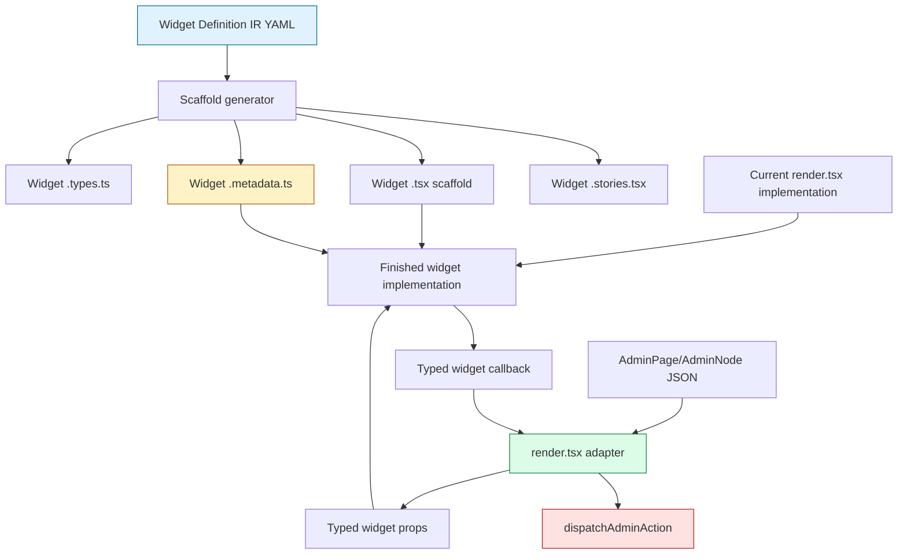

# Widget IR to Finished Widget Playbook

## Executive Summary

This playbook describes the complete path from a Widget Definition IR YAML entry to a finished Admin DSL React widget. The goal is not only to create a component file. The goal is to preserve the design intent, typed contract, action context, current renderer behavior, Storybook coverage, and review evidence while gradually shrinking `web/src/admin-dsl/render.tsx` into a set of adapters.

The central rule is simple: **YAML describes the widget contract and intent; current renderer code supplies the first proven HTML and styling for existing widgets; `render.tsx` remains the adapter that reads Admin DSL JSON and lowers widget callbacks to backend-bound action dispatch.** A finished widget should receive typed props. It should not parse raw `AdminNode` objects, inspect arbitrary JSON props, or call `dispatchAdminAction` directly.

The first completed example is `WorkbenchShell`. The schema-v2 YAML defines why the shell exists and what props it accepts. The previous inline `WorkbenchShell` function in `render.tsx` supplied the real frame HTML and token-based styles. The new `WorkbenchShell.metadata.ts` sidecar preserves the original IR context after the scaffold became hand-written code.

## The Four Layers

A safe migration keeps four layers separate.



The YAML layer is the durable source for intent and contract. The generator layer creates consistent files and preserves provenance. The implementation layer owns React markup, styling, responsive behavior, and accessibility behavior. The adapter layer owns raw Admin DSL parsing and action dispatch.

This separation is what prevents the widget extraction from becoming a rename of `render.tsx`. The renderer should become smaller because it delegates visual work to typed components, but it remains important because it is the boundary between untyped transport JSON and typed React props.

## Step 1: Read the Widget YAML

Start from the widget definition file under:

```text
ttmp/2026/05/15/HAIR-041--real-admin-backend-for-intake-app/sources/admin-dsl-widget-ir/
```

For each target widget, read these fields before writing code:

- `id` gives the stable widget identity.
- `name` gives the React component name.
- `classification` tells whether the widget is an atom, molecule, or organism.
- `source_mapping` tells where the current implementation or source concept lives.
- `intent.purpose` explains what the widget is responsible for.
- `intent.design_rationale` explains why the boundary exists.
- `intent.adapter_boundary` tells what must stay outside the widget.
- `contract.props` defines TypeScript interfaces.
- `contract.action_slots` defines callback contexts and valid action locations.
- `examples` show intended usage.
- `stories` define visual and behavioral coverage.
- `outputs` defines generated file paths.
- `implementation_todos` records what is still required before production use.

Do not start from the generated `.tsx` scaffold alone. The scaffold is a projection of the YAML, not the whole source of understanding.

## Step 2: Read the Current Renderer Source

For existing Admin DSL widgets, the first finished HTML and CSS should usually come from current working code. The common sources are:

| Widget family | Current source |
|---|---|
| Shell, page header, dashboard grid, panel, resource table, display widgets, form preview widgets | `web/src/admin-dsl/render.tsx` |
| Calendar week and appointment block behavior | `web/src/admin-dsl/calendar.tsx` and `render.tsx` |
| Action styling and action classification | `web/src/admin-dsl/actions.ts` and `render.tsx` |
| JSON prop reading helpers | `web/src/admin-dsl/renderUtils.ts` |
| Transport shape | `web/src/admin-dsl/schema.ts` |

The YAML tells you what the target component should be. The renderer tells you what already works in the live application. The first implementation pass should extract working behavior, not redesign everything at once.

## Step 3: Generate or Refresh the Scaffold

Use the schema-v2 generator:

```bash
python3 ttmp/2026/05/15/HAIR-041--real-admin-backend-for-intake-app/scripts/05-scaffold-admin-dsl-widgets.py \
  --name WorkbenchShell \
  ttmp/2026/05/15/HAIR-041--real-admin-backend-for-intake-app/sources/admin-dsl-widget-ir/03-shell-widgets.yaml
```

For a newly generated widget, the expected output set is:

```text
web/src/admin-dsl/widgets/<level>/<Widget>/<Widget>.types.ts
web/src/admin-dsl/widgets/<level>/<Widget>/<Widget>.metadata.ts
web/src/admin-dsl/widgets/<level>/<Widget>/<Widget>.tsx
web/src/admin-dsl/widgets/<level>/<Widget>/<Widget>.stories.tsx
web/src/admin-dsl/widgets/<level>/<Widget>/index.ts
```

Use `--dry-run` before `--force`. Do not run broad `--force` regeneration over hand-written widgets unless you have reviewed the overwrite scope.

If scaffold output is new or materially refreshed, commit it before hand-editing. That gives reviewers a clean boundary between generated code and implementation code.

## Step 4: Preserve Metadata Before Replacing Scaffold JSX

Every promoted widget should keep a metadata sidecar next to the implementation:

```text
<Widget>.metadata.ts
```

This file should preserve:

- widget id and classification;
- purpose and design rationale;
- adapter boundary;
- action slots and callback contexts;
- examples;
- Storybook scenario intent;
- implementation todos;
- source mappings.

The component should import or re-export the metadata so it remains visible to TypeScript and to future code search. For example:

```ts
import { workbenchShellWidgetMetadata } from "./WorkbenchShell.metadata";

<main data-admin-dsl-widget-id={workbenchShellWidgetMetadata.widgetId}>
  ...
</main>
```

This is not only documentation. It is design memory that stays with the code after generated placeholder JSX has been replaced.

## Step 5: Promote the Scaffold to a Real Component

Replace the scaffold diagnostic JSX in `<Widget>.tsx` with real implementation code. The initial implementation should come from current renderer code unless the widget is entirely new.

For `WorkbenchShell`, the old renderer code looked conceptually like this:

```tsx
function WorkbenchShell({ page, context }) {
  const shellProps = page.shell.props || {};
  const sidebar = jsonObject(shellProps, "sidebar");
  const items = jsonArray(sidebar, "items");

  return (
    <main className="adminDslRoot adminDslWorkbenchRoot">
      <div className="adminDslWorkbenchTopbar">...</div>
      <aside className="adminDslWorkbenchSidebar">...</aside>
      <section className="adminDslWorkbenchContent">
        {page.nodes.map(renderAdminNode)}
      </section>
    </main>
  );
}
```

The finished widget should not receive `page` or `context`. It should receive typed props:

```tsx
function WorkbenchShell({ pageId, title, sidebar, user, children, onSidebarAction }) {
  return (
    <main data-admin-dsl-page={pageId}>
      ...
      {children}
    </main>
  );
}
```

The refactor is complete only when raw Admin DSL JSON parsing has moved out of the widget.

## Step 6: Keep `render.tsx` as the Adapter

After implementing the widget, add or update a small adapter in `render.tsx`. The adapter has four jobs:

1. Read raw Admin DSL JSON using helpers such as `jsonObject`, `jsonArray`, `str`, and `bool`.
2. Convert that raw JSON into typed widget props.
3. Render child Admin DSL nodes before passing them as `children` or named slots.
4. Lower typed widget callbacks back to `dispatchAdminAction`.

The adapter should look like this in shape:

```tsx
function renderWorkbenchShell({ page, context }) {
  const sidebar = jsonObject(page.shell.props, "sidebar");
  const items = jsonArray(sidebar, "items");

  const sidebarItems = items.map((item) => normalizeSidebarItem(item));

  return (
    <WorkbenchShell
      pageId={page.id}
      title={page.title}
      sidebar={{ activeItemId, items: sidebarItems }}
      onSidebarAction={(action, ctx) => {
        dispatchAdminAction(context, navNode, action, ctx.item);
      }}
    >
      {page.nodes.map((node) => renderAdminNode(node, context))}
    </WorkbenchShell>
  );
}
```

The adapter may keep temporary escape hatches while the migration is underway, but those escape hatches should be explicit. For example, WorkbenchShell currently preserves the raw sidebar item as `rawItem` so the adapter can pass the same payload that the old renderer used. That is acceptable as a transitional adapter detail; it should not become a widget concern.

## Step 7: Preserve the Backend Action Trust Boundary

Widgets should never call `dispatchAdminAction` directly. They should emit typed callbacks. The adapter owns backend-bound dispatch.

| Context | Widget callback | Adapter lowering |
|---|---|---|
| Page header action | `onPrimaryAction(action, { pageId })` | `dispatchAdminAction(ctx, node, action)` |
| Panel toolbar action | `onToolbarAction(action, { panelId })` | `dispatchAdminAction(ctx, node, action)` |
| Table row action | `onRowAction(action, { tableId, row, rowId })` | `dispatchAdminAction(ctx, node, action, row)` |
| Bulk table action | `onBulkAction(action, { tableId, scope, rows, selectedRowIds })` | `dispatchAdminAction(ctx, node, action, payload)` |
| Form action | `onFormAction(action, { formId, values })` | `dispatchAdminAction(ctx, node, action, values)` |
| Sidebar nav action | `onSidebarAction(action, { item, activeItemId })` | `dispatchAdminAction(ctx, navNode, action, item)` |

This rule keeps the browser-side component library independent from backend flow execution. A widget can be tested in Storybook with fake callbacks because it does not know how backend actions are transported.

## Step 8: Move CSS Deliberately

There are three kinds of styling in the current renderer:

1. Inline token styles that belong to a widget.
2. Responsive class rules that belong to a widget.
3. Shared legacy responsive rules that still affect many widgets.

When promoting a widget, move category 1 immediately. Move category 2 when it can be isolated without breaking other renderer cases. Leave category 3 in `responsiveCss` temporarily and record what remains.

For `WorkbenchShell`, the inline styles for the root, sidebar, topbar, user footer, and content region moved into `WorkbenchShell.tsx`. The shared `responsiveCss` string remains in `render.tsx` because it still contains rules for page headers, dashboard grids, panels, resource tables, comparison tables, forms, side columns, calendar scrollers, and overlay surfaces.

A later CSS split should leave each widget with its own local style ownership. Until then, do not remove global rules just because the corresponding JSX has moved.

## Step 9: Update Types and YAML Together

If implementation reveals a missing prop, do not silently add it to TypeScript only. Update all relevant artifacts:

- source YAML `contract.props`;
- generated or hand-edited `.types.ts`;
- `.metadata.ts` if the meaning affects intent or adapter boundary;
- Storybook fixtures if the prop changes scenarios;
- `render.tsx` adapter if the prop comes from Admin DSL JSON.

The goal is to avoid drift between the IR and implementation. The YAML does not have to capture every internal implementation variable, but it should capture public widget props and action contexts.

## Step 10: Update Storybook

Generated stories are a starting point. They are a scenario plan, not finished coverage. A generated story can have a good name and good documentation while still rendering the same `defaultArgs` as every other story. That is useful for scaffolding, but it is not useful for visual review.

A promoted widget needs hand-authored stories with fixtures that actually vary the widget state. Each story should answer a specific question. If two stories look the same, either the fixtures are wrong or the stories do not need to be separate.

A promoted widget should usually have:

- a default desktop story;
- a mobile/narrow story if layout changes at small widths;
- empty/loading/error stories when relevant;
- action-context stories for callback-heavy widgets;
- dense data stories for table and admin workbench widgets;
- long text/wrapping stories for content-heavy widgets.

For each generated story, replace generic `defaultArgs` reuse with purposeful props:

```tsx
export const NoUser: Story = {
  args: {
    ...defaultArgs,
    user: undefined,
    children: <DemoContent title="No User Footer" />,
  },
};

export const LongNavigation: Story = {
  args: {
    ...defaultArgs,
    sidebar: { activeItemId: "audit", items: manyItems },
    children: <DenseWorkbenchContent />,
  },
};
```

Callback-heavy widgets should include at least one interactive probe story. The probe should show callback output on screen so a reviewer can click the widget and see the typed context that would be lowered by the adapter:

```tsx
function ActionDispatchDemo(args: WorkbenchShellProps) {
  const [lastAction, setLastAction] = useState("No action clicked yet.");

  return (
    <WorkbenchShell
      {...args}
      onSidebarAction={(action, context) => {
        setLastAction(`${action.label} -> ${action.target}; active=${context.activeItemId}`);
      }}
    >
      <CallbackOutput>{lastAction}</CallbackOutput>
    </WorkbenchShell>
  );
}
```

Storybook should show both visual behavior and callback context. For example, a `ResourceTable` story should not only display rows. It should also prove that row actions receive `{ tableId, row, rowId }` and bulk actions receive `{ tableId, scope, rows, selectedRowIds }`.

### Storybook CSS ownership

Standalone widget stories cannot rely on `render.tsx` injecting legacy `responsiveCss`. When a promoted widget owns responsive behavior, move the widget-specific rules into the widget, a widget-local CSS module/file, or a local style helper before trusting the mobile story.

`WorkbenchShell` exposed this issue. Its generated stories existed, but all stories looked the same and the mobile viewport could not prove shell behavior until the shell-specific rules for `.adminDslWorkbenchTopbar`, `.adminDslWorkbenchSidebar`, and `.adminDslWorkbenchContent` moved into the widget.

Use this check before considering story work complete:

- The story names correspond to distinct props or interactions.
- The rendered output visibly differs where the story says it should differ.
- Mobile stories work in isolated Storybook, not only through the app renderer.
- Action/callback stories display the emitted context or assert it through a test/play function.
- `npx storybook build --quiet` succeeds after story changes.

## Step 11: Validate

Run at least:

```bash
cd web && npx tsc --noEmit
```

For visual or renderer behavior changes, also run the relevant tests:

```bash
cd web && pnpm test -- --runInBand
```

For backend-driven Admin DSL changes, run Go tests too:

```bash
go test ./... -count=1
```

If the widget affects live admin screens, run the existing smoke and capture scripts:

```bash
node ttmp/2026/05/15/HAIR-041--real-admin-backend-for-intake-app/scripts/04-capture-admin-dsl-v2-storybook.mjs
node ttmp/2026/05/15/HAIR-041--real-admin-backend-for-intake-app/scripts/03-smoke-admin-intake-phase8.mjs
```

## Step 12: Capture Screenshots for Visual Changes

When a widget changes layout or styling, capture screenshots through Storybook iframe URLs or app routes. Do not capture Storybook chrome when the purpose is visual review of the widget itself.

Store ticket screenshots under a ticket artifact directory such as:

```text
ttmp/2026/05/15/HAIR-041--real-admin-backend-for-intake-app/various/storybook-v2/
```

Use stable filenames that identify the story, viewport, and date or step when useful.

## Step 13: Commit at Natural Boundaries

Commit at boundaries that make review easier. A widget extraction often has multiple kinds of changes: source YAML, generated scaffold, hand-written implementation, renderer adapter, stories, screenshots, and ticket docs. These should not be mixed blindly.

Use separate commits for separate review concerns:

1. YAML/metadata contract changes.
2. Generated scaffold or regenerated files.
3. Hand-written implementation extraction.
4. Renderer adapter changes, if they are large enough to review separately.
5. Storybook fixture hardening and interaction probes.
6. Screenshot artifacts, when they are large or numerous.
7. Diary/changelog updates.

Small widget extractions can combine implementation, adapter, stories, and docs in one commit if the diff is easy to review. Large table/form/calendar extractions should be split. Storybook hardening is often worth its own commit when it changes only fixtures and coverage, because generated stories may exist before they are meaningful.

Before every commit, run:

```bash
git status --short
git diff --stat
git diff -- <paths-you-plan-to-commit>
```

Stage explicit paths. Prefer `git commit --only -- <paths>` when the working tree contains unrelated changes. Do not rely on broad `git add .` in this ticket.

Always avoid committing unrelated working tree changes. At the time this playbook was written, the known unrelated files were:

```text
pkg/admindsl/flows/intake_config.flow.js
ttmp/2026/05/15/HAIR-041--real-admin-backend-for-intake-app/meta-dsl-comments.md
web/src/admin-dsl/AdminDslWorkbench.stories.tsx
ttmp/2026/05/15/HAIR-041--real-admin-backend-for-intake-app/various/remarkable-pdfs/
```

## Step 14: Keep the Diary and Changelog Current

Update the ticket diary as part of the work, not only after everything is finished. The diary is the continuity mechanism for this migration. It should record what moved, what failed, why a boundary was chosen, what validation ran, and what still remains in `render.tsx`.

After each meaningful implementation step, update:

- `reference/01-diary.md` with the prompt context, files changed, failures, validation commands, tricky details, second-pair-of-eyes risks, future work, and code review instructions;
- `changelog.md` with the user-visible or architecture-visible change;
- doc relations using `docmgr doc relate` for the widget, adapter, YAML, generator, and story files.

The diary entry should explicitly state what remains in `render.tsx`. That makes the next extraction easier.

A useful diary entry for a widget extraction should answer:

- Which renderer branch or helper moved?
- Which widget now owns the HTML and CSS?
- Which adapter function now converts JSON to typed props?
- Which callbacks are emitted by the widget, and where are they lowered to `dispatchAdminAction`?
- Which generated stories were still scaffold-level, and which were made meaningful?
- Which validation commands passed?
- Which known issues remain?

Do not wait until the final report to record failures. If Storybook stories all look the same because they reuse `defaultArgs`, record that immediately and explain the fix. Those small observations are valuable implementation guidance for the next widget.

## Recommended Extraction Order

Extract widgets in dependency order. The best next sequence is:

1. `ActionButton`
2. `ActionGroup`
3. `Panel`
4. `PageHeader`
5. `DashboardGrid`
6. `ResourceTable`
7. `AdminForm`
8. `MonthCalendar`

This order reduces rework. `ActionButton` and `ActionGroup` are used by most other widgets, so extracting them first gives later widgets a stable action-rendering surface. `Panel`, `PageHeader`, and `DashboardGrid` are lower-risk layout widgets. `ResourceTable`, `AdminForm`, and `MonthCalendar` have richer callback and responsive behavior, so they should be extracted after the simpler action/layout primitives are in place.

## Definition of Done

A widget is finished when all of these are true:

- The widget has a `.types.ts` contract matching the YAML.
- The widget has a `.metadata.ts` sidecar preserving intent and action slots.
- The widget implementation owns its HTML, styling, accessibility behavior, and local responsive behavior.
- The widget receives typed props and does not parse raw `AdminNode` JSON.
- `render.tsx` adapts Admin DSL JSON into typed props.
- `render.tsx` lowers widget callbacks into `dispatchAdminAction`.
- Storybook stories exercise the important states and action contexts with distinct fixtures, not repeated `defaultArgs`.
- Mobile/responsive stories work in isolated Storybook because widget-specific responsive CSS is owned by the widget or its local styles.
- TypeScript validation passes.
- Relevant tests and smoke scripts pass when behavior changed.
- Screenshots exist for visual changes.
- The ticket diary and changelog explain the extraction.

## Practical Review Checklist

Use this checklist during review:

- Does the widget import metadata or export it from its barrel?
- Does the implementation avoid `AdminNode`, `AdminPage`, `AdminJsonObject`, and `dispatchAdminAction` imports?
- Does the adapter remain small and readable?
- Are action callbacks typed by context rather than passed as generic event blobs?
- Did any CSS remain in `responsiveCss`, and is that intentional?
- Do stories cover mobile behavior when the widget has responsive layout?
- Do the stories actually look or behave differently when their names claim different states?
- Does at least one callback-heavy story expose emitted action context through visible output or assertions?
- Did validation run after the final edit?
- Were unrelated working tree files excluded from the commit?

## Current Example: WorkbenchShell

The first extraction followed this path:

1. Read `03-shell-widgets.yaml` for the `admin.shell.workbench` contract.
2. Read the inline `WorkbenchShell` implementation in `render.tsx`.
3. Replaced the generated `WorkbenchShell.tsx` diagnostics with the real shell frame markup and token styles.
4. Added `WorkbenchShell.metadata.ts` to preserve the original IR context.
5. Converted the old inline renderer function into `renderWorkbenchShell`, an adapter from `AdminPage` to typed props.
6. Kept `dispatchAdminAction` in `render.tsx`.
7. Replaced generated same-args Storybook stories with distinct fixtures for desktop, mobile, long navigation, no-user, and action-dispatch states.
8. Moved WorkbenchShell-specific mobile responsive CSS into the widget so isolated Storybook stories could prove mobile behavior.
9. Ran `cd web && npx tsc --noEmit` and `cd web && npx storybook build --quiet`.
10. Committed extraction, metadata preservation, and Storybook hardening as separate reviewable steps.

This is the model for the remaining widgets.
